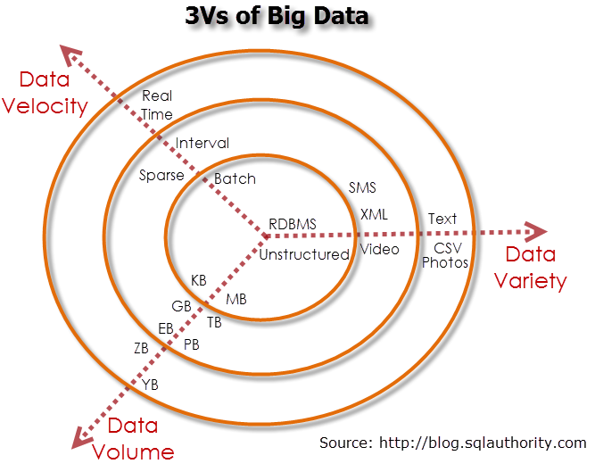

Introduction
===============

As information systems grow more ubiquitous and inexpensive, many organizations have experienced a large increase in the amount of data available. The emergence of Big Data has led to situations that could only be analyzed through traditional statistics with a high degree of nuance that is not commonly available. The field of data science (AKA Machine learning, predictive modeling, knowledge discovery and data mining) has emerged to describe the methods and practices related to managing big data, analysis, and interpreting the analysis within a decision making workflow.

Because of the need to integrate the data preparation, exploration, modeling, analysis, and presentation of results into a unified workflow, standalone, single function tools that have been used to teach individual courses lead to a siloed understanding of 

Characteristics of big data
---------------------------

Big data can be characterized by four aspects.

1.  Volume
2.  Velocity
3.  Variety
4.  Veracity

1.  Volume refers to presence of quantities of data that are beyond the capability of a single analysis sitting at a single computer to analyze.  The knowledge needed to work with high volumes of data include the IT capabilities of remote storage and remote processing (cloud computing) and the understanding of programming concepts needed to take advantage of cloud computing resources (parallel processing, functional programming).
2.  Velocity refers to the changing nature of data within a short decision cycle. This becomes an issue in cases where decisions have to be made for a specific instance on a small amount of specific data, or when the character of the data changes rapidly.  Working with this requires methods that can integrate within corporate IT systems (databases) and can use the mass of related data to provide insight into a specific observation (machine learning methods and Bayesian based statistics).
3.  Variety refers to the range of information that is available on a specific observation.  This variety can come from the fact that data may be available on a single subject from a range of sources, or because collecting and storing a range of attributes on a specific observation is easy. It may also result from the range of data storage and transmission types that are commonly encountered in practice. Working with a wide range of data requires knowledge of data handling methods and methods to identify which attributes or combinations of attributes are important (data processing and machine learning).
4.  Veracity refers to the correct understanding of the meaning of the information available. This includes dealing with missing values, identifying and correcting data errors, and an understanding of the intent of the data collectors.  Skills and knowledge in working with these issues include data munging and data analysis.

Characteristics of data scientists.
------------------------------

Drew Conway describes data scientists as having a combination of three sets of disparate skills:

- computer programming/hacking skills,
- math and statistics knowledge, and
- substantive expertise.

### Computer programming skills

Computer programming skills are required because data is traded electronically, so data scientists need to be able to manipulate text files, understand vectorized operations to work with data, and to think algorithmically.  Without computer skills means you cannot even get started with using electronic data.  The computer programming skills also link the various steps in the data workflow together from data collection, manipulation, modeling, analysis, then presentation of results. In contrast, single purpose programs typically do not lend themselves to being part of an integrated workflow.

In practice, a set of programming languages have become common in data science. They have the following characteristics:

1.  Built on top of numeric libraries for computation including linear algebra libraries (BLAS/LAPACK)
2.  Interactive, either through an interpreter or a Read-Evaluate-Print-Loop readily available (no compilation step as methods are modified).
3.  Have available a large number of topical and subject based technical computation libraries.
4.  Can operate on vectors and related data types (include functional programming capabilities).
5.  Have facilities to manage a range of types of data to include numerical and character based data.
6.  Have data structures that maintain knowledge of relationship and properties of data elements. (e.g. the data frame type)
7.  Have good and flexible graphical capabilities.
8.  Can express data analysis methods in forms corresponding to mathematical and statistical notation.

Popular languages for this are R and Python.  Other languages that share these characteristics include Julia, Clojure, Scala, and F#.  Matlab/Octave is also a close fit, however it does not have good facilities for working with character data nor does it have the equivalent to a data frame type.  Numeric and statistical libraries are often written in C, C++, Java, or Fortran, but they lack interactivity and do not have the expressiveness that corresponds to the forms used to represent problems and algorithms in mathematical or statistical notation which are useful for practicing data science.

Another note is that this is not the same as the standard computer science curriculum. While the CS curriculum can provide a good foundation for the programming skills required, in practice what is required is the ability to use computer programming to build the workflow that goes from data exploration to data manipulation to model development and evaluation to presentation of results in forms useful for decision making.  In many cities, programmers in industry have formed groups that focus on teaching the skills required for practical use to both those with university training in programming (e.g. computer science majors) and those with minimal formal education (e.g. high school graduates without any college background). One such group is Code & Supply based in Pittsburgh.

### Math and Statistics

While computer programming is required in order to even get started in data science, an understanding of the mathematical and statistical principles that underlie the methods is needed to give insight into which methods may be useful for a given problem and to evaluate the quality of models used. In the absence of this understanding, the analyst is essentially feeding data to a computer and taking output but without its meaning may be misunderstood and can lead to danger.

In particular, one implication of the elements of big data is that standard hypothesis testing based statistical analysis is inappropriate. Because of the volume and variety of data that is available, a large number of hypothesis could be generated and tested, and with high probability there will be hypothesis that will test to be significant, even if in fact there is no such relationship in real life.

The methods of data science model evaluation tend to be more similar to model evaluation in Bayesian statistics rather than model evaluation in traditional, frequentist based statistics with a focus on assessing candidate features contribution to the predictive ability of a model, and methods that explicitly favor simpler models that require justification to add complexity and detail.

### Substantive Expertise

The third leg in Drew Conway's Data Science Venn diagram is substantive expertise.  The observation by those in industry who may have need for data science is that they have trouble with academically trained analysts (e.g. recent university graduates at any level) is that they do not relate the math and statistics to an actionable plan.  In the absence of a connection between the math/statistics/computer programming and the substantive expertise, what you have is the academic field of machine learning. It is possible to generate the insights from data, but the insights are not related to pending business decisions or they are not delivered in a form that can assist in making business decisions.

In contrast to academic programs in machine learning, data mining, or statistics, data science practitioners have developed frameworks that give context to the work, and also provide guidance to the model evaluation.  One such framework is Context, Needs, Vision, Outcome (CoNVO) by Max Shron.  This framework focuses on the entity (usually an organization) with an interest in the work. 

-  Context explains the reason for the organization's interest.  
-  Need is a question that the organization has to answer before taking an action. 
-  Vision is how the results of the data analysis project will deliver the results so the organization can answer the question, 
-  Outcome is how the organization uses the results and how the organization will repeat the analysis for future decisions.  

Of note is the fact that the data project is not actually a part of any of these four points. The data project lies in between the Need and the Vision, and the modeling and methodology (which is the traditional focus of academic programs) is only one facet of the data project.

Understanding this CoNVO framework drives many of the decisions to be made by the data scientist. First, it helps in identifying outcomes and decision variables, which are based on the Need and Outcome of the organization. Second it helps in model evaluation, for example in making the tradeoffs between Type I and Type II errors (and their counterparts in other model evaluation methods).

-  Science is about discovery and building knowledge, which requires some motivating questions about the world and hypotheses tested with statistical methods.
-  Most academics (you) have math and statistics plus substantive expertise.

***

