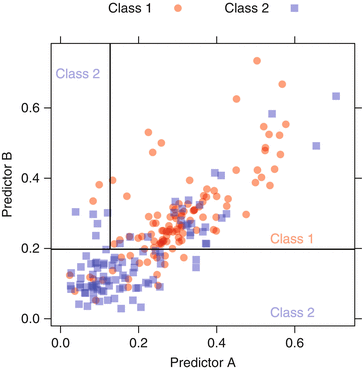

```{r loadlibraries, echo=FALSE, message=FALSE, warning=FALSE}
options(digits = 4)
library(dplyr)
library(magrittr)
library(caret)
library(pROC)
library(partykit)
load("../data/Lect13ClassificationTrees.Rdata")
```

Classification trees and rule based methods
=====================

Classification trees
=========

- Classification trees fall with the family of tree-based models.
- Consisted of nested `if-then` statements
  - Similar to regression trees.
- Tree is used to classify an observation.
  - Each classification has a prediction/class, and the appropriate class is applied to the new observation.

Types of methods
============

- Similarly with regression models, many other models are built on classification trees.
-  Random forests, boosting, and other ensemble methods.

Basic classification trees
===========

- The aim of classification trees is to partition the data into smaller, more homogeneous groups.



Homogeneity in classifications
========

- *Homogeneity* means that the nodes of the split are more pure (larger proportion of one class in each node).
- Purity is defined by maximizing accuracy or minimizing misclassifications.

Measuring purity - Gini Index
===============

- Gini index

$$p_1(1-p_1) + p_2(1-p_2)$$

  - Minimized when either of the class probabilities is driven toward zero.
  - Maximized if $p_1=p_2$
- Can calculate Gini index before and after splits.

Stopping point criteria
==============

- Two criteria: Minimum number of samples in a node or maximum tree depth.
- Trees that are very deep or have small number of samples in a node tend to over-fit the training data.
- An indirect criteria is *cost-complexity*, which is a function of the total number of nodes on a tree. (covered in regression trees)
- Cost-complexity is applied by pruning a tree after the stopping criteria are met.
  - Pruning involves removing nodes from a tree to reduce the danger of over-fitting.

Choosing splits
===================

- Several algorithms are available for classification trees.
- Classification and Regression Trees (CART)
- C4.5
- J48 (updated version of C4.5 found in Weka)

Preliminaries
==============

- Set up leave group out cross validation methods
- LGOCV is randomized holdout sets

```{r}
load("../data/grantData.RData")
set.seed(100)
numpre2008 = length(pre2008)
trainingrows = sort(sample(nrow(training), size=1000, replace=FALSE))

training = training[trainingrows,]
pre2008 = pre2008[trainingrows[trainingrows<=numpre2008]]
ctrl <- trainControl(method = "LGOCV",
                     summaryFunction = twoClassSummary,
                     classProbs = TRUE,
                     index = list(TrainSet = pre2008),
                     savePredictions = TRUE)
```

Performance - ROC Curve
=======================

-  *Sensitivity* - samples that were predicted to be true and were true compared to the samples that were true.
  - Did you identify the true samples?
-  *Specificity* - samples that were predicted to be false and were false compared to the total number of samples that were false
  - Did you correctly exclude the false samples?
  - *false positive*   1 - *specificity*
-  Use threshold to move along ROC curve

Recursive partitioning
=========================

- `rpart` applies CART
- Splitting based on maximizing the Gini coefficient.
- Ensemble models use trees as their base method.

```
{r}
set.seed(476)
rpartFit <- train(x = training[,fullSet], 
                   y = training$Class,
                   method = "rpart",
                   tuneLength = 30,
                   metric = "ROC",
                   trControl = ctrl)
```

rpart results
================
```{r}
rpartFit$results
```


```{r, echo=FALSE}
rpartRoc <- roc(response = rpartFit$pred$obs,
                predictor = rpartFit$pred$successful,
                levels = rev(levels(rpartFit$pred$obs)))
```

Plot ROC curve
-------------------
```{r}
plot(rpartRoc, type = "s",  legacy.axes = TRUE)
```


rpart final tree
===
```{r, echo=FALSE}
library(partykit)
plot(as.party(rpartFit$finalModel))

rpart2008 <- merge(rpartFit$pred,  rpartFit$bestTune)
rpartCM <- confusionMatrix(rpartFit, norm = "none")
```

rpart Confusion matrix
========
```{r, echo=FALSE}
rpartCM$table
```

Working through the ROC curve
=============
```{r}
rocoutput <- data.frame(thresholds=rpartRoc$thresholds,
                        sensitivites=rpartRoc$sensitivities,
                        specificities=rpartRoc$specificities)
rocoutput
```

Choose where you will be
======================
```{r}
plot(rpartRoc, type = "s",  legacy.axes = TRUE)
```

rpart with reduced set of predictors
===
```
set.seed(476)
rpartFactorFit <- train(x = training[,factorPredictors], 
                        y = training$Class,
                        method = "rpart",
                        tuneLength = 30,
                        metric = "ROC",
                        trControl = ctrl)
```
```{r}
rpartFactorFit$results
```

ROC curves
============
```{r}
rpartFactorRoc <- roc(response = rpartFactorFit$pred$obs,
                      predictor = rpartFactorFit$pred$successful,
                      levels = rev(levels(rpartFactorFit$pred$obs)))

```

Plot ROC curve
=============
```{r}
plot(rpartFactorRoc, type = "s", legacy.axes = TRUE)
```


Choose where on the ROC curve you want to be
======

```{r}
rpartrocoutput <- data.frame(thresholds=rpartRoc$thresholds,
                        sensitivites=rpartRoc$sensitivities,
                        specificities=rpartRoc$specificities)
rpartrocoutput
```

Plot tree with reduced set of predictors
===
```{r}
plot(as.party(rpartFactorFit$finalModel))
```

Confusion matrix with reduced set of predictors. 
===
```{r}
rpartFactor2008 <- merge(rpartFactorFit$pred,  rpartFactorFit$bestTune)
rpartFactorCM <- confusionMatrix(rpartFactorFit, norm = "none")
rpartFactorCM$table
```


Recursive partitioning ROC curves with full vs partial set of predictors
=====
``` {r, echo=FALSE, fig=TRUE}

plot(rpartRoc, type = "s", print.thres = c(.5),
     print.thres.pch = 3,
     print.thres.pattern = "",
     print.thres.cex = 1.2,
     col = "red", legacy.axes = TRUE,
     print.thres.col = "red")
plot(rpartFactorRoc,
     type = "s",
     add = TRUE,
     print.thres = c(.5),
     print.thres.pch = 16, legacy.axes = TRUE,
     print.thres.pattern = "",
     print.thres.cex = 1.2)
legend(.75, .2,
       c("All predictors", "Reduced predictors"),
       lwd = c(1, 1),
       col = c("red", "black"),
       pch = c(16, 3))
```

Classification trees
===========

- J48 method from WEKA implements a variation of C4.5
- Differs from CART based on the pruning method.
- Two strategies for pruning
  1. Simple elimination of a subtree
  2.  Raising a subtree so that it replaces a node further up the tree.
- Pessimistic pruning focusing on an upper bound on the number of classification errors.
- Implementation is in J48 from Weka.
```
set.seed(476)
j48FactorFit <- train(x = training[,factorPredictors], 
                      y = training$Class,
                      method = "J48",
                      metric = "ROC",
                      trControl = ctrl)
```

J48 output with reduced set of predictors
======
```{r}
j48FactorFit
```

J48 Confusion matrix
===
```{r}
j48Factor2008 <- merge(j48FactorFit$pred,  j48FactorFit$bestTune)
j48FactorCM <- confusionMatrix(j48FactorFit, norm = "none")
j48FactorCM$table
```

```{r, echo=FALSE}
j48FactorRoc <- roc(response = j48FactorFit$pred$obs,
                    predictor = j48FactorFit$pred$successful,
                    levels = rev(levels(j48FactorFit$pred$obs)))
```

```{r}
plot(j48FactorRoc, type = "s", legacy.axes = TRUE)
```


J48 with full set of predictors
===
```
set.seed(476)
j48Fit <- train(x = training[,fullSet], 
                y = training$Class,
                method = "J48",
                metric = "ROC",
                trControl = ctrl)
```
```{r}
j48Fit
```

J48 confusion matrix
=====================
```{r}
j482008 <- merge(j48Fit$pred,  j48Fit$bestTune)
j48CM <- confusionMatrix(j48Fit, norm = "none")
j48CM$table
```

J48 ROC calculation 
===
```{r}
j48Roc <- roc(response = j48Fit$pred$obs,
              predictor = j48Fit$pred$successful,
              levels = rev(levels(j48Fit$pred$obs)))
```

```{r}
plot(j48Roc, type = "s", legacy.axes = TRUE)
```


J48 Classification tree ROC plots of partial and full set of predictors
=====

```{r, plottreeROC, echo=FALSE, fig=TRUE}
plot(j48FactorRoc, type = "s", col = "black", print.thres = c(.5), 
     print.thres.pch = 16, print.thres.pattern = "", 
     print.thres.cex = 1.2, legacy.axes = TRUE)

plot(j48Roc, type = "s", print.thres = c(.5), 
     print.thres.pch = 3, print.thres.pattern = "", 
     print.thres.cex = 1.2, legacy.axes = TRUE,
     add = TRUE, col = "red", print.thres.col = "red")
legend(.75, .2,
       c("J48 Reduced factors", "J48"),
       lwd = c(1, 1),
       col = c("black", "red"),
       pch = c(16, 3))

```

Rule based models
=============

- `PART` is a rule based classifier from Weka.
```
set.seed(476)
partFit <- train(x = training[,fullSet], 
                 y = training$Class,
                 method = "PART",
                 metric = "ROC",
                 trControl = ctrl)
```
```{r}
partFit
```

Confusion matrix for rule based model and full set of predictors
==================
```{r}
part2008 <- merge(partFit$pred,  partFit$bestTune)
partCM <- confusionMatrix(partFit, norm = "none")
partCM$table
```

ROC curve for rule-based classifier
==========


```{r, echo=FALSE}
partRoc <- roc(response = partFit$pred$obs,
               predictor = partFit$pred$successful,
               levels = rev(levels(partFit$pred$obs)))
partRoc
```

```{r}
plot(partRoc, type = "s", legacy.axes = TRUE)
```


Partitioning with reduced set of predictors
============

- PART rule based model. 
```
set.seed(476)
partFactorFit <- train(training[,factorPredictors], training$Class,
                       method = "PART",
                       metric = "ROC",
                       trControl = ctrl)
```
```{r}
partFactorFit
```

Confusion matrix for PART with reduced set of predictors
==============
```{r, cache=TRUE,  echo=FALSE}
partFactor2008 <- merge(partFactorFit$pred,  partFactorFit$bestTune)
partFactorCM <- confusionMatrix(partFactorFit, norm = "none")
partFactorCM$table
```

ROC calculation for PART
=====
```{r, cache=TRUE,  echo=FALSE}
partFactorRoc <- roc(response = partFactorFit$pred$obs,
                     predictor = partFactorFit$pred$successful,
                     levels = rev(levels(partFactorFit$pred$obs)))
partFactorRoc
```

```{r}
plot(partFactorRoc, type = "s", legacy.axes = TRUE)
```

Ensemble methods
=================

Bagging
=======

- Bagging for classification 
- *B*ootstrap *Agg*regation
- Using bootstrapping with a classification method
  - Each iteration uses a bootstrapped sample of the original data which is fit with a classification tree.
  - Each model in the resulting ensemble is used to predict a new observation.
  - Highest vote getter wins.

Bagged Trees
=============

```
set.seed(476)
treebagFit <- train(x = training[,fullSet], 
                    y = training$Class,
                    method = "treebag",
                    nbagg = 50,
                    metric = "ROC",
                    trControl = ctrl)
```
```{r, cache=TRUE,  echo=FALSE}
treebagFit
```

Confusion matrix for bagged trees
======
```{r}
treebag2008 <- merge(treebagFit$pred,  treebagFit$bestTune)
treebagCM <- confusionMatrix(treebagFit, norm = "none")
treebagCM
```
```{r, cache=TRUE,  echo=FALSE}
treebagCM$table
```

Bagged Tree ROC
============
```{r}
treebagRoc <- roc(response = treebagFit$pred$obs,
                  predictor = treebagFit$pred$successful,
                  levels = rev(levels(treebagFit$pred$obs)))
```
```
{r}
set.seed(476)
```
```
{r}
treebagFactorFit <- train(x = training[,factorPredictors], 
                          y = training$Class,
                          method = "treebag",
                          nbagg = 50,
                          metric = "ROC",
                          trControl = ctrl)
```
```{r}
treebagFactorFit$result
```

```{r}
treebagFactor2008 <- merge(treebagFactorFit$pred,  treebagFactorFit$bestTune)
treebagFactorCM <- confusionMatrix(treebagFactorFit, norm = "none")
treebagFactorRoc <- roc(response = treebagFactorFit$pred$obs,
                        predictor = treebagFactorFit$pred$successful,
                        levels = rev(levels(treebagFactorFit$pred$obs)))
```


```{r}
plot(treebagFactorRoc, type = "s", legacy.axes = TRUE)
```

Confusion matrix for bagged trees
===============
```{r, cache=TRUE,  echo=FALSE}
treebagFactorCM$table
```

Bagged tree ROC plots vs recursive partitioning and J48 - reduced predictors
=====

```{r, cache=TRUE,  echo=FALSE, fig=TRUE}
plot(rpartRoc, type = "s", col = "black", legacy.axes = TRUE)
plot(j48FactorRoc, type = "s", add = TRUE, col = "blue", 
     legacy.axes = TRUE )
plot(treebagRoc, type = "s", add = TRUE, print.thres = c(.5), 
     print.thres.pch = 3, legacy.axes = TRUE, print.thres.pattern = "", 
     print.thres.cex = 1.2,
     col = "red", print.thres.col = "red")
plot(treebagFactorRoc, type = "s", col = "green", add = TRUE, print.thres = c(.5), 
     print.thres.pch = 16, print.thres.pattern = "", legacy.axes = TRUE, 
     print.thres.cex = 1.2)
legend(.75, .2,
       c("R partitioning", "J48", "Bagged Tree", "Bagged Tree Reduced"),
       lwd = c(1, 1),
       col = c("black", "blue", "red", "green"),
       pch = c(16, 3))
```

Bagging
=========

-  For each iteration, a bootstrapped data sample is created
-  Models differ on the dataset used (which elements are samples repeatedly and which samples become used for evaluation)


Random Forest
=======

- Instead of the regression tree for every iteration of random forest, a classification tree is used.
- Tuning parameter is the number of randomly selected predictors to choose from.
- Models differ by the available candidate factors


Boosting
=========

-  Boosting methods generates a sequence of weak classifiers.
-  At every iteration, samples that are incorrectly classified are given more weight, so subsequent models that are part of the ensemble are better at samples that were incorrectly classified earlier.


-  For each iteration, a bootstrapped data sample is created
-  Models differ on the dataset used (which elements are samples repeatedly and which samples become used for evaluation)

```{r}
save.image("../data/Lect12ClassificationTrees.Rdata")

```
