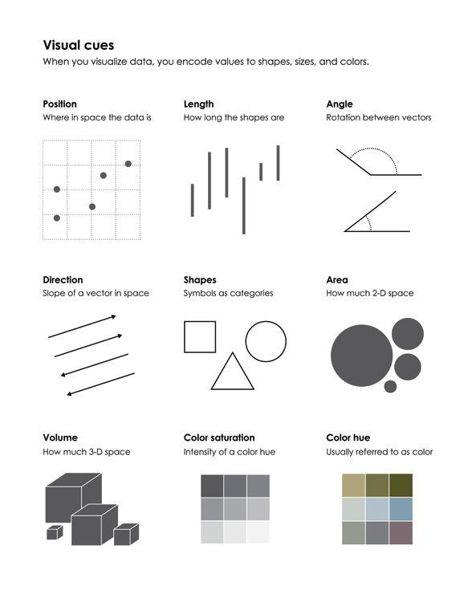
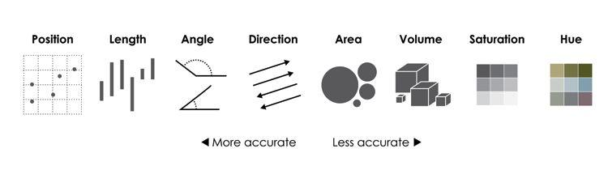
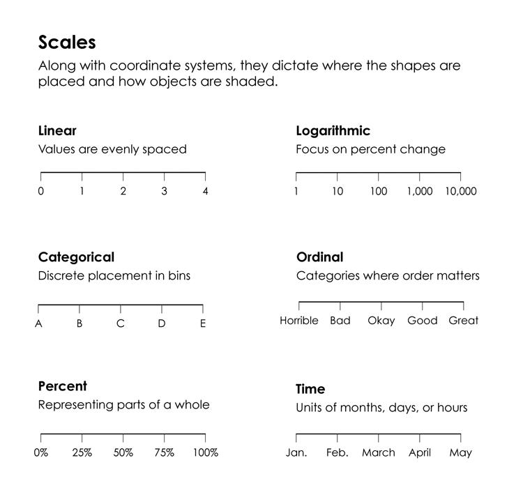
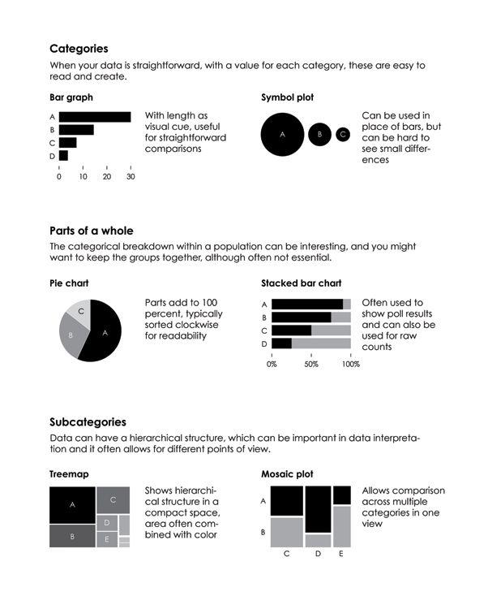
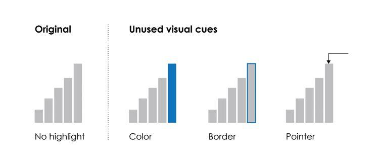
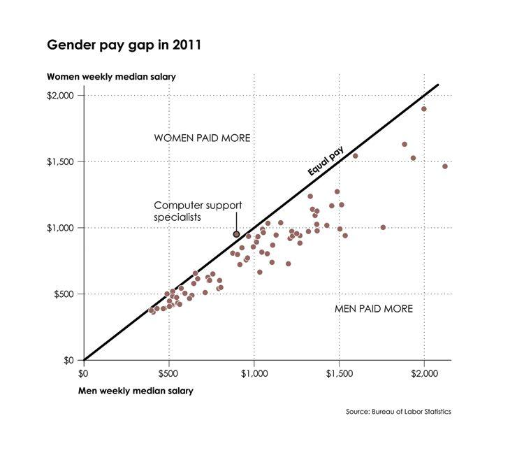
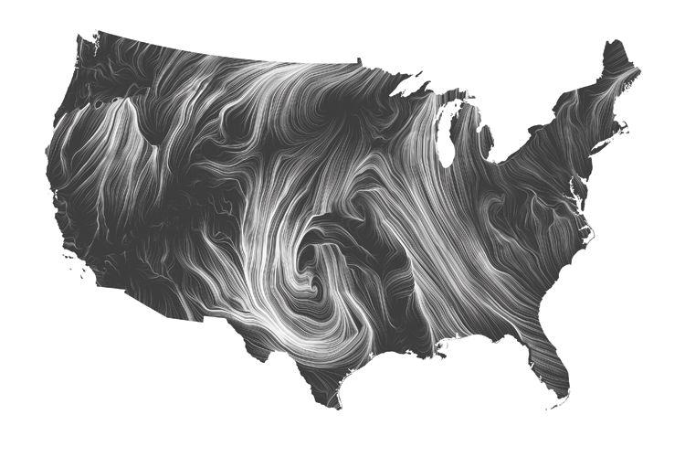

Scoping problems
===================

Projects
========

-  Look at Kaggle for ideas.
-  If you have a project from another source (another class, project with another professor, thesis topic exploration, etc.) ask me about using it for this project.

Representing data
=================

Lending club
========

- What do you want to know about historical load data?


What is visualization for?
==========================

-  Analysis and exploration
-  Communicate and present information
-  Entertainment
-  Art

Visualizations in data science
==============================


How do we represent data?
=========================

-  Use visual cues to show values.
-  Shapes, colors, scales, position.
-  Visualization is how we summarize raw data to communicate meaning.
-  What makes for a good visualization?


Visualization components
========================

Visualization components
========================

.


Visual cues
===========

.


Ranking visual cues
===================

Some visual cues are more clear than others



Coordinate systems
==================

Coordinate systems dictate the dimensions of the visualization.

.


Scales
======

Scales dictate where in the dimensions the data maps to.

.


Using visualization
===================


Data exploration questions to ask?
==================================

-  What data do you have?
-  What do you want to know about your data?
    -  What do you have?
    -  Is it complete?
    -  Is it representative of problem I will see in the future?
-  Which visualization methods should you use?
-  What do you see and does it make sense?

Exploring through visualization
===============================


Visualizing categorical data
============================

.



Time
====

Time is continuous, but you can also divide it into categories.


Time series
===========

How does your data change over time?

.


Visualizing spatial data
========================

.


Combining components
====================

By combining components, graphs are richer and can display many relationships at once.

.


Multiple variables
==================

There is no hard limit to how many variables can be in one visualization

.


Data distribution
=================

- Visualization can show how data is distributed in a population
- Box plots
- Histograms
- Density plots

Visualizing distributions
=========================

.


Comparisons
===========

One thing that visualizations should do is show how things change.

.


Color scales
============

-  Sequential
-  Diverging
-  Qualitative


Highlighting
============

Emphasize a particular data point or series to place focus



Annotation
==========

Give context to data or explain boundary cases.

.


Making things pretty
====================



Summary
=======

-  Think in terms of telling a story.
-  What is the message?
-  What is the main point?
-  How to tell it?

How to use visualizations
=======

-  Think in terms of telling a story.
-  What is the message?
-  What is the main point?
-  How to tell it?


# Visualizations in ggplot

-  Geometries and statistical summaries
-  Scales, Axis, and Legends
-  Colors


# Geometries and statistics

# Geom

- A *geom* is the geometrical object that a plot uses to represent data.
- We have been identifying the data to be represented in the main `ggplot()` function, but we could represent it in the `geom_()` function.
- We do this because we want to change the statistic represented or because we will plot many things in the same chart.

```{r}
library(ggplot2)
dsmall = diamonds[sample(nrow(diamonds),200),]
```

Diamond scatter plots
=========

These two are the same. I will usually name the dataset in the `ggplot()` function and the aesthetic mapping in the `geom_()` command

```{r}
ggplot(dsmall, aes(x=carat, y=price)) + geom_point()
```
***

```{r}
ggplot(dsmall) + geom_point(mapping = aes(x=carat, y=price))
```

Setting attributes
======================

-  One reason to use this version is that some aesthetics only make sense with certain *geom*, so keeping the aesthetics with the `geom_()` function makes sense.
-  The `geom_smooth()` function takes data and creates a single curve that draws the conditional mean (mean of `y` given `x` along with a shaded region that represents the confidence interval around the mean at the given `x`. 
-  In addition to `x` and `y`, you can specify the line type, `lintype`
  - solid
  - dashed
  - dotted
  - dash-dot
  - etc.
  
`geom_smooth()` with using linetype for adding a dimension
=================


```{r}
ggplot(dsmall) +
  geom_smooth(mapping = aes(x = carat, y = price))
```
```{r}
ggplot(dsmall) +
  geom_smooth(mapping = aes(x = carat, y = price, linetype = color, color=color))
```

Overlaying representations
=================

- You can then overlay multiple representations of the same data to provide more information.

```{r}
ggplot(dsmall) +
  geom_point(mapping = aes(x=carat, y=price)) +
  geom_smooth(mapping = aes(x = carat, y = price))
```

Using representations to show more facets
=================

- The aesthetics do not have to be the same for each layer of the plot.
- Use one to provide overall summaries, and use another to show how it varies

```{r}
ggplot(dsmall) +
  geom_point(mapping = aes(x=carat, y=price, color = color)) +
  geom_smooth(mapping = aes(x = carat, y = price))
```


Another example of multiple layers
=================

- Emphasize the individual points.
- Use summary data to show how the groups are distributed differently.

```{r}
ggplot(dsmall) +
  geom_point(mapping = aes(x=carat, y=price)) +
  geom_smooth(mapping = aes(x = carat, y = price, color = color, group = color, lintype=color))
```

Stat
==========

-  We can specify a chart type by the `geom` or by `stat`
-  Each `geom` has a default `stat`
-  Each `stat` has a default `geom`
-  But the default can be changed.

Bar chart
===========

- The default `stat` for `geom_bar()` is a count.
- The default `geom` for `stat_count()` is a `bar`

```{r}
ggplot(data=diamonds) +
  geom_bar(mapping=aes(x=cut))
```

```{r}
ggplot(data=diamonds) + 
  stat_count(mapping = aes(x=cut))
```

Changing the default `stat`
==================

-  Sometimes you want to change this.
-  Example, you want to use a bar chart, and you have been given summary data.
-  The `identity` stat is the actual value in the aesthetic being displayed.

```{r}
demo <- data.frame(a=c('bar1', 'bar2', 'bar3'),
                   b=c(20, 30, 40))
ggplot(data=demo) +
  geom_bar(mapping=aes(x=a, y=b), stat="identity")
```

You can also plot a summary
===================

-  Proportions can be generated by a count over the sum of all counts
-  The `..` operator can be used to refer to any *value* calculated by a `geom_` or `stat_` function.

```{r}
ggplot(data=diamonds) +
  geom_bar(mapping=aes(x=cut, y = (..count..)/sum(..count..)), stat="count") +
  ylab("Proportion") +
  ggtitle("Proportion of diamonds with a specific cut")
```

Many `stat_()` transforms have corresponding `geom_()` 
=====

- stat_bin(): geom_bar(), geom_freqpoly(), geom_histogram()
- stat_bin2d(): geom_bin2d()
- stat_bindot(): - geom_dotplot()
- stat_binhex(): geom_hex()
- stat_boxplot(): geom_boxplot()
- stat_contour(): geom_contour()
- stat_quantile(): geom_quantile()
- stat_smooth(): geom_smooth()
- stat_sum(): geom_count()

Some other important `stat` plots
==========

- `stat_count()`
- `stat_identity()`
- `stat_summary()`
- `stat_ellipse()`
- `stat_smooth()`
- `stat_ecdf()`
- `stat_qq()`
- `stat_function()`

`stat_identity()`
=====

- Uses the value of the variable in the aesthetic to plot.
- Contrast to `stat_count()` which counts number of occurrences (like bar charts)

```{r}
summary(demo)
ggplot(demo) + stat_identity(aes(x=a, y=b))
```

`stat_summary()`
===

- Plots a summary of the `y`-values for each unique `x`-value.
- Specify what functions should be mapped to the beginning and end of the line, and the center point.

```{r}
ggplot(diamonds) + 
  stat_summary(aes(cut, depth),
               fun.ymin=min,
               fun.ymax=max,
               fun.y=median
  )
```

stat_summary variations
============

-  `stat_summary_2d()`
-  `stat_summary_hex()`

-  Data is binned in `x` and `y`, then values of `z` are summarized using functions specified in the parameter.

`stat_ellipse()`
=====

- Draws an ellipse around the the bulk of the data.
- Useful for emphasizing the range of the data over two dimensions that is tighter than drawing a box.

```{r}
ggplot(dsmall, aes(log(carat), log(price))) +
  geom_point(aes(color=cut)) +
  stat_ellipse()
```

`stat_smooth()`
======
- Draws a mean and confidence interval of `y` at a given `x`.
- A range of methods are available.
- Compare to using `stat_ellipse()`

```{r}
ggplot(dsmall, aes(log(carat), log(price))) +
  geom_point(aes(color=cut)) +
  stat_smooth()
```

`stat_ecdf()`
=====

- Empirical Cumulative Distribution Function.
- Probability of a sample being less than a given number.

```{r}
ggplot(diamonds) + 
  stat_ecdf(aes(carat))
```

`stat_qq()`
=============

- Quantile-quantile plot
- In probability, used to compare data to a theoretical distribution.
- Very often used to determine if data is normally distributed or exponentially distributed.
  - Errors of statistical models should be normally distributed.

```{r}
lmdiamonds <- lm(price ~ carat, dsmall)
dflmdiamonds <- data.frame(residuals = lmdiamonds$residuals, prediction = lmdiamonds$fitted.values)
ggplot(dflmdiamonds) + stat_qq(aes(sample=residuals))
```


`stat_function`
===========

- Superimposes a function on top of the plot.

```{r}
df <- data.frame(
  x = rnorm(100)
)
base <- ggplot(df, aes(x)) + geom_density()
base + stat_function(fun = dnorm, colour = "red")
```


Scales, Axis, and Legends
===========

- Data does not speak by itself.
- You must explain the data.
- Scales, axis, legends, and titles tell the viewer how to interpret the plot.
- Always include them if you expect the plot to be seen by someone other than the one who made it.

Scales
=======

- Every aesthetic in a plot requires a scale.
- Some aesthetics have default scales.

```{r}
ggplot(dsmall, aes(log(carat) , log(price))) +
  geom_point() +
  scale_x_continuous() +
  scale_y_continuous()
```

Name of scale functions
================

- There are three parts of a scale function, separated by underscores (`_`).
  - `scale`
  - Name of aesthetic (e.g. `x`, `y`, `color`, `shape`)
  - Name of scale (e.g. `continuous`, `discrete`, `brewer`)
    - `brewer` indicates a color scale.
    
Scale commands
=====

```
scale_x_continuous(name, breaks, labels, limits, trans)
```

- name : x or y axis labels
- breaks : control the breaks in the guide (axis ticks, grid lines, …). Among the possible values, there are :
    - NULL : hide all breaks
    - waiver() : the default break computation
    - a character or numeric vector specifying the breaks to display
- labels : labels of axis tick marks. Allowed values are :
    - NULL for no labels
    - waiver() for the default labels
    - character vector to be used for break labels
- limits : a numeric vector specifying x or y axis limits (min, max)
trans for axis transformations. Possible values are “log2”, “log10”, “sqrt”, etc

Short cuts for axis
==============

- `scale_x_continuous()`: `xlab()`
- `scale_y_continuous()`: `ylab()`
- For both at the same time: `labs()`

Breaks and labels
=====================

-  Breaks and labels are the values that appear in the scale.
-  R and `ggplot` attempt to have sensible defaults that tradeoff between avoiding being to busy and not having enough information.
-  If you specify labels, you must specify breaks.

===

```{r}
ggplot(dsmall, aes(carat, price)) +
  geom_point() +
  scale_x_continuous(breaks= 1:3)
```

```{r}
ggplot(dsmall, aes(carat, price)) +
  geom_point() +
  scale_x_continuous(breaks= seq(0,3,.25))
```

Scale labeling options
=============

Some other common labeling options in the `scales` package include:

- `scales:dollar_format()`: use currency symbols.
- `scales:unit_format()`: Include units in legend.
- `scales:wrap_format()`: Uses multiple lines for long labels.

Legends
=======

- A *legend* is the part of the chart that defines the symbols used for various groups. (e.g. color, shape, line type)
- There can be multiple layers being defined.
- A legend also requires parameters such as location, number of columns, horizontal/vertical orientation, etc.

Specifying a legend
===========

- A legend is only defined for variables mapped by `aes()`.
```{r}
ggplot(dsmall) + geom_point(aes(carat, price, color=color), show.legend=TRUE)
```

You can map multiple layers to the same legend.
======
```{r}
ggplot(dsmall) + geom_point(aes(carat, price, color=cut, shape=cut), show.legend=TRUE)
```


Theme
=====

The theme controls the non-data components of the plot.

- Title
- Axis titles

Defined themes
=====

-  There are defined themes.
-  ` theme_grey()` Default (grey background with white grid)
-  `theme_bw()`
-  `theme_dark()`

You can change theme elements
=============

- http://docs.ggplot2.org/current/theme.html
- e.g. rotate the x-axis text.

```{r}
ggplot(data=diamonds) +
  geom_bar(mapping=aes(x=cut)) +
  theme(axis.text.x = element_text(angle=90))
```

Legend layout
====

- A legend can be either positioned `right`, `left`, `top`, `bottom`, or `none`

```{r}
ggplot(dsmall) + geom_point(aes(carat, price, color=cut, shape=cut), show.legend=TRUE) +
  theme(legend.position="right")
```

legend.position = "left"
===

```{r}
ggplot(dsmall) + geom_point(aes(carat, price, color=cut, shape=cut), show.legend=TRUE) +
  theme(legend.position="left")
```

legend.position = "top"
===

```{r}
ggplot(dsmall) + geom_point(aes(carat, price, color=cut, shape=cut), show.legend=TRUE) +
  theme(legend.position="top")
```

legend.position = "bottom"
===

```{r}
ggplot(dsmall) + geom_point(aes(carat, price, color=cut, shape=cut), show.legend=TRUE) +
  theme(legend.position="bottom")
```

legend.position = "none"
===

```{r}
ggplot(dsmall) + geom_point(aes(carat, price, color=cut, shape=cut), show.legend=TRUE) +
  theme(legend.position="none")
```

Limits
=====

- The ends of the scale are usually determined from the data.
- You may set this manually if there are a set of plots that need to be comparable to each other.
- Or you may want focus on an interesting section of the data.

====

```{r}
ggplot(dsmall) + geom_point(aes(carat, price, color=cut, shape=cut), show.legend=TRUE) +
  scale_x_continuous(limits= c(0.5, 1.5))
```

Setting limits
==========

- `xlim()` and `ylim()` are shortcuts for setting limits.
- Limits can be anything: numerical, discrete, categorical, dates.
  - `ggplot` will do the right thing in each of those settings.
  
Scale transformations
============

- You can transform the scale independently of the aesthetic.
- E.g. log, exponential, reciprocal, power/root

```{r}
ggplot(dsmall, aes(carat, price)) +
  geom_point() +
  scale_x_continuous(name = "log10(carat)", trans="log10") + 
  scale_y_continuous(name = "log10(price)", trans="log10")
```

Colors
======

- Colors are a very common scale.
- We need a way to pick colors that are visually distinct.
- We also have to be concerned with color blindness and printing/photocopy on black and white.

Specifying colors
===================

- You may be familiar with RGB (screen) or CMYK (print) color specifications.
- We use Hue, Chroma, Luminance, because the colors that are equidistant in value are (roughly) equidistant in perception. 
  - Hue: the value that "colour" for the color (e.g. red, green, blue)
  - Chroma: the purity of a color.
  - Luminance: the brightness of the color.
- Hue is *not* ordered. Chroma and Luminance are ordered.
- Some HCL combinations are named colors (i.e. like your crayon box)

Gradients
=======

- Color gradients can be:
  - Continuous
  - Discrete
  - Identity
  
Continuous color gradients
============

- `scale_color_gradient(), scale_fill_gradient()`: two color gradient, specify a `low` and a `high` color.  
  - Generally, use the same hue, change chroma and luminance.
  
```{r}
erupt <- ggplot(faithfuld, aes(waiting, eruptions, fill=density)) + 
  geom_raster() + 
  scale_x_continuous( expand=c(0,0)) +
  scale_y_continuous(expand=c(0,0)) + 
  theme(legend.position="none")
```

Color scales: black to white
====
```{r}
erupt + scale_fill_gradient(low="white", high="black")
```

Color scales: light to dark
====
```{r}
erupt + scale_fill_gradient(low="white", high="black")
```

Color Brewer
======

- *ColorBrewer* is a standard for specifying color schemes for use in charts.
- Go to http://colorbrewer2.org

scale_fill_distiller with ColorBrewer palettes
=====
- `scale_fill_distiller` uses the ColorBrewer palettes to fill.

```{r}
erupt + scale_fill_distiller(palette="Greys")
```

Normally, you use a single color
======

```{r}
erupt + scale_fill_distiller(palette="Greens")
```

There are some multi-color schemes that work
===
```{r}
erupt + scale_fill_distiller(palette="YlOrRd")
```

Discrete color palettes
===========

- We can use `scale_fill_hue` to set a range of hue.

```{r}
diamondcolor <- ggplot(dsmall, aes(color)) +
  geom_bar(aes(fill=color))
diamondcolor
```

Default is to change hue
================
- Problem, this will photocopy as uniform grey.
```{r}
diamondcolor +
  scale_fill_hue(c=40)
```

Color brewer
=============

- `scale_fill_brewer()`: uses ColorBrewer palettes.

```{r}
diamondcolor + scale_fill_brewer(palette="Greys")
```

Color brewer
=============

- `scale_fill_brewer()`: uses ColorBrewer palettes.


There are some predefined palettes
===
```{r}
diamondcolor + scale_fill_brewer(palette="Set1")
```

Color brewer
=============

- `scale_fill_brewer()`: uses ColorBrewer palettes.

Another predefined palette that may be better for fills (areas)
=====
```{r}
diamondcolor + scale_fill_brewer(palette="Set2")
```

And a standard set of grays
=============

- `scale_fill_grey()` takes a start and end as the fraction of black (vs white), with 0 being white and 1 being black.

```{r}
diamondcolor + scale_fill_grey(start = 0.2, end=0.9)
```

scale_color_identity
===============

- You can also pull a color from the data itself, if it is in the LUV color space (which is similar to HCL)

```{r}
ggplot(luv_colours, aes(u, v)) +
  geom_point(aes(color=col), size=3) +
  scale_color_identity() + 
  coord_equal()
```       


Theme (repeat for printing)
=====

The theme controls the non-data components of the plot.

- Title
- Axis titles

Defined themes
=====

-  There are defined themes.
-  ` theme_grey()` Default (grey background with white grid)
-  `theme_bw()`
-  `theme_dark()`

You can change theme elements
=============

- http://docs.ggplot2.org/current/theme.html
- e.g. rotate the x-axis text.

```{r}
ggplot(data=diamonds) +
  geom_bar(mapping=aes(x=cut)) +
  theme(axis.text.x = element_text(angle=90))
```
You can also plot a summary
===================

-  Proportions can be generated by a count over the sum of all counts
-  The `..` operator can be used to refer to any *value* calculated by a `geom_` or `stat_` function.

```{r}
ggplot(data=diamonds) +
  geom_bar(mapping=aes(x=cut, y = (..count..)/sum(..count..)), stat="count") +
  ylab("Proportion") +
  ggtitle("Proportion of diamonds with a specific cut")
```

Tidy Data
===========

Introduction to tidy data
============

- 80% of data analysis is spent on the process of cleaning and preparing data.
- Tidy data provides a standard way to organize data values within a data set.
- Standard facilitates initial exploration and analysis of data.
- Simplifies the development of data analysis tools that work well together.
  - You do not have to take the output of one tool, then manipulate it into the input of the next.
- Understanding tidy data should also improve your spreadsheets.
  - Design your spreadsheets knowing that you will use it as a data source in addition to an analysis tool.

Where data manipulation fits in the workflow
=======================

  
Relationship to databases
=========================

- Tidy data is similar to Codd's normal forms in relational algebra and relational databases.
  - This is covered this in IE 1014 Database design.
- Presentation is focused on the need to make data analysis tools work together.


Definitions
==================

- Most statistical datasets are rectangular tables made up of *rows* and *columns*.
- A dataset is a collection of values
  - Each value belongs to an *observation* and *variable*
  - A *variable* contains all values that measure the same underlying attribute across observational units.
  - An *observation* contains all values measured on the same unit.
- A *tibble*  is an immutable data frame 
  - *immutable* cannot be changed. This is an aspect of functional (as opposed to procedural or object oriented) programming. You can use a data frame where R4DS says tibble.

Tidy data rules
==========

1.  Each variable must have its own column.
2.  Each observation must have its own row.
3.  Each value must have its own cell.

Implications
===========

1. Put each dataset has its own data.frame.
2. Put each variable in a column.

Benefits to tidy data
=====================

1.  Having one consistent way of storing data leads you to learn a standard set of tools and methods to work with them (i.e. patterns)
2.  If variables are in columns, then you can use vectorized methods. (vectorized methods are a hallmark of data focused programming environments like R, Matlab, and Python)
3.  The R packages you will learn this semester (ggplot2, dplyr) are designed to work with tidy data.

Introduction to R
=================

- R is a data analysis environment.
- Includes the tools for working with data using data frames.
- Anything that you can do in a database, you can do with a data frame.
- Usually, the reason you use a database is to ensure data integrity and availability.

Data types in R
===============

- R tries to automatically recognize data types, but you can tell R that a data frame variable is of a specific data type.
- as.integer()
- as.double()
- as.character()
- as.factor()
- as.ordered()

```{r}
library(dplyr)
library(magrittr)
library(tidyr)
```

Three versions of a table, what makes it not tidy?
- Country, year, population, cases

Version 1
===========
```{r, echo=FALSE}
table2
```

Version 2
==========
```{r, echo=FALSE}
table3
```

Version 3
==========
```{r, echo=FALSE}
table4a
```
```{r, echo=FALSE}
table4b
```

Version 4
=========
```{r, echo=FALSE}
table1
```

Benefits - Vectorized operations %>% operator
=================================

- %>% (pipe) operator works on each row of a data frame.
- Take something on the left side and perform the function on the right side to each element.
- Alternative - ???

```{r}
table1 %>% 
  mutate(rate = cases / population * 10000)
```

Why may data be provided in other forms?
===========================

- Data may be organized for another purpose? e.g. making collection easy.
- People who do not work with data may not appreciate the need to make it easy.

Ways data may be badly organized
============================

- There may be a variable spread among multiple columns (e.g. class1, class2, class3)
- One observation may be spread among multiple rows.

Basic operations to correct this
=================================

- *gather* - Column names are actually values not variables, need to break them into rows of individual values.
- *spread* - One observation is on multiple rows, collect rows and use columns to hold variables.
- use the package `tidyr` (part of `tidyverse`)

Gather
===========

- Take a table where values are spread over two columns
- Create rows that give a year and number of cases.
- Columns should be: Country, year, cases
```{r}
table4a
```

gather()
========
```
help(gather)
```


using gather
===========
```{r}
head(gather(table4a, `1999`, `2000`, key = "year", value = "cases"),6)
```

Same thing using pipes
============
```{r}
table4a %>% gather(`1999`, `2000`, key = "year", value = "cases") %>% head(6)
```

Do the same thing with the population table and save the results
=================

```{r}
tidy4a <- table4a %>% gather(`1999`, `2000`, key = "year", value = "cases") %>% head(6)
tidy4b <- table4b %>% gather(`1999`, `2000`, key = "year", value = "population")
```
```{r}
tidy4b %>% head(4)
```

With tidy data, now other operations become easier
================

- We will cover relational operations in the next lecture.

```{r}
tidy4 <- left_join(tidy4a, tidy4b, by=c('country', 'year'))
head(tidy4, 4)
```

Spread
=======

- Data on a single observation is spread on two rows.
- Often used to make data readable on a single sheet of paper.
- You need to combine rows for a single observation into a single row.

Example
=====

- For each country and year, have cases and population.
- Then you can easily calculate a rate or proportion of population.
```{r}
table2%>% head(4)
```

Using spread
==========

- Key is the column with the variable names (which were split into different rows)
- Value is the column with the value of the variable for that observation.

```
help(spread)
```

spread
========
```{r}
tidy2 <- table2 %>% spread(key=type, value=count)
tidy2 %>% head(4)
```

Separate
========

- Separate is when two values are kept in a single column.
- Often seen in Excel spreadsheets where 2 values are put in a single cell to mimic a table.
- `separate` will split on a non-alpha numeric character

```
help(separate)
```

Separate example
========


```{r}
table3 %>% head(2)
```

Rate column into cases and population
===========
```{r}
tidy3 <- table3 %>% separate(col='rate', into=c('cases', 'population'), sep='/')
head(tidy3, 4)
```


