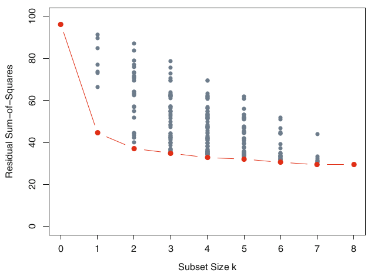
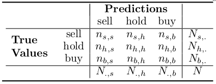

Model Evaluation Methods
==============
author: Louis Luangkesorn
date: February 2016

General principles for model evaluation
=============
type:section

Choosing between models
==================

-  General principles
-  Comparing predictors
-  Comparing classifications


General principles
=====================

1. Flexibility of models.
2. Models that lead to easy interpretation.
3. Simplicity

Flexibility
===========

-  Some models are very flexible
-  e.g. Boosting, Support Vector Machines
-  Likely to be very accurate emperically
-  Con: very difficult to interpret and gain understanding from the results

Interpretation
=============

-  Some model types lend themselves to easy interpretation
-  e.g. regression methods, naive Bayes, association rules
-  May be less accurate emperically, but leads to understanding about the system
-  Very useful if the goal is to inform a person making the decision as opposed to pure machine learning.

Simplicity
============

-  Use the simplest model that is a reasonable approximation of the complex model
   -  Note: a more complex model should be more accurate, but it may not be more accurate by much.
   -  Tradeoff simplicity for accuracy. If the simpler model is within some measure of error of the more complex one, use the simpler model since there is no significant improvement.


Considerations for predictive models
=============

-  Balance between accuracy and overfitting
  -  The goal of the model is to describe the system, not fit the available data.
-  Balance between identifying all members of a target class and overfitting to the data set you happen to have.

Methods for model evaluation
===============
type:section


Regression methods
===============

-  Mean Squared Error based methods
-  Distance methods

Classification methods
==================

-  Receiver operating characteristics
-  Sensitivity vs Specificity
-  Precision vs Recall
-  Lift

Overfitting
===========

- Our goal is to perform the best prediction on future samples, not the samples we already have.
- One danger is that our model is overly specific, it matches the data that we happen to have instead of being a good general model.
- Cross-validation
  1.  Obtain *k* equally sized and random subsets of the training data.
  2.  For each of these *k* subsets, build a model using the remaining *k−1* sets.
  3.  evaluate this model on the *k*th subset.

Summary
=======

When facing a predictive task, we have to make the following decisions:

- Select the alternative models to consider (the models can actually be alternative settings of the same algorithm) for the predictive task(s) we want to address.
- Select the evaluation metrics that will be used to compare the models.
- Choose the experimental methodology for obtaining reliable estimates
of these metrics.

Regression methods using caret
===============================
type: section

The `caret` package enables consistent implementation and evaluation of a range of machine learning models.

```r
library(AppliedPredictiveModeling)
library(caret)
```
Ordinary Linear Regression
================

- Regression requires a function and a data frame as input.
- Returns parameters and model evaluation statistics.

Linear model implementation
===========
- Specify data
-  Specify outcome variable
- Later we will split data for cross-evaluations


```r
data(FuelEconomy)
trainingData <- cars2010
lmFit1 <- lm(FE ~ . - FE, data = trainingData)
```

Linear regression output
========

```

Call:
lm(formula = FE ~ . - FE, data = trainingData)

Residuals:
    Min      1Q  Median      3Q     Max 
-17.261  -1.794   0.065   1.708  21.691 

Coefficients:
                                                Estimate Std. Error
(Intercept)                                       56.740      2.532
EngDispl                                          -2.035      0.249
NumCyl                                            -1.182      0.159
TransmissionA4                                    -6.269      1.457
TransmissionA5                                    -5.676      1.482
TransmissionA6                                    -3.648      1.594
TransmissionA7                                    -3.827      1.785
TransmissionAM6                                   -8.167      1.799
TransmissionAM7                                   -7.941      2.239
TransmissionAV                                    -5.006      1.863
TransmissionAVS6                                  -7.978      2.061
TransmissionM5                                    -5.561      1.484
TransmissionM6                                    -5.872      1.556
TransmissionS4                                    -9.792      1.713
TransmissionS5                                    -6.801      1.527
TransmissionS6                                    -4.161      1.562
TransmissionS7                                    -5.006      1.857
TransmissionS8                                    -0.697      2.225
AirAspirationMethodSupercharged                   -1.345      0.826
AirAspirationMethodTurbocharged                   -0.572      0.328
NumGears                                          -0.516      0.365
TransLockup                                       -0.745      0.372
TransCreeperGear                                  -0.949      0.516
DriveDescFourWheelDrive                           -0.334      0.457
DriveDescParttimeFourWheelDrive                   -0.358      1.121
DriveDescTwoWheelDriveFront                        4.780      0.390
DriveDescTwoWheelDriveRear                         1.353      0.385
IntakeValvePerCyl                                 -0.593      0.771
ExhaustValvesPerCyl                               -1.290      0.768
CarlineClassDesc2Seaters                           3.321      1.230
CarlineClassDescCompactCars                        4.159      1.156
CarlineClassDescLargeCars                          2.712      1.193
CarlineClassDescMidsizeCars                        3.672      1.157
CarlineClassDescMinicompactCars                    3.944      1.257
CarlineClassDescSmallPickupTrucks2WD              -1.607      1.311
CarlineClassDescSmallPickupTrucks4WD              -0.920      1.419
CarlineClassDescSmallStationWagons                 2.664      1.193
CarlineClassDescSpecialPurposeVehicleminivan2WD   -2.136      1.437
CarlineClassDescSpecialPurposeVehicleSUV2WD       -1.303      1.169
CarlineClassDescSpecialPurposeVehicleSUV4WD       -0.245      1.183
CarlineClassDescStandardPickupTrucks2WD           -1.082      1.336
CarlineClassDescStandardPickupTrucks4WD           -1.387      1.369
CarlineClassDescSubcompactCars                     3.346      1.171
CarlineClassDescVansCargoTypes                    -3.407      1.599
CarlineClassDescVansPassengerType                 -3.551      2.055
VarValveTiming                                     0.436      0.303
VarValveLift                                       0.861      0.318
                                                t value Pr(>|t|)    
(Intercept)                                       22.41  < 2e-16 ***
EngDispl                                          -8.17  8.6e-16 ***
NumCyl                                            -7.45  1.9e-13 ***
TransmissionA4                                    -4.30  1.8e-05 ***
TransmissionA5                                    -3.83  0.00014 ***
TransmissionA6                                    -2.29  0.02228 *  
TransmissionA7                                    -2.14  0.03231 *  
TransmissionAM6                                   -4.54  6.3e-06 ***
TransmissionAM7                                   -3.55  0.00041 ***
TransmissionAV                                    -2.69  0.00731 ** 
TransmissionAVS6                                  -3.87  0.00012 ***
TransmissionM5                                    -3.75  0.00019 ***
TransmissionM6                                    -3.77  0.00017 ***
TransmissionS4                                    -5.71  1.4e-08 ***
TransmissionS5                                    -4.45  9.3e-06 ***
TransmissionS6                                    -2.66  0.00783 ** 
TransmissionS7                                    -2.70  0.00714 ** 
TransmissionS8                                    -0.31  0.75420    
AirAspirationMethodSupercharged                   -1.63  0.10363    
AirAspirationMethodTurbocharged                   -1.74  0.08142 .  
NumGears                                          -1.41  0.15769    
TransLockup                                       -2.00  0.04559 *  
TransCreeperGear                                  -1.84  0.06641 .  
DriveDescFourWheelDrive                           -0.73  0.46516    
DriveDescParttimeFourWheelDrive                   -0.32  0.74935    
DriveDescTwoWheelDriveFront                       12.26  < 2e-16 ***
DriveDescTwoWheelDriveRear                         3.52  0.00045 ***
IntakeValvePerCyl                                 -0.77  0.44189    
ExhaustValvesPerCyl                               -1.68  0.09346 .  
CarlineClassDesc2Seaters                           2.70  0.00704 ** 
CarlineClassDescCompactCars                        3.60  0.00034 ***
CarlineClassDescLargeCars                          2.27  0.02315 *  
CarlineClassDescMidsizeCars                        3.17  0.00154 ** 
CarlineClassDescMinicompactCars                    3.14  0.00174 ** 
CarlineClassDescSmallPickupTrucks2WD              -1.23  0.22056    
CarlineClassDescSmallPickupTrucks4WD              -0.65  0.51661    
CarlineClassDescSmallStationWagons                 2.23  0.02580 *  
CarlineClassDescSpecialPurposeVehicleminivan2WD   -1.49  0.13743    
CarlineClassDescSpecialPurposeVehicleSUV2WD       -1.11  0.26517    
CarlineClassDescSpecialPurposeVehicleSUV4WD       -0.21  0.83622    
CarlineClassDescStandardPickupTrucks2WD           -0.81  0.41799    
CarlineClassDescStandardPickupTrucks4WD           -1.01  0.31114    
CarlineClassDescSubcompactCars                     2.86  0.00435 ** 
CarlineClassDescVansCargoTypes                    -2.13  0.03336 *  
CarlineClassDescVansPassengerType                 -1.73  0.08430 .  
VarValveTiming                                     1.44  0.15026    
VarValveLift                                       2.70  0.00697 ** 
---
Signif. codes:  0 '***' 0.001 '**' 0.01 '*' 0.05 '.' 0.1 ' ' 1

Residual standard error: 3.32 on 1060 degrees of freedom
Multiple R-squared:  0.813,	Adjusted R-squared:  0.804 
F-statistic: 99.9 on 46 and 1060 DF,  p-value: <2e-16
```

Look at R^2 and RMSE
=========

- To get RMSE, look at predictors


```r
lmFitPred1 <-predict(lmFit1, cars2010[,-4])
lmFitValues1 <- data.frame(obs=cars2010[,c("FE")], pred=lmFitPred1)
defaultSummary(lmFitValues1)
```

```
    RMSE Rsquared 
  3.2450   0.8125 
```

Model evaluation
================
- Model evaluation is best done through cross-validation
- Cross validation generates a model using training data
- Test using holdout data
- Multiple cross validation using different holdout data sets generate a mean and standard error for model predictive performance.
-  We can use statistical methods like Mean Squared Error based methods when the prediction is a value that can be compared to the actual value.
-  Similar to methods used in developing regression models (Least Squared Error)

Model criteria
==============

-  Mean absolute error (MAE) between predictions and real values of the target variables.
-  Mean squared error (MSE)
-  Normalized mean squared error (NMSE)

Scatter plot with prediction
======================


```r
carsplot <- cars2010
carsplot$Pred1 <- lmFitPred1
qplot(Pred1, FE, data=carsplot, main = "Linear Model", xlab = "Predictions", ylab = "True Values") + geom_smooth(method="lm")
```


Absolute error
====

-  Take the average of the absolute value of difference between prediction and actual value


```r
(mae.a1.lm <- mean(abs(carsplot$Pred1 - cars2010[,"FE"])))
```

```
[1] 2.282
```

Note that units are the same units as the measurement

Mean squared error
=================

- Square the errors to penalize distance between prediction and actual.
- Take average of squared errors.

MSE Calculations
=============

```r
(mse.a1.lm <- mean(mean(abs(carsplot$Pred1 - cars2010[,"FE"]))^2))
```

```
[1] 5.21
```

Normalized mean squared error
=============================

-  Divide by the square of the difference between observations and the mean.
-  NMSE controls for the variance in the population so it gives values that are comparable between sample populations.
-  Result is a ratio.

NMSE Calculations
==========


```r
(nmse.a1.lm <- mean(((carsplot$Pred1 - cars2010[,"FE"]))^2)/
   mean((mean(cars2010[,"FE"])-cars2010[,"FE"])^2))
```

```
[1] 0.1875
```

Distance based metrics
=============

-  Create a metric that looks at the distance between the prediction and actual.
-  Note: this is context dependent!
-  Need to define a distance metric. (e.g. square root of some of squares)
-  Need to control for the variation that is in the data.
-  Normalization controls for the variation by dividing the distance by a measure of variation.

Normalized Distance
=======

-  Look at the distance between a prediction and actual by normalied against the InterQuartile Range (IQR).
-  NDTP(u) - Normalized distance to typical price
$$NDTP_p(u)=\frac{|u-\widetilde{U}_p|}{IQR_p}$$
-  Unit price of observation minus the median of the unit prices of the product divided by the IQR of the unit prices of the product.
  -  If IQR==0, set $IQR = \widetilde{U_p}$


Using cross validation
=========================

- Determine model type (e.g. Linear regression)
- Determine cross validation methods using `trainControl`
- Set random number seed
- Train model using random holdout sets based on cross validation method

Cross validation example
==========

```r
ctrl = trainControl(method="cv", number = 10)
set.seed(100)
lmFit1 <- train(x = cars2010[,-4], y=cars2010[,4],
                method="lm", trControl=ctrl)
lmFit1
```

```
Linear Regression 

1107 samples
  13 predictors

No pre-processing
Resampling: Cross-Validated (10 fold) 
Summary of sample sizes: 996, 997, 996, 996, 996, 996, ... 
Resampling results

  RMSE   Rsquared  RMSE SD  Rsquared SD
  3.394  0.7973    0.4591   0.02991    

 
```

Regression trees (with caret)
============================

Repeat model evaluation and comparison between regression trees and linear regression
===========================================


Cross validation 
==================

Subset selection methods
==================================
type: subsection

Subset selection
===================

-  To evaluate a regression model, we can look at the coefficient of variation of the error.
-  $CV = \frac{\sigma}{\mu}$
-  But, in general, more terms lead to lower $\sigma$.
-  Need to balance lower errors against model complexity



Results of cross-validation
================================

-  For each candidate model (subset size), cross validation will generate a series of estimates of error.
-  This gives the *estimated prediction error* and standard error bands
-  Identify the best model.
-  Take the sum of the mean error plus the standard error (standard deviation of error).
-  Find the model with the smallest subset size that is less than this sum.

Estimated prediction error curves
=============================


Classification methods
==================
type: section

**REMOVE SECTION ON CLASSIFICATION METHODS**
**LECTURE 17 USES CARET FOR CLASSIFICATION METHODS**

Methods for evaluating classifications
========

-  Confusion matrix
-  Precision vs Recall
-  Sensitivity vs Specificity
-  Receiver operating characteristics
-  Sensitivity vs Specificity
-  Lift


Confusion matrix
=====================

-  *Precision* - Proportion of event signals created by the model that are correct.
-  *Recall* - Proportion of events that are signaled by the models.
-  Confusion matrix



Precision and recall
====================

- Precision
$$Prec=\frac{n_{s,s} + n_{b,b}}{N_{.,s}+N_{.,b}}$$
- Recall
$$Rec=\frac{n_{s,s} + n_{b,b}}{N_{s,.}+N_{b,.}}$$
- Combine these to form the *F-measure*
$$F=\frac{\beta^2+1 * Prec * Rec}{\beta^2 * Prec + Rec}$$
- Where $0\leq \beta \leq 1$
- *F-measure*  uses $\beta$ to specify the relative importance of recall to precision.

Precision - recall curve example
=====================

```r
library(ROCR)
data(ROCR.simple)
pred <- prediction(ROCR.simple$predictions, ROCR.simple$labels)
perf <- performance(pred, "prec", "rec")
plot(perf)
```


Sensitivity and specificity
=======================

-  For a two-class problem, a prediction can be evaluated in two ways

1.  The rate that an event is predicted correctly *sensitivity* - or *True positive*
2.  The rate that non-events are predicted correctly *specificity* - or *True negative*
  -  1 - *specificity* =  *False positive*

Sensitivity and specificity
===================

-  Sensitivity

$$\frac{\text{\# Samples with the event AND predicted to have the event}}{\text{\# samples having the event}}$$

-  Specificity

$$\frac{\text{\# Samples without the event AND predicted as nonevents}}{\text{\# samples without the event}}$$

- *J index* combines these
$$J = Sensitivity + Specificity -1$$

Positive and Negative Predictive Value
=====================

-  PPV - If the prediction method predicts positive, what is the probability of the sample being positive?
-  NPV - If the prediction method predicts negative, what is the probability of the sample being negative?


Sensitivity and specificity
==================

Predicted | Observed |_
----------|----------|------------
          | **Event**    | **Non-event**
Event     | TP       |  FP
Non-event | FN       |  TN


```r
sensspec <- performance(pred, "sens", "spec")
plot(sensspec)
```


Receiver Operating Characteristic (ROC)
==================

-  Taken from the radio electronics industry.
-  Can the instrument detect a signal from noise.
-  Combines Sensitivity and Specificity
-  Plot *1 - Specificity* against *Sensitivity* (FPR vs TPR)
-  AUC - Area Under ROC curve

ROC curve
========

-  Evaluate a model against a continuum of thresholds.
-  Thresholds are scores used to separate the range of possible observations into two potential classes.
-  For each threshold, determine the resulting Specificity and Sensitivity.
-  Plot on ROC chart.
-  A perfect model has 100% Sensitivity and specificity.
-  In practice, higher sensitivity leads to lower specificity (being able to identify all representatives of a class leads to also having false positives)


True positive rate vs false positive rate
=====


```r
pred <- prediction(ROCR.simple$predictions, ROCR.simple$labels)
perf <- performance(pred, "tpr", "fpr")
plot(perf, main="ROC Curve")
```


Lift charts
=============

-  Evaluate a model against a complete random selection of samples.

1.  Predict a set of samples that were not used in building the model but have known outcomes.
2.  Determine the *baseline* event rate, i.e. the percentage of true events in the data set.
3.  Using the model, order the data by classification probability (i.e. the samples most likely to be events first)
4.  For each class probability value, calculate the actual percentage of true eents in all samples below the probability value.
5. Divide the percent of true events for each probability threshold by the baseline event rate.  Fraction is the lift (>1.0)
- Cumulative recall charts also

Lift chart example
============


```r
par(mfrow=c(1,2))
pred <- prediction(ROCR.simple$predictions, ROCR.simple$labels)
perf <- performance(pred, "lift", "rpp")
plot(perf, main="Lift Chart")
cp <- performance(pred, "rec", "rpp")
plot(cp, main="Cumulative recall chart")
```


```r
par(mfrow=c(1,1))
```


