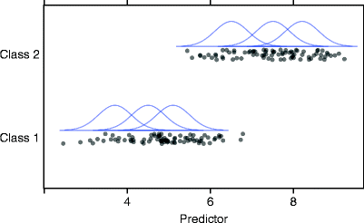
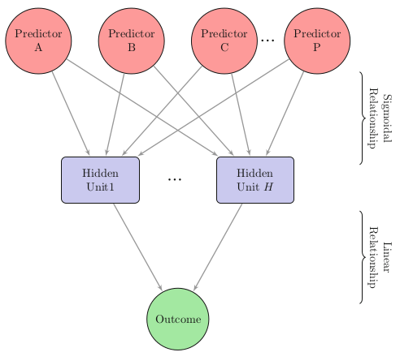
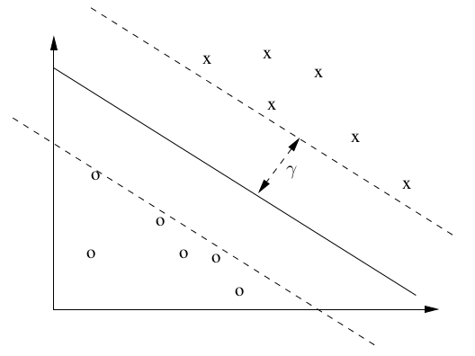

```{r loadlibraries, echo=FALSE}
################################################################################
### R code from Applied Predictive Modeling (2013) by Kuhn and Johnson.
### Copyright 2013 Kuhn and Johnson
### Web Page: http://www.appliedpredictivemodeling.com
### Contact: Max Kuhn (mxkuhn@gmail.com) 
###
### Chapter 13 Non-Linear Classification Models
###
### Required packages: AppliedPredictiveModeling, caret, doMC (optional) 
###                    kernlab, klaR, lattice, latticeExtra, MASS, mda, nnet,
###                    pROC
###
### Data used: The grant application data. See the file 'CreateGrantData.R'
###
### Notes: 
### 1) This code is provided without warranty.
###
### 2) This code should help the user reproduce the results in the
### text. There will be differences between this code and what is is
### the computing section. For example, the computing sections show
### how the source functions work (e.g. randomForest() or plsr()),
### which were not directly used when creating the book. Also, there may be 
### syntax differences that occur over time as packages evolve. These files 
### will reflect those changes.
###
### 3) In some cases, the calculations in the book were run in 
### parallel. The sub-processes may reset the random number seed.
### Your results may slightly vary.
###
################################################################################

################################################################################
### Section 13.1 Nonlinear Discriminant Analysis

options(digits=4)
#load("07_nonlinear.RData")
load("13_Non-Linear_Class.Rdata")
library(caret)
library(pROC)
#library(doMC)
#registerDoMC(2)
```
Nonlinear classification models
================

-  Linear classification models work through defining boundaries that were linear functions of the predictors.
-  In *quadratic discriminant models* the boundaries between classes can be quadratically curvilinear.
-  More complex boundaries, but may require fewer boundaries (because you do not need as many linear segments to define a class boundary)
-  Tends not to be useful when many variables are indicator variables (linear boundaries are adequate here)


Mechanics
============

-  Use grant application data
-  Use LGOCV (Leave Group Out CV)

```
ctrl <- trainControl(method = "LGOCV",
             summaryFunction = twoClassSummary,
             classProbs = TRUE,
             index = list(TrainSet = pre2008),
             savePredictions = TRUE)
```

Mixture Discriminant Analysis
===================

-  If linear discriminant analysis assumed that each class had a distribution of predictors that were normally distributed.
-  MDA allows for subclasses that are normally distributed.
-  Number of subclasses is the level of complexity.



MDA implementation
==============

```{r}
set.seed(476)
mdaFit <- train(x = training[,reducedSet], 
          y = training$Class,
          method = "mda",
          metric = "ROC",
          tries = 40,
          tuneGrid = expand.grid(subclasses = 1:8),
          trControl = ctrl)
```

MDA result - confusion matrix
=============

```{r mixturediscrimantanalysisoutput, echo=FALSE}
mdaFit

mdaFit$results <- mdaFit$results[!is.na(mdaFit$results$ROC),]                
mdaFit$pred <- merge(mdaFit$pred,  mdaFit$bestTune)
mdaCM <- confusionMatrix(mdaFit, norm = "none")
mdaCM$table
```
```
mdaRoc <- roc(response = mdaFit$pred$obs,
        predictor = mdaFit$pred$successful,
        levels = rev(levels(mdaFit$pred$obs)))
```

MDA - ROC AUC vs subclasses per class
=============
```{r mdaroc, echo=FALSE}
mdaRoc
update(plot(mdaFit, ylab = "ROC AUC (2008 Hold-Out Data)"))
```

Neural Networks
===========

-  We can represent $C$ potential class outcomes as $C$ binary indicator variables.
-  Then the neural network will predict $C$ different probabilities as a linear model of a set of hidden factors.
-  Each hidden factor is a linear model of another combination of hidden units.
-  The first set of hidden units is a linear model of combinations of observable parameters.
-  Number of hidden layers is the measure of complexity.


Neural Network mechanics
====================

-  Like the logistic regression, we want probabilities.
-  Sigmoidal function (same as with logistic regression) generates a set of probabilities.
-  Create hidden units based on the observed predictors, then do the final prediction based on the hidden units.
-  There can be multiple layers of hidden units. When taken to an extreme it results in the Google inception art project.

Neural network illustration
======



Implementation
================

- Tuned by number of units in hidden layer and the weight decay.
-  Preprocessing will center and scale the data so that each observation variable values are in terms of the mean and standard deviation of that variable. 
-  SpatialSign - projection of vector onto a unit length circle (1 1-norm)
```
nnetGrid <- expand.grid(size = 1:10, decay = c(0, .1, 1, 2))
maxSize <- max(nnetGrid$size)

nnetFit <- train(x = training[,reducedSet], 
           y = training$Class,
           method = "nnet",
           metric = "ROC",
           preProc = c("center", "scale"),
           tuneGrid = nnetGrid,
           trace = FALSE,
           maxit = 2000,
           MaxNWts = 1*(maxSize * 
              (length(reducedSet) + 1) + maxSize + 1),
           trControl = ctrl)
```            

Results for model 1 - Simple network model
===============


```{r nnet1results, echo=FALSE}
nnetFit
```
```
set.seed(476)
nnetFit2 <- train(x = training[,reducedSet], 
              y = training$Class,
              method = "nnet",
              metric = "ROC",
              preProc = c("center", "scale", "spatialSign"),
              tuneGrid = nnetGrid,
              trace = FALSE,
              maxit = 2000,
              MaxNWts = 1*(maxSize * 
                  (length(reducedSet) + 1) + maxSize + 1),
              trControl = ctrl)
```

Second model - Add additional preprocessing (SpatialSign)
============
```{r nnet2, echo=FALSE}
nnetFit2
```
```
nnetGrid$bag <- FALSE

set.seed(476)
nnetFit3 <- train(x = training[,reducedSet], 
              y = training$Class,
              method = "avNNet",
              metric = "ROC",
              preProc = c("center", "scale"),
              tuneGrid = nnetGrid,
              repeats = 10,
              trace = FALSE,
              maxit = 2000,
              MaxNWts = 10*(maxSize * (length(reducedSet) + 1) + maxSize + 1),
              allowParallel = FALSE, 
              ## this will cause to many workers to be launched.
              trControl = ctrl)
```

Neural net model 3 - Use AvNNet package implementation.
```{r nnet3, echo=FALSE}
nnetFit3
```

```
set.seed(476)
nnetFit4 <- train(x = training[,reducedSet], 
              y = training$Class,
              method = "avNNet",
              metric = "ROC",
              preProc = c("center", "scale", "spatialSign"),
              tuneGrid = nnetGrid,
              trace = FALSE,
              maxit = 2000,
              repeats = 10,
              MaxNWts = 10*(maxSize * 
                (length(reducedSet) + 1) + maxSize + 1),
              allowParallel = FALSE, 
              trControl = ctrl)
```

Neural net model 4, use AvNNet implementation with additional preprocessing (SpatialSign)
====
```{r nnet4, echo=FALSE}
nnetFit4
```
```
nnetFit4$pred <- merge(nnetFit4$pred,  nnetFit4$bestTune)
nnetCM <- confusionMatrix(nnetFit4, norm = "none")
```

Neural net model 4 confusion matrix
=========

```{r nnet4confusionmatrix, echo=FALSE}
nnetCM$table
```

```
nnetRoc <- roc(response = nnetFit4$pred$obs,
           predictor = nnetFit4$pred$successful,
           levels = rev(levels(nnetFit4$pred$obs)))


nnet1 <- nnetFit$results
nnet1$Transform <- "No Transformation"
nnet1$Model <- "Single Model"

nnet2 <- nnetFit2$results
nnet2$Transform <- "Spatial Sign"
nnet2$Model <- "Single Model"

nnet3 <- nnetFit3$results
nnet3$Transform <- "No Transformation"
nnet3$Model <- "Model Averaging"
nnet3$bag <- NULL

nnet4 <- nnetFit4$results
nnet4$Transform <- "Spatial Sign"
nnet4$Model <- "Model Averaging"
nnet4$bag <- NULL
```

Looking at all neural net model results
========
```{r nnetresults, echo=FALSE}
nnetResults <- rbind(nnet1, nnet2, nnet3, nnet4)
nnetResults$Model <- factor(as.character(nnetResults$Model),
                            levels = c("Single Model", "Model Averaging"))
```

Plot neural net model ROC
==========
```{r, echo=FALSE}
library(latticeExtra)
useOuterStrips(
  xyplot(ROC ~ size|Model*Transform,
       data = nnetResults,
       groups = decay,
       as.table = TRUE,
       type = c("p", "l", "g"),
       lty = 1,
       ylab = "ROC AUC (2008 Hold-Out Data)",
       xlab = "Number of Hidden Units",
       auto.key = list(columns = 4, 
                   title = "Weight Decay", 
                   cex.title = 1)))
```

ROC curve
=========
```{r, echo=FALSE}
plot(nnetRoc, type = "s", legacy.axes = TRUE, print.auc=TRUE)
```


Flexible discriminant analysis
=======================

-  We can modify linear discriminant analysis to use other regression methods to define the class boundaries
  -  e.g. lasso, ridge regression, MARS
-  Tuning based the type of linear model. (e.g. retained terms for lasso or MARS)
  
```
set.seed(476)
fdaFit <- train(x = training[,reducedSet], 
          y = training$Class,
          method = "fda",
          metric = "ROC",
          tuneGrid = expand.grid(degree = 1, nprune = :25),
          trControl = ctrl)
```
```{r, echo=FALSE}
fdaFit
```
```
fdaFit$pred <- merge(fdaFit$pred,  fdaFit$bestTune)
fdaCM <- confusionMatrix(fdaFit, norm = "none")
fdaCM

fdaRoc <- roc(response = fdaFit$pred$obs,
          predictor = fdaFit$pred$successful,
          levels = rev(levels(fdaFit$pred$obs)))
```

FDA parameter tuning ROC plot
====
```{r, echo=FALSE}
update(plot(fdaFit), ylab = "ROC AUC (2008 Hold-Out Data)")
```

===

```{r, echo=FALSE}
plot(nnetRoc, type = "s", col = rgb(.2, .2, .2, .2), legacy.axes = TRUE)
```

Support Vector Machines
=======
left: 60%
- Similar to the regression version, generate boundaries to define classes.
- Define planes that represent the best boundaries between classes
  - recognizing there are no perfect boundaries.
  - Planes are scored by distance from boundary to points (greater is better) and penalized for points on wrong side or too close to boundary (within the margin)
***



```
library(kernlab)

set.seed(201)
sigmaRangeFull <- sigest(as.matrix(training[,fullSet]))
svmRGridFull <- expand.grid(sigma =  as.vector(sigmaRangeFull)[1],
                            C = 2^(-3:4))
set.seed(476)
svmRFitFull <- train(x = training[,fullSet], 
                     y = training$Class,
                     method = "svmRadial",
                     metric = "ROC",
                     preProc = c("center", "scale"),
                     tuneGrid = svmRGridFull,
                     trControl = ctrl)
```

Example SVM output
==========
```{r, echo=FALSE}
svmRFitFull$finalModel
```

```
set.seed(202)
sigmaRangeReduced <- sigest(as.matrix(training[,reducedSet]))
svmRGridReduced <- expand.grid(sigma = sigmaRangeReduced[1],
                               C = 2^(seq(-4, 4)))
set.seed(476)
svmRFitReduced <- train(x = training[,reducedSet], 
                        y = training$Class,
                        method = "svmRadial",
                        metric = "ROC",
                        preProc = c("center", "scale"),
                        tuneGrid = svmRGridReduced,
                        trControl = ctrl)
```

SVM with reduced set of predictors
=============
```{r, echo=FALSE}
svmRFitReduced$finalModel
```

```
svmPGrid <-  expand.grid(degree = 1:2,
                         scale = c(0.01, .005),
                         C = 2^(seq(-6, -2, length = 10)))

set.seed(476)
svmPFitFull <- train(x = training[,fullSet], 
                     y = training$Class,
                     method = "svmPoly",
                     metric = "ROC",
                     preProc = c("center", "scale"),
                     tuneGrid = svmPGrid,
                     trControl = ctrl)
```

```
svmPFitFull
```

```
svmPGrid2 <-  expand.grid(degree = 1:2,
                          scale = c(0.01, .005),
                          C = 2^(seq(-6, -2, length = 10)))
set.seed(476)
svmPFitReduced <- train(x = training[,reducedSet], 
                        y = training$Class,
                        method = "svmPoly",
                        metric = "ROC",
                        preProc = c("center", "scale"),
                        tuneGrid = svmPGrid2,
                        fit = FALSE,
                        trControl = ctrl)
```
```
svmPFitReduced
```
```
svmPFitReduced$pred <- merge(svmPFitReduced$pred,  svmPFitReduced$bestTune)
svmPCM <- confusionMatrix(svmPFitReduced, norm = "none")
svmPRoc <- roc(response = svmPFitReduced$pred$obs,
           predictor = svmPFitReduced$pred$successful,
           levels = rev(levels(svmPFitReduced$pred$obs)))


svmRadialResults <- rbind(svmRFitReduced$results,
                          svmRFitFull$results)
svmRadialResults$Set <- c(rep("Reduced Set", nrow(svmRFitReduced$result)),
                          rep("Full Set", nrow(svmRFitFull$result)))
svmRadialResults$Sigma <- paste("sigma = ", 
                                format(svmRadialResults$sigma, 
                                       scientific = FALSE, digits= 5))
svmRadialResults <- svmRadialResults[!is.na(svmRadialResults$ROC),]
```

SVM ROC with a few different SVM models
====================

```{r, echo=FALSE}
xyplot(ROC ~ C|Set, data = svmRadialResults,
       groups = Sigma, type = c("g", "o"),
       xlab = "Cost",
       ylab = "ROC (2008 Hold-Out Data)",
       auto.key = list(columns = 2),
       scales = list(x = list(log = 2)))
```

```
svmPolyResults <- rbind(svmPFitReduced$results,
                        svmPFitFull$results)
svmPolyResults$Set <- c(rep("Reduced Set", nrow(svmPFitReduced$result)),
                        rep("Full Set", nrow(svmPFitFull$result)))
svmPolyResults <- svmPolyResults[!is.na(svmPolyResults$ROC),]
svmPolyResults$scale <- paste("scale = ", 
                              format(svmPolyResults$scale, 
                                     scientific = FALSE))
svmPolyResults$Degree <- "Linear"
svmPolyResults$Degree[svmPolyResults$degree == 2] <- "Quadratic"
useOuterStrips(xyplot(ROC ~ C|Degree*Set, data = svmPolyResults,
                      groups = scale, type = c("g", "o"),
                      xlab = "Cost",
                      ylab = "ROC (2008 Hold-Out Data)",
                      auto.key = list(columns = 2),
                      scales = list(x = list(log = 2))))
```

Neural Net vs. FDA vs. SVM
==========
```{r}
plot(nnetRoc, type = "s", col = rgb(.8, .2, .2, .2), legacy.axes = TRUE)
plot(fdaRoc, type = "s", add = TRUE, col = rgb(.2, .8, .2, .2), legacy.axes = TRUE)
plot(svmPRoc, type = "s", add = TRUE, col = rgb(.2, .2, .8, .2), legacy.axes = TRUE)
```

K-Nearest Neighbors
====

-  For each observation, make prediction based on polling the nearest $N$ trained data points.
-  'nearest' needs to be defined. Usually use Euclidean metrics (square root of the sum of the squares of differences in predictors)
-  Typically, you would center and scale predictors first.

```
set.seed(476)
knnFit <- train(x = training[,reducedSet], 
                y = training$Class,
                method = "knn",
                metric = "ROC",
                preProc = c("center", "scale"),
                tuneGrid = data.frame(k = c(4*(0:5)+1,20*(1:5)+1,50*(2:9)+1)),
                trControl = ctrl)
```

kNN output
=============
```{r, echo=FALSE}
knnFit$finalModel
```

KNN Confusion matrix
=====
```
knnFit$pred <- merge(knnFit$pred,  knnFit$bestTune)
knnCM <- confusionMatrix(knnFit, norm = "none")
```
```{r, echo=FALSE}
knnCM$table
```
KNN ROC plot
===========
```
knnRoc <- roc(response = knnFit$pred$obs,
              predictor = knnFit$pred$successful,
              levels = rev(levels(knnFit$pred$obs)))
```
```{r, echo=FALSE}
update(plot(knnFit, ylab = "ROC (2008 Hold-Out Data)"))
```

Comparisons plot of FDA, Neural Net, SVM, KNN
=====
```{r, echo=FALSE, message=FALSE}
plot(fdaRoc, type = "s", col = rgb(.8, .2, .2, .2), legacy.axes = TRUE)
plot(nnetRoc, type = "s", add = TRUE, col = rgb(.2, .8, .2, .2), legacy.axes = TRUE)
plot(svmPRoc, type = "s", add = TRUE, col = rgb(.2, .2, .8, .2), legacy.axes = TRUE)
plot(knnRoc, type = "s", add = TRUE, legacy.axes = TRUE)
```

Naive Bayes
=====

- Bayes rule - Based on the predictors observed, what is the conditional probability of the outcome.

$$P(Y=C_{l}|X)= \frac{P(Y) P(X|Y=C_{l})}{P(X)}$$

-  $P(Y)$ is the prior probability
-  $P(X)$ is the probability of the predictor values
-  $P(X|Y=C_l)$ is the conditional probability
-  But $Y$ can be very complex (conditioning on many variables)

Naive Bayes - Simplifying Bayes rule
=============

- Naive Bayes simplifies Bayes rule by assuming all predictors are independent of the others.

$$P(X|Y=C_l) = \Pi_{j=1}^P P(X_j|Y=C_l)$$

-  So instead of calculating joint probabilities, multiply conditionals.
-  Assumption is false, but is often close enough for a good predictor.
-  We need to make a check along the way for issues such as conditional observed frequencies = 0


```{r, echo=FALSE}
factors <- c("Sponsor.Code", "ContractValueBand", "Month", "Weekday")

nbPredictors <- factorPredictors[factorPredictors %in% reducedSet]
nbPredictors <- factorPredictors[]
#nbPredictors <- c(nbPredictors, factors)
nbPredictors <- nbPredictors[nbPredictors != "SponsorUnk"]
```
```
nbTraining <- training[, c("Class", nbPredictors)]
nbTesting <- testing[, c("Class", nbPredictors)]

for(i in nbPredictors)
{
  if(length(unique(training[,i])) <= 15)
  {
    nbTraining[, i] <- factor(nbTraining[,i], levels = paste(sort(unique(training[,i]))))
    nbTesting[, i] <- factor(nbTesting[,i], levels = paste(sort(unique(training[,i]))))
  }
}

set.seed(476)
nBayesFit <- train(x = nbTraining[,nbPredictors],
                   y = nbTraining$Class,
                   method = "nb",
                   metric = "ROC",
                   tuneGrid = data.frame(usekernel = c(TRUE, FALSE), fL = 2),
                   trControl = ctrl)
```

Naive Bayes model
==============
```{r, echo=FALSE}
#load("nBayesFit.RData")
nBayesFit$finalModel$apriori
```

Naive Bayes confusion matrix
==============
```{r, echo=FALSE}
nBayesFit$pred <- merge(nBayesFit$pred,  nBayesFit$bestTune)
nBayesCM <- confusionMatrix(nBayesFit, norm = "none")
nBayesCM$table
```

```{r, echo=FALSE}
nBayesRoc <- roc(response = nBayesFit$pred$obs,
                 predictor = nBayesFit$pred$successful,
                 levels = rev(levels(nBayesFit$pred$obs)))
```
Neural Net vs. Naive Bayes ROC
=====
```{r, echo=FALSE, message=FALSE, warning=FALSE}
plot(nnetRoc, type = "s", col = rgb(.2, .2, .2, .2), legacy.axes = TRUE, print.auc=TRUE )
```
***
```{r, echo=FALSE, message=FALSE, warning=FALSE}
plot(nBayesRoc, type = "s", legacy.axes = TRUE, print.auc=TRUE)
```

