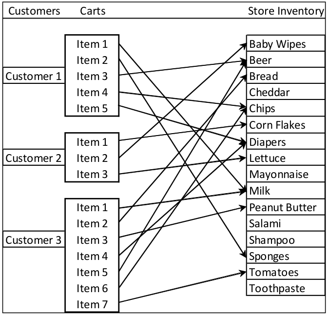
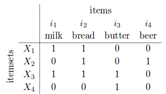

Introduction
==================
type: section


Why use Frequent Pattern Mining?
================================

-  One common purpose of data mining is to discover novel patterns in the data.
-  How can we find if elements in the data are related?
-  *Association Rules* are one example of an *Unsupervised learning* method.
  - You have not provided the procedure with examples of what *correct* answers look like, so the method needs to search for candidate correct answers.


Association Rules
=================
type: section

Association Rules Illustrated
=============================
left: 40%
- Grocery customers and shopping baskets.
- What items are commonly bought together?
- If you were told an answer, what would you want to know about it?

***



Affinity analysis
=================

-  Consider many possible propositions of combinations (rules).
-  Evaluate the database of transactions to evaluate a list of rules for *support*.
-  *support* - portion of cases that particular pair appears.
-  *confidence* - of the cases where one member appears, the portion of the time where the second member of a pair appears.


Groceries example
=================

Let's look at some data.

```{r}
library(arules)
data(Groceries)
```

Grocery summary
===============
```{r}
summary(Groceries)
```

Data structure
================

-  Sparse matrix
-  Which items are most frequent?
-  How many items in a cart?

Itemset matrix example
======================



Some common items
=================
```{r}
itemFrequencyPlot(Groceries,support=0.1,cex.names=0.5)
```

Association rules algorithms
============================

- `apriori()`
- `eclat()`
-  Parameter sets
  -  `parameter` changes the characteristics of the ruleset (e.g. *support, confidence, maxlen*)
  -  `control` influences the performance (e.g. sorting)
  -  `appearance` - Any restrictions
-  Changing parameter values changes the results (size of subsets, number of rules generated tai)

apriori
========

```{r}
ruleset1 <-apriori(Groceries,parameter=list(support=0.005, confidence=0.5))
```

Reduce the number of rules
==========================
```{r}
ruleset2 <- apriori(Groceries,parameter=list(support=0.01, confidence=0.5))
```

Look at the result
==================
```{r}
summary(ruleset2)
```

lift
======

-  How do you determine how *interesting* a rule is?
-  A measure of *support* for a rule.
  -  Gives increased weight where the Left Hand Side or Right Hand Side occur rarely, but when they do occur, occur together.
-  Larger lift is more *interesting*

Take a closer look at the results
=================================
```{r}
inspect(ruleset2)
```


Now for a visual inspection of results
======================================
```{r}
library(arulesViz)
plot(ruleset1)
```

See if there are any good rules from the larger set
===================================================
```{r}
goodrules <- ruleset1[quality(ruleset1)$lift > 3.0]
inspect(goodrules)
```

Data preparation example
===============================
type:section

Epub downloads
==============
Electronic book downloads from Vienna University of Economics

```{r}
data(Epub)
Epub
```

Get more information
====================
```{r}
summary(Epub)
```

See how it changes over time
=============================

```{r}
year <- strftime(as.POSIXlt(transactionInfo(Epub)[["TimeStamp"]]), "%Y")
table(year)
```

Look at one years worth of downloads
====================================
```{r}
epub2003 <- Epub[year=="2003"]
length(epub2003)
image(epub2003)
```

Let's look at only long transactions 
====================================
```{r}
transactionInfo(epub2003[size(epub2003) > 20])
```

Let's take a closer look
========================
```{r}
inspect(epub2003[1:5])
```

What if I want transactions per document
========================================

Coerce into a vertical layout with transaction ID list for each document.
```{r}
epubTidLists <- as(Epub, "tidLists")
as(epubTidLists[5], 'list')
```

Questionnaire data example
==========================

-  Source:  1994 U.S. Census
-  48842 records
-  Filtered so that `AAGE>16` and `AGI>100`
  -  Adults with non-zero income
-  Can we determine if 

```{r}
data("AdultUCI")
dim(AdultUCI)
```

Data summary
============
```{r}
summary(AdultUCI)
```

Take a closer look
==================
```{r}
AdultUCI[1:2,]
```
Clean data
==========
  
Remove a weighting calculation and a duplicate education factor
```{r}
AdultUCI[["fnlwgt"]] <- NULL
AdultUCI[["education-num"]] <- NULL
```

Map some other values to categorical variables
==============================================
```{r}
AdultUCI[[ "age"]] <- ordered(cut(AdultUCI[[ "age"]],                          c(15,25,45,65,100)), labels = c("Young", "Middle-aged", "Senior", "Old"))
AdultUCI[[ "hours-per-week"]] <- ordered(cut(AdultUCI[["hours-per-week"]], c(0,25,40,60,168)),labels = c("Part-time", "Full-time", "Over-time", "Workaholic"))
AdultUCI[[ "capital-gain"]] <- ordered(cut(AdultUCI[[
"capital-gain"]],  c(-Inf,0,median(AdultUCI[[ "capital-gain"]]                  [AdultUCI[[ "capital-gain"]]>0]),Inf)),  labels = c("None", "Low", "High"))
AdultUCI[[ "capital-loss"]] <- ordered(cut(AdultUCI[["capital-loss"]],  c(-Inf,0, median(AdultUCI[[ "capital-loss"]]                   [AdultUCI[[ "capital-loss"]]>0]),Inf)),  labels = c("none", "low", "high"))
```

Convert to a binary incidence matrix through coercion to transactions
============================================================================
```{r}
Adult <- as(AdultUCI, "transactions")
Adult
```

See what we have
=================
```{r}
summary(Adult)
```

Now plot the Item Frequency Plot
=================================

```{r}
itemFrequencyPlot(Adult, support = 0.2, cex.names=0.8)
```

Generate some rules
===================

```{r}
rules <- apriori(Adult,
                 parameter = 
                   list(support = 0.01, confidence = 0.6))
```

Summarize the rules
===================
```{r}
summary(rules)
```

Break data into subset, and limit the number of rules
=====================================================

-  Create rules for both 'income-small' and 'income-large'
-  Limit the number of rules by specifying a minimum lift.

```{r}
rulesIncomeSmall <- subset(rules, subset = 
            rhs %in% "income=small" & lift > 1.2)
rulesIncomeLarge <- subset(rules, subset = 
            rhs %in% "income=large" & lift > 1.2)
```

Inspect the best rules
======================
```{r}
inspect(head(sort(rulesIncomeSmall, by = "confidence"),
             n = 3))
```

Inspect when income large
=========================
```{r}
inspect(head(sort(rulesIncomeLarge, by = "confidence"),
             n = 3))
```

Save the rules
==============

Save these rules using PMML for use in other systems.
```{r}
library(pmml)
write.PMML(rulesIncomeSmall, file = "incomerulessmall.xml")
```

