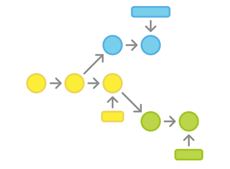

The Data Science Venn Diagram
=============================

The primary colors of data

  - Hacking skills, 
  - Math and statistics knowledge, and 
  - Substantive expertise.

<!--http://drewconway.com/zia/2013/3/26/the-data-science-venn-diagram-->

Hacking skills
==============

-  Programming language - *R*
-  Integrated Development Environment - *R Studio*
-  Source code version control - *Git*

Math and Statistics
===================

R
===

- Most statistical and data analysis methods have been implemented as R packages.
- Installed using `install.packages()` command, or **Tools -> Install Packages** in R-Studio.
- `ggplot` for data visualization.
- `tm` for text manipulation

Rattle
======
-  Data mining interface for R
-  Installing `rattle` automatically installs a large number of data mining and data processing packages.
  - Includes`arules`, `biclust`, `e1071`, `nnet`, `randomforest`, `rpart`, `weightedKmeans`, `pmml`
  
ggplot
======

-  Graphics package
-  Based on *Grammer of graphics*
-  Instead of having different commands for different types of plots, have a unified functional interface that takes different sets of options to produce different plots.
-  Very easy to try different visualizations on the same data set.
  
Substantive areas
=================

Substantive knowledge
=====================

- Tools allow you to perform an analysis, substantive knowledge tells you what questions you are trying to answer.
- Understand your data, the environment that produced the data, the meaning of the data elements.
- Know methods used in your field
  - **CRAN Task Views** can help with implementations of subject specific models.

Git: Version control
====================

Version control
===============

-  Distributed Version Control Systems (DVCS) enable tracking of changes to text based files (e.g. code files).
-  By `commit`ing changes at frequent milestones, you can use DVCS to return to a working version of the code at any point in time.
-  DVCS enable teams to work on the same code base simultaneously, as it assists in reconciling team members work.

Version control terms
=====================

-  repository - The version control history of the project.
-  working directory - The files you do your actual work on.
-  master - The main branch of the project.
-  branch - Work done off of the main branch of the project.  
-  merge - Reconciling a master and a branch
-  remote - A repository other than the directory you do your work on.
-  fork - A copy of a repository created so that a developer can work separately from the main team.  Later, a *pull request* can be made to integrate the changes.

Git basics
==========

Tasks that you need to be able to do

- `git init` - Initialize a repository
- `git clone` - Clone (copy) a remote repository
- `git add` - *Stage* changes - add changes to be tracked in a repository
- `git commit` - Take changes and commits them to the project history
- `git status` - Show the state of the working directory and the staged changes.
- `git fetch` - Downloads updates from a remote repository (but does not change your working directory)
- `git pull` - Download changes from remote repository and merges changes into the working directory.
- `git push` - Uploads committed changes to the remote repository.

Thinking about data
===================

Thinking about data
===================

-  We will spend most of our time looking at how to work with data.
-  But what we need to do first is think about why.
-  Define the problem.

Data as storytelling
====================

-  Our goal is looking at data is insight.
-  The alternative to looking at data is _____.
-  To do better, we need to ask good questions and develop a story.
-  To tell a good story, we need to learn a structure to a story.

Scoping a data project
======================

-  **Co**ntext
-  **N**eeds
-  **V**ision
-  **O**utcome

Context
=======

Context
=======

- Context is the frame that is apart from the particular problem we are trying to solve.
- *The big picture*
- Who is interested in the results of this project?
- What are they generally trying to achieve?
- What overall work is this project contributing to?

Sources of contexts
=====================

- Long term goals
- Organization missions
- Decision points
- Personal curiosity

Needs
======

Needs
======

-  Needs are challenges that are to be met through the data project.
-  Needs should be presented in terms of the organization.
-  The need is NOT build a model/chart/graph. The need is to solve a specific problem.

How can data fill needs
=======================

-  Create knowledge.
-  Understand some part of how the world works.
-  Better understanding leads to better decisions.
-  What will we do differently if we have the knowledge that data gives us?

Learning what the needs are
===========================

-  Talking to people.
-  Ask for stories about what the people involved care about, what they work on, what they are stuck on.
-  Ask questions to dig deeper into what needs to be understood, why, and by whom.

What makes a good need
======================

-  Relates directly to an action that depends on having good information.
-  Information will inform an action.
-  Information could be related to a bigger strategic question in meeting the organizations larger goals.
-  Without a good definition of need, the work is fluff.
-  A need is a problem, the need is never *we need a tool*.

Vision
======

Vision
======

-  Where are we going?
-  What might it look like to achieve our goal?

What does success look like?
============================

-  What are potential results of the data analysis?
-  What kind of argument will you make with the data?
-  What kind of decisions will result from seeing outcomes?

Talking about results
=========================

-  How will the data be used to support the decisions?
-  How should the data be presented to best support the use of the data?
-  Mockups of the output
    -  Example reports of outcomes
    -  Simplified graphs
    -  Sketches of displays or user interfaces to spark discussion of using a tool

Thinking about arguments
=========================

-  The results of data analysis should be a decision.
-  The results need to advocate one choice over another.
-  Question:  What makes a convincing case of one choice over another?  Will the data analysis provide that case?

Aspects of an argument
======================

-  Who needs to be convinced? What is their background, their priorities?
-  Are they interested in subjective or objective measurements?
-  Do they need an experiment?

This defines how simple or complex the data analysis needs to be.

Outcome
=======

Outcome
=======

-  How will the data analysis be used?
-  How will it be integrated into the organization?
-  Who will own the integration?
-  Who will use it?
-  How will success be measured?

Who will have to use the results
===

-  Who will interpret or act on the work?
-  Who are they?
-  What are their requirements?

Who will handle keeping the work relevant?
==========================================

-  Will this need to be rerun at some point?
-  What needs to be adjusted between runs?

What do we hope will change after we finish the work?
========

-  What will change in the organization?
-  How do we verify the change?

Big data
=============

What is Big Data?
=================

-  A recognition that the standard methods and techniques as taught in traditional statistics is inappropriate when data is collected on an automated basis.
-  Traditional statistics research was done on the basis of data scarcity, where data collection was expensive.
-  Design of experiments planned the data collection with the goal of answering a specific question.
-  When data collection became automated, we now had data collection that was not planned for the experiment in question.

Qualities of big data
=====================

- Volume
- Velocity
- Variety
- + Veracity

Volume
======
-  Data is now collected in large quantities on a mass basis.
-  Reports, transaction data, object tracking, computer servers.
-  The big dividing line: Can the data processing be done on an individual computer?
  -  Volume:  More data then can fit in memory.
  -  Processing capability:  Processing requires more than a PC.

Variety
=======

-  Data can come from many sources.
  -  E.g. combine complaints and locations of fires.
  -  Combine sales data with census data.
-  Data can come in many forms.
  -  Structured tables (DBMS, Spreadsheets)
  -  Unstructured text (reports, Twitter)
  -  Images, video

Velocity
======
left:60%

-  Data can be time sensitive.
-  Static data (census)
-  Changing slowly over time (popularity)
-  Linked to an incident where an immediate response is required (natural disaster, major accident, disease outbreak)

Varacity
========

-  Data is of uncertain origin, of uncertain quality, and of uncertain relevance.
-  Contrast with the case where the data collection is designed for the purpose of doing the analysis.
-  e.g.  data collection errors, typos, misdefined.
-  Note: this has always been true, but now we compute based on this type of data.

> "The government are very keen on amassing statistics. They collect them, add them, raise them to the nth power, take the cube root and prepare wonderful diagrams. But you must never forget that every one of these figures comes in the first instance from the village watchman, who just puts down what he damn pleases." - *Josiah Stamp, UK, 19th century*

Why big data is an issue now
============================

1. Decline in prices of sensors makes it cheaper and easier to collect data.
2. Declining cost of storage and access makes it more practical to have available data.
3. People are more willing to reveal information if it provides benefits to them.
4. *Machine learning* methods allow for using a wider range of data.
5. When data gets to a certain size and variety, conventional statistical tests of significance are not useful, because given the number of potential connections that are being tested, it is likely that something will test as significant.

Dangers with big data
=====================

-  Garbage in, garbage out.
-  More data equals more likely to find anomalies.
-  Linking data equals more potential to find interesting connections.  *Not* necessarily more likely to be significant.

Difficulties in working with big data
=====================================

1.  The more complex the data, the more difficult it is to make sure the data is suitable for our purposes *cleaning the data*.
2.  Rare or unusual events are by nature unpredictable. Data mining does not guarantee that we can understand an event, even if it does help us uncover a pattern.
3.  Linking data sets increases the complexity and the likelihood of finding spurious (false) patterns.