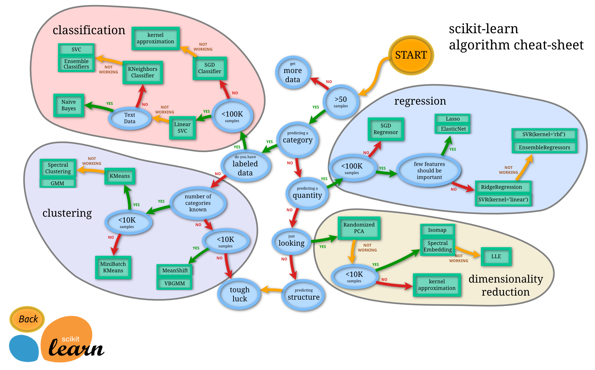

Topics
======

-  Machine learning
-  Motivating regression example
-  Regression
-  Algae bloom example
-  Regression Trees
-  Model evaluation


Machine learning overview
==========================

What to do after EDA?
=====================

After exploratory data analysis, you goal is to process the data and perform analysis

-  Data munging, preparation, and processing
-  Optimization and parameter estimation.
-  Machine learning, data mining

Machine learning algorithms
===========================

- Predict (regression)
- Classify
- Cluster
- Feature selection/dimensionality reduction

Some differences between machine learning and statistics
==================================================

Warning: generalizations.

- **Interpreting parameters** Statisticians regard the parameters as determined by models have real world interpretations. Machine learning are only interested in the predictive power.
- **Confidence intervals** Statisticians provide confidence intervals and posterior distributions for parameters an estimators and are interested in the uncertainty. Machine learning methods don't usually provide confidence intervals and they don't have a meaning.
- **Explicit assumption** Statistical models make explicit assumptions about the data generating process.  Machine learning methods do not make assumptions about the distributions.

Note: data science is somewhere in between these.

Machine Learning
================



Basic predictive algorithms
==============================

- Regression
  - Linear regression
  - Recursive partitioning
- Clustering
  -  *k*-means
- Categorization
  -  *k*-nearest neighbors
- Frequent pattern mining
  - Association Rules


Regression
======

Example: Predicting attendance at a game
========================================================

Australian Football League afl.txt data is found on Courseweb in data folder

```{r, echo=FALSE}
library(ggplot2)
```
An example: Australian Rules Football game attendance
=====================================================

-  Question: Can we predict attendance at AFL games in Melbourne, AUS?
-  AFL is one of only five professional sports leagues in the world with an average attendance above thirty thousand.
-  AFL clubs have memberships that could include tickets to home or away games. (comparable to season ticket holders)
-  Lets try to predict attendance based on membership counts.
- What else should we think about?

Game attendance data
====================

```{r}
attend<-read.delim("data/afl.txt", header=TRUE)
head(attend)
#http://www.statsci.org/data/oz/afl.html
```

Data field
==========

-  MCG - Attendance at the MCG in 1000's.
-	 Temp - Forecasted high temperature in whole degrees C.
-	Other- Attendance at other AFL matches that day in 1000's.
-	Members - Membership. The sum of the memberships of the two clubs playing in 1000's.
- Top50 - Number of players from the top fifty playing.
-	Date 		Date of the match in the format dd/mm/yy.
-	Home 		Abbreviation for home team.
-	Away 		Abbreviation for away team.

What do you think are the dependent and independent variables?

Plot the data
=============

Try plotting attendance vs membership.

```{r}
ggplot(attend, aes(Members, MCG)) + xlab("Combined membership of teams playing") + ylab("MCG Match Day Attendance" ) + geom_point() + theme_bw()

```

Let's try a linear model
========================
```{r}
model1 <- lm(MCG ~ Members-1, data = attend)
summary(model1)
#Create a data.frame to save the prediction
xmin <- floor(min(attend$Members))
xmax <- ceiling(max(attend$Members))
predict1 <- data.frame(Members = attend$Members)
predict1$MCG <- predict(model1, predict1)
```

And plot the linear model
=========================
```{r}
# Scatter plot where the linear regression line is added
ggplot(attend, aes(Members, MCG)) + xlab("Combined membership of teams playing") + ylab("MCG Match Day Attendance" ) + geom_point() + theme_bw()+ geom_line(data=predict1)
```


Maybe it matters if the other team is from out of state
=======================================================

Create a field that identifies if one team is from out of state.
```{r}
attend$away.inter <-
ifelse(attend$Away=="WC" |
       attend$Away=="Adel"|
       attend$Away=="Syd"|
       attend$Away=="Bris",1,0)
```

Try the new model
=================

```{r}
model2<-lm(MCG~Members+away.inter-1, data = attend)
summary(model2)
predict2 <- data.frame(Members = attend$Members, 
                       away.inter = attend$away.inter)
predict2$MCG <- predict(model2, predict2)
ggplot(attend, aes(Members, MCG)) + xlab("Combined membership of teams playing") + ylab("MCG Match Day Attendance" ) + geom_point() + theme_bw()+ geom_line(data=predict2)
```

Linear regression
=================

-  Express the mathematical relationship between an outcome (dependent) variable and one or more predictors (independent) variables.
-  Assumes that the outcome has a linear relationship with the predictors.
-  Thought:  the world is not linear. Why can we still do this?

A linear model
==============
$$y = Ax + b$$
```{r}
summary(model1)
```

Parts of a linear model
=======================

$$y = \beta_0 + \beta_1 x$$

-  *trend* - The optimal line relating the predictor to the outcome.
-  *variation* error of the prediction line from the actual outcome.
-  When using *least squares estimation* the error is normally distributed.

Developing a model
==================

From a basic linear model with one predictor and coefficient we can

1.  Add modeling assumptions about the errors.
2.  Add more predictors.
3.  Transform the predictors.


Evaluating a model
==================

-  *R-squared* - the proportion of the variance in the data explained by the model.
-  *p-values* - The probability that we would observe the data observed if the value of the coefficient is zero.
-  *Cross validation* - Divide the data into a training set and test set.  Fit the model on the training set, then look at the *mean squared error* when using the resulting model on the test set.


Assumptions about errors
========================

$$ y = \beta_0 + \beta_1 x + \epsilon$$

-  Add an error term $\epsilon$
-  Can assume that $\epsilon \approx N(0,\sigma^2)$

Loss functions
==============

- *Mean squared error* Assumes normally distributed error and can rely on the maximum likelihood principle.
- *Absolute error*

Add other predictors
====================

$$y=\beta_0 + \beta_1 x_1 + \beta_2 x_2 + \epsilon$$

-  *multiple linear regression* allows for multiple predictors.
-  Note that each predictor is linear (degree 1)
-  Can also include interactions.
$$y=\beta_0 + \beta_1 x_1 + \beta_2 x_2 + \beta_{1,2} x_1 * x_2 + \epsilon$$

```
model <- lm(y~x1 + x2 + x1*x2)
```


Algae Bloom Example
===================

- Find the frequency of seven types of algae in a set of 140 water samples.


```{r echo=FALSE}
library(DMwR2)
data(algae)
head(algae[,5:10], n=5)
head(algae[,11:18], n=5)
```

Clean the data
==============
```{r}
algae <- algae[-manyNAs(algae),]
clean.algae <- knnImputation(algae, k=10)
```

Linear model with everything
============================
```{r}
lm.a1 <- lm(a1 ~ ., data = clean.algae[,1:12])
summary(lm.a1)
```

Initial observations
====================

-  *R* handled the nominal variables by converting them into factors
  - *seasonspring, seasonsummer, seasonwinter* (what happened to season *autumn*)
  - *size*, *speed*
- For each variable, R gives its value and standard error.
-  We can use *t-test* to compare each coefficient against the null hypothesis.
-  Look at $R^2$ to look at the variation explained by the model as a whole.

Analysis of variance
====================

- Try ANOVA to see what terms contribute the least
```{r}
anova(lm.a1)
```

Remove the lowest contributor
=============================
```{r}
lm2.a1 <- update(lm.a1, . ~ . - season)
summary(lm2.a1)
```

Compare models
==============
```{r}
anova(lm.a1, lm2.a1)
```

Now, repeat until we only have significant factors
==================================================
```{r echo=FALSE}
final.lm <- step(lm.a1)
```
final.lm <- step(lm.a1)
```
```
```{r}
summary(final.lm)
```

Evaluation of results
=====================

-  $R^2$ ?
-  p-value ?
-  Simple ?

Regression trees
================

Recursive Partitioning
======================

-  Build classification or regression models using a two stage procedure.
  -  One version is a Classification and Regression Tree (CART)
  -  Resulting models can be represented as binary trees.
-  Goal: Predict a value by using a hierarchy of logical (TRUE/FALSE) tests on some explanatory variables.

Procedure - Stage 1
===================


1.  Determine the variable which *best* splits the data into two groups.
2.  Repeat the process *separately* to each group.
3.  Repeat until subgroups reach a minimum size or until no improvement can be made.

Procedure - Stage 2
===================

-  Pruning the tree -  Decide how much of the model to retain.
-  Cross validation - Divide the data set into *s* groups, 
  -  For each group, fit the model for the entire data set except for the group, then predict the class for each observation in the group.

The R pruning method called cost complexity pruning (Breiman et al., 1984). This method estimates the value of the parameter `cp` that R calculates for each node of the tree that ensures the best compromise between predictive accuracy and tree size.

Procedure in R
==============

The function rpart() that we have used to obtain our tree only grows the tree, stopping when certain criteria are met. 

1. The decrease in the deviance goes below a certain threshold;
2. the number of samples in the node is less than another threshold; or
3. the tree depth exceeds another value. 

These thresholds are controlled by the parameters `cp, minsplit`, and `maxdepth`, respectively.


Cancer example
=====================

Prostrate cancer example
========================

-  146 stage C cancer patients from a study exploring the prognostic value of flow cytometry.
-  The main clinical endpoint of interest is whether the disease recurs after initial surgical removal
of the prostate, and the time interval to that progression 
-  `status` takes on the value 1 if the disease has progressed and 0 if not.`

Data
=============

- In package `rpart`

```{r}
library(rpart)
data(stagec)
summary(stagec)
```

`stagec` variables
===================

-  `pgtime` time to progression, or last follow-up free of progression
-  `pgstat` status at last follow-up (1=progressed, 0=censored)
-  `age` age at diagnosis
-  `eet` early endocrine therapy (1=no, 0=yes)
-  `ploidy` diploid/tetraploid/aneuploid DNA pattern
-  `g2` % of cells in G2 phase
-  `grade` tumor grade (1-4)
-  `gleason` Gleason grade (3-10)

Fitting the model - Classification
==================================

```{r}
progstat <- factor(stagec$pgstat, levels = 0:1, labels = c("No", "Prog"))
cfit <- rpart(progstat ~ age + eet + g2 + grade + gleason + ploidy, data = stagec, method = 'class')
print(cfit)
```

Plotting tree
=============

```{r echo=FALSE, fig=TRUE}
par(mar = rep(0.1, 4))
plot(cfit, uniform=TRUE)
text(cfit, use.n = TRUE, all=TRUE)
```

Looking at the classification tree
==================================

```{r}
printcp(cfit)
```

Summary of classification tree
==============================

```{r}
summary(cfit, cp=0.1)
```

Algae example
=============

Preprocess algae data
=====================

```{r}
data(algae)
algae <- algae[-manyNAs(algae), ]
```

Regression tree
===============
```{r}
rt.a1 <- rpart(a1 ~ ., data = algae[, 1:12])
rt.a1
```

Plotting regression tree
========================

```{r}
par(mar = rep(0.1, 4))
plot(rt.a1, uniform=TRUE)
text(rt.a1, use.n = TRUE, all=TRUE)
```

Pruning `cp` value
==================

```{r}
printcp(rt.a1)
```

cp value statistics
===================

-  CP: cost complexity parameter
-  nsplit: Number of splits
-  rel error: Relative error
-  xerror: Cross validation average relative error
-  xstd: Cross validation error standard deviation

Some selection rules
====================

1.  Use the lowest estimated relative error.
2.  1-SE rule:  
    -  Smallest tree with error less than the best value of xerror + xstd. 

Pruning
=======

- Prune using the chosen tree, use the `cp` value of what is chosen

```{r}
rt2.a1 <- prune(rt.a1, cp = 0.08)
print(rt2.a1)
```


Model evaluation and selection
===============================

Model evaluation
================

-  Which should we use, regression or recursive partitioning?
-  Need some criteria.

Model criteria
==============

-  Mean absolute error (MAE) between predictions and real values of the target variables.
-  Mean squared error (MSE)
-  Normalized mean squared error (NMSE)

Mean absolute error
===================

```{r}
lm.predictions.a1 <- predict(final.lm, clean.algae)
rt.predictions.a1 <- predict(rt.a1, algae)
(mae.a1.lm <- mean(abs(lm.predictions.a1 - algae$a1)))
(mae.a1.rt <- mean(abs(rt.predictions.a1 - algae$a1)))
```

Note that units are the same units as the measurement

Mean squared error
=================

```{r}
(mse.a1.lm <- mean((lm.predictions.a1 - algae$a1)^2))
(mse.a1.rt <- mean((rt.predictions.a1 - algae$a1)^2))
```

Normalized mean squared error
=============================

```{r}
(nmse.a1.lm <- mean((lm.predictions.a1-algae$a1)^2)/ 
   mean((mean(algae$a1)-algae$a1)^2))
(nmse.a1.rt <- mean((rt.predictions.a1-algae$a1)^2)/
   mean((mean(algae$a1)-algae$a1)^2))
```

Scatter plot of errors
======================

```{r}
old.par <- par(mfrow = c(1, 2))
plot(lm.predictions.a1, algae$a1, main = "Linear Model", xlab = "Predictions", ylab = "True Values")
abline(0, 1, lty = 2) 
plot(rt.predictions.a1, algae$a1,main = "Regression Tree", xlab = "Predictions", ylab = "True Values")
abline(0, 1, lty = 2)
par(old.par)
```


Overfitting
===========

-  Our goal is to perform the best prediction on future samples, not the samples we already have.
-  One danger is that our model is overly specific, it matches the data that we happen to have instead of being a good general model.
-  Cross-validation
  1.  Divide data into $k$ equally sized and random subsets of the training data. 
  2.  For each of these subsets, build a model using the remaining $k-1$ sets. 
  3.  Evaluate this model on the original subset.

Predictive model evaluation
=============================

When facing a predictive task, we have to make the following decisions:

-  Select the alternative models to consider (the models can actually be alternative settings of the same algorithm) for the predictive task(s) we want to address.
-  Select the evaluation metrics that will be used to compare the models.
-  Choose the experimental methodology for obtaining reliable estimates of these metrics.

```{r}

## Section 6.1 Case Study: Quantitative Structure- Activity
## Relationship Modeling

library(AppliedPredictiveModeling)
data(solubility)
library(caret)
library(lattice)
#load("regression_cousins.Rdata")
```
##  Case study: Quantitative structure-activity relationship modeling

- Data set of 1267 chemical compounds
-  208 binary "fingerprints" that indicate the presence of a specific chemical substructure
-  16 count descriptors (e.g. number of bonds or number of a specific type of atom)
-  Four continuous descriptors (e.g. molecular weight or surface area)
- Target: solubility values


## Some initial plots of the data - Molecular weight vs Solubility

```{r}
xyplot(solTrainY ~ solTrainX$MolWeight, type = c("p", "g"),
       ylab = "Solubility (log)",
       main = "(a)",
       xlab = "Molecular Weight")
```

## Some initial plots of the data - Number of bonds vs Solubility

```{r}
xyplot(solTrainY ~ solTrainX$NumRotBonds, type = c("p", "g"),
       ylab = "Solubility (log)",
       xlab = "Number of Rotatable Bonds")
```

## Some initial plots of the data - Structure vs Solubility

```{r}

bwplot(solTrainY ~ ifelse(solTrainX[,100] == 1, 
                          "structure present", 
                          "structure absent"),
       ylab = "Solubility (log)",
       main = "(b)",
       horizontal = FALSE)
```


##  Feature plot for fingerprints

```{r, warning=FALSE}
notFingerprints <- grep("FP", names(solTrainXtrans))
featurePlot(solTrainXtrans[, -notFingerprints],
            solTrainY,
            between = list(x = 1, y = 1),
            type = c("g", "p", "smooth"),
            labels = rep("", 2))
```


## Correlation plots for fingerprints


```{r}
library(corrplot)
corrplot::corrplot(cor(solTrainXtrans[, -notFingerprints]), 
                   order = "hclust", 
                   tl.cex = .8)
```
## Linear regression

- Ordinary least squares regression.
- Minimize the sum of squared errors (SSE) between observed and predicted.

## Set up Cross validation

```{r}
set.seed(100)
indx <- createFolds(solTrainY, returnTrain = TRUE)
ctrl <- trainControl(method = "cv", index = indx)
```

## Linear regression with all predictors

```{r}
set.seed(100)
lmTune0 <- train(x = solTrainXtrans, y = solTrainY,
                 method = "lm",
                 trControl = ctrl)
```
```{r}
lmTune0                 
```

## Remove predictors with correlations that are too high
```{r}
tooHigh <- findCorrelation(cor(solTrainXtrans), .9)
trainXfiltered <- solTrainXtrans[, -tooHigh]
testXfiltered  <-  solTestXtrans[, -tooHigh]

set.seed(100)
lmTune <- train(x = trainXfiltered, y = solTrainY,
                method = "lm",
                trControl = ctrl)
```
```{r}
lmTune
testResults <- data.frame(obs = solTestY,
                          Linear_Regression = predict(lmTune, testXfiltered))
```

## Principle Component Analysis and Regression

-  If there are a large number of predictors, another alternative to removing high correlation variables is to use Principle Component Analysis on the predictos.
-  Resulting principle components are uncorrelated (by definition)

## Partial Least Squares

- Used when there are correlated predictors.
-  Method finds underlyikng relationships among the predictors that are correlated with the response.
  -  Relationship between predictos and response is the *direction* **W**
-  Predictor data is projected onto the direction to generate *scores* **t**
-  Scores are used to generate loadings **p**
-  **W, t, p** are used to predict new samples

```{r}
set.seed(100)
plsTune <- train(x = solTrainXtrans, y = solTrainY,
                 method = "pls",
                 tuneGrid = expand.grid(ncomp = 1:20),
                 trControl = ctrl)

testResults$PLS <- predict(plsTune, solTestXtrans)

set.seed(100)
pcrTune <- train(x = solTrainXtrans, y = solTrainY,
                 method = "pcr",
                 tuneGrid = expand.grid(ncomp = 1:35),
                 trControl = ctrl)
```

## Partial least squares results

-  Cross validation chooses 10 components as the optimal model with smallest value.
```{r}
plsTune
```

## Partial least squares importance scores

```{r}
plsImp <- varImp(plsTune, scale = FALSE)
plot(plsImp, top = 25, scales = list(y = list(cex = .95)))
```


## Principle Component Regression results
-  Cross validation chooses 35 components as the optimal model with smallest value.

```{r}
pcrTune                  
```

## Plot PLS and PCR against each other
```{r, echo=FALSE, fig=TRUE}
plsResamples <- plsTune$results
plsResamples$Model <- "PLS"
pcrResamples <- pcrTune$results
pcrResamples$Model <- "PCR"
plsPlotData <- rbind(plsResamples, pcrResamples)

xyplot(RMSE ~ ncomp,
       data = plsPlotData,
       #aspect = 1,
       xlab = "# Components",
       ylab = "RMSE (Cross-Validation)",
       auto.key = list(columns = 2),
       groups = Model,
       type = c("o", "g"))
```


######################################################
##  Penalized Models

## Ridge regression

-  For SSE, add a penalty to the sum of the squared regression parameters

$$SSE_{L2} = \sum_{i=1}^n (y_i - \hat{y}_i)^2 + \lambda \sum_{j=1}^P \beta_j^2$$
-  Compare to the use of adjusted $R^2$ to penalize the number of terms in the regression model.

$$R^2_{adf} = 1 - \frac{(1-R^2)(n-1)}{n-k-1}$$

```{r}
ridgeGrid <- expand.grid(lambda = seq(0, .1, length = 15))

set.seed(100)
ridgeTune <- train(x = solTrainXtrans, y = solTrainY,
                   method = "ridge",
                   tuneGrid = ridgeGrid,
                   trControl = ctrl,
                   preProc = c("center", "scale"))
ridgeTune
```

## Cross validation results using Ridge Regression

```{r}
print(update(plot(ridgeTune), xlab = "Penalty"))
```


## Lasso (elastic net)

-  Least Absolute Shrinkage and Selection Operator model
-  Uses another penalty function, simlar to ridge regression

$$SSE_{L1} = \sum_{i=1}^n (y_i - \hat{y}_i)^2 + \lambda \sum_{j=1}^P |\beta_j|$$
- Both ridge regression and Lasso penalizes positive parameters
  - Effect is to force the parameters to zero
  


```{r}

enetGrid <- expand.grid(lambda = c(0, 0.01, .1), 
                        fraction = seq(.05, 1, length = 20))
set.seed(100)
enetTune <- train(x = solTrainXtrans, y = solTrainY,
                  method = "enet",
                  tuneGrid = enetGrid,
                  trControl = ctrl,
                  preProc = c("center", "scale"))
enetTune
```

## Cross validation profiles for Lasso (elastic net) with different values of decay $\lambda$

```{r}
plot(enetTune)
```

```{r}
testResults$Enet <- predict(enetTune, solTestXtrans)
```

save.image("regression_cousins.Rdata")

