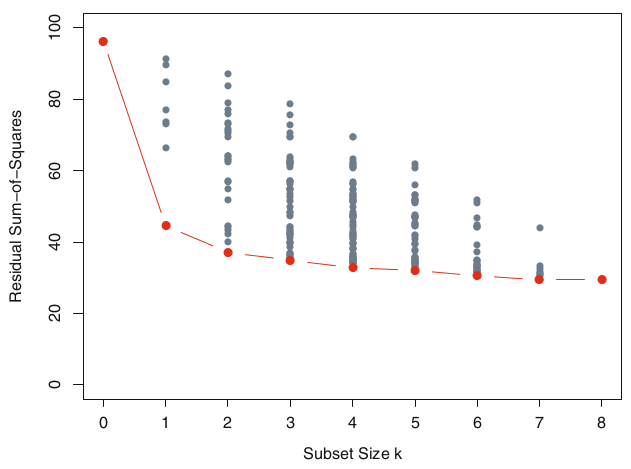

General principles for model evaluation
=============

Choosing between models
==================

-  General principles
-  Comparing predictors
-  Comparing classifications


General principles
=====================

1. Flexibility of models.
2. Models that lead to easy interpretation.
3. Simplicity

Flexibility
===========

-  Some models are very flexible
-  e.g. Boosting, Support Vector Machines
-  Likely to be very accurate empirically
-  Con: very difficult to interpret and gain understanding from the results

Interpretation
=============

-  Some model types lend themselves to easy interpretation
-  e.g. regression methods, naive Bayes, association rules
-  May be less accurate empirically, but leads to understanding about the system
-  Very useful if the goal is to inform a person making the decision as opposed to pure machine learning.

Simplicity
============

-  Use the simplest model that is a reasonable approximation of the complex model
   -  Note: a more complex model should be more accurate, but it may not be more accurate by much.
   -  Tradeoff simplicity for accuracy. If the simpler model is within some measure of error of the more complex one, use the simpler model since there is no significant improvement.


Considerations for predictive models
=============

-  Balance between accuracy and overfitting
  -  The goal of the model is to describe the system, not fit the available data.
-  Balance between identifying all members of a target class and overfitting to the data set you happen to have.

Methods for model evaluation
===============

Model evaluation process
=====================


Regression methods
===============

-  Mean Squared Error based methods
-  Distance methods

Classification methods
==================

-  Receiver operating characteristics
-  Sensitivity vs Specificity
-  Precision vs Recall
-  Lift

Overfitting
===========

- Our goal is to perform the best prediction on future samples, not the samples we already have.
- One danger is that our model is overly specific, it matches the data that we happen to have instead of being a good general model.
- Cross-validation
  1.  Obtain *k* equally sized and random subsets of the training data.
  2.  For each of these *k* subsets, build a model using the remaining *k* - 1 sets.
  3.  evaluate this model on the *k*th subset.

Summary
=======

When facing a predictive task, we have to make the following decisions:

- Select the alternative models to consider (the models can actually be alternative settings of the same algorithm) for the predictive task(s) we want to address.
- Select the evaluation metrics that will be used to compare the models.
- Choose the experimental methodology for obtaining reliable estimates
of these metrics.

Regression methods using caret
===============================
type: section

The `caret` package enables consistent implementation and evaluation of a range of machine learning models.
```{r}
library(AppliedPredictiveModeling)
library(caret)
```
Ordinary Linear Regression
================

- Regression requires a function and a data frame as input.
- Returns parameters and model evaluation statistics.

Linear model implementation
===========
- Specify data
-  Specify outcome variable
- Later we will split data for cross-evaluations

```{r}
data(FuelEconomy)
trainingData <- cars2010
lmFit1 <- lm(FE ~ . - FE, data = trainingData)
```

Linear regression output
========
```{r, echo=FALSE}
summary(lmFit1)
```

Look at R^2 and RMSE
=========

- To get RMSE, look at predictors

```{r}
lmFitPred1 <-predict(lmFit1, cars2010[,-4])
lmFitValues1 <- data.frame(obs=cars2010[,c("FE")], pred=lmFitPred1)
defaultSummary(lmFitValues1)
```

Model evaluation
================
- Model evaluation is best done through cross-validation
- Cross validation generates a model using training data
- Test using holdout data
- Multiple cross validation using different holdout data sets generate a mean and standard error for model predictive performance.
-  We can use statistical methods like Mean Squared Error based methods when the prediction is a value that can be compared to the actual value.
-  Similar to methods used in developing regression models (Least Squared Error)

Model criteria
==============

-  Mean absolute error (MAE) between predictions and real values of the target variables.
-  Mean squared error (MSE)
-  Normalized mean squared error (NMSE)

Scatter plot with prediction
======================

```{r}
carsplot <- cars2010
carsplot$Pred1 <- lmFitPred1
qplot(Pred1, FE, data=carsplot, main = "Linear Model", xlab = "Predictions", ylab = "True Values") + geom_smooth(method="lm")
```

Absolute error
====

-  Take the average of the absolute value of difference between prediction and actual value

```{r}
(mae.a1.lm <- mean(abs(carsplot$Pred1 - cars2010[,"FE"])))
```

Note that units are the same units as the measurement

Mean squared error
=================

- Square the errors to penalize distance between prediction and actual.
- Take average of squared errors.

MSE Calculations
=============
```{r}
(mse.a1.lm <- mean(mean(abs(carsplot$Pred1 - cars2010[,"FE"]))^2))
```

Normalized mean squared error
=============================

-  Divide by the square of the difference between observations and the mean.
-  NMSE controls for the variance in the population so it gives values that are comparable between sample populations.
-  Result is a ratio.

NMSE Calculations
==========

```{r}
(nmse.a1.lm <- mean(((carsplot$Pred1 - cars2010[,"FE"]))^2)/
   mean((mean(cars2010[,"FE"])-cars2010[,"FE"])^2))
```

Distance based metrics
=============

-  Create a metric that looks at the distance between the prediction and actual.
-  Note: this is context dependent!
-  Need to define a distance metric. (e.g. square root of some of squares)
-  Need to control for the variation that is in the data.
-  Normalization controls for the variation by dividing the distance by a measure of variation.

Normalized Distance
=======

-  Look at the distance between a prediction and actual by normalized against the InterQuartile Range (IQR).
-  NDTP(u) - Normalized distance to typical price
$$NDTP_p(u)=\frac{|u-\widetilde{U}_p|}{IQR_p}$$
-  Unit price of observation minus the median of the unit prices of the product divided by the IQR of the unit prices of the product.
  -  If IQR==0, set $IQR = \widetilde{U_p}$

```{r, echo=FALSE}
avgNDTP <- function(toInsp,train,stats) {
  if (missing(train) && missing(stats))
    stop('Provide either the training data or the product stats')
  if (missing(stats)) {
    notF <- which(train$Insp != 'fraud')
    stats <- tapply(train$Uprice[notF],
                    list(Prod=train$Prod[notF]),
                    function(x) {
                      bp <- boxplot.stats(x)$stats
                      c(median=bp[3],iqr=bp[4]-bp[2])
                    })
    stats <- matrix(unlist(stats),
                    length(stats),2,byrow=T,
                    dimnames=list(names(stats),c('median','iqr')))
    stats[which(stats[,'iqr']==0),'iqr'] <-
        stats[which(stats[,'iqr']==0),'median']
  }

  mdtp <- mean(abs(toInsp$Uprice-stats[toInsp$Prod,'median']) /
               stats[toInsp$Prod,'iqr'])
  return(mdtp)
}
```


Using cross validation
=========================

- Determine model type (e.g. Linear regression)
- Determine cross validation methods using `trainControl`
- Set random number seed
- Train model using random holdout sets based on cross validation method

Cross validation example using caret
==========
```{r}
ctrl = trainControl(method="cv", number = 10)
set.seed(100)
lmFit1 <- train(x = cars2010[,-4], y=cars2010[,4],
                method="lm", trControl=ctrl)
lmFit1
```

Regression trees (with caret)
============================

```{r}
set.seed(100)
rtFit1 <- train(x = cars2010[,-4], y=cars2010[,4],
                method="rpart", trControl=ctrl)
rtFit1
```
Repeat model evaluation and comparison between regression trees and linear regression
===========================================

```{r}
lmFit1$results
```
```{r}
rtFit1$results
```

Cross validation and resampling techniques
==================

- Resampling techniques are used to estimate model performance.
- Use a subset of samples to train (fit) a model.
- Use a different subset of samples where the results are known to test the model.
- Repeat multiple times and aggregate and summarize the results (mean, standard error)

Forms of resampling
=================

-  *k*-fold cross validation
-  Leave one out cross validation (LOOCV)
-  Monte Carlo cross validation
-  Bootstrapping

k-fold Cross- Validation
========================

-  Divide the data into $k$ subsets
-  For each of the $k$ subsets, use remaining data to train a model, test on the chosen subset.
-  *k* can be anything, but is normally set to 5 or 10
  - Larger values of $k$ give more accurate performance measures, but at the cost of smaller test sets.
  - Research shows little benefit to $k>10$


Leave one out
=============
-  Extreme version of $k$-fold Cross validation.
-  For each observation, attempt to predict it based on ALL of the other available data.
-  Lowest bias in performance estimate (most similar to real life)
-  Computationally intensive

Monte Carlo cross validation 
============

- Each training/test split is generated randomly.
  - Note that test data and training data are always separate.
- Individual samples could be in several different test sets.
- Can have any number of test sets of any size


Bootstrap cross validation
=========================

- For each validation sample, sample a number of times equal to the size of the dataset *with replacement* to form the training set. Note there will be repetition.
- Samples that are not selected become the test set.
- Lower between set variation because of larger training data sizes, but higher bias because of reuse of data in training set.


Model selection
=================

-  Generally for each model type, pick the tuning parameter that balances predictive error and complexity.
-  For linear regression, tuning parameter is the size of the subset of available parameters.
-  Next, compare different model types.
-  Note that cross-validation will show that accuracy does not necessarily improve as parameters are added (increased model complexity does not add to accuracy.)


Subset selection methods
==================================

Subset selection
===================

-  To evaluate a regression model, we can look at the coefficient of variation of the error.
-  $CV = \frac{\sigma}{\mu}$
-  But, in general, more terms lead to lower $\sigma$.
-  Need to balance lower errors against model complexity
-  Chart shows all possible combinations of parameters for a given subset size.



Results of cross-validation
================================

-  For each candidate model (subset size), cross validation will generate a series of estimates of error.
-  This gives the *estimated prediction error* and standard error bands
-  Identify the best model.
-  Take the sum of the mean error plus the standard error (standard deviation of error).
-  Find the model with the smallest subset size that is less than this sum.

Estimated prediction error curves
=============================


Modeling in caret
================

- `caret` develops a consistent interface between machine learning methods and model evaluation methods.
- A *wrapper* around the various machine learning packages which are found in a number of R packages
-  train command takes data, outcome, method, metric, and type of cross validation method (trControl) and implements cross validation as well as a final model.

train function
=======

```
train(x, y, 
      method = "rf",  
      preProcess = NULL,
      ..., 
      weights = NULL,
      metric = ifelse(is.factor(y), "Accuracy", "RMSE"),   
      maximize = ifelse(metric %in% c("RMSE", "logLoss"), FALSE, TRUE),
      trControl = trainControl(), 
      tuneGrid = NULL,  tuneLength = 3)
```

Specifying method
======
-  *method* refers to the machine learning model type
-  Full list with arguments at https://topepo.github.io/caret/modelList.html

trControl
==========

- `trainControl()` specifies the type of cross validation to be used.
- boot, boot632, 
- cv, repeatedcv, LOOCV, LGOCV, 
- none (only fits one model to the entire training set)
- others . . .

More information on caret package
===========

-  *Applied Predictive Modeling* ch 4, 5, 11, App B
-  Kuhn, 2008, *Building Predictive Models in R Using the caret Package*, **Journal of Statistical Software**, Vol 28, No. 5, http://www.jstatsoft.org/article/view/v028i05

