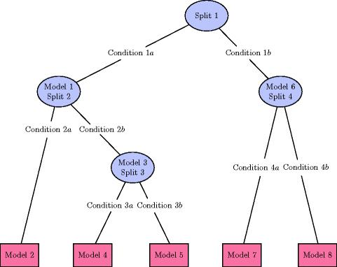

```{r, echo=FALSE}
#Note: this presentation takes a long time to render. I ran the entire file, then I commented out the r code by removing the `{r}` at the beginning of the code blocks that ran calculations.  The final result was saved using the command:

#`save.image("regressionTree.Rdata")`

#which saves all datasets and variables that currently existed in the data set.  Then I reload the data in the following code chunk.
```
```{r}
library(AppliedPredictiveModeling)
library(caret)
data(solubility)
load("regressionTree.Rdata")
```


Overview
========

-  Regression trees
-  Rule based methods
-  Bagged trees
-  Random Forests
-  Boosting
-  Cubist

Case study: Quantitative structure-activity relationship modeling
==============

- Data set of 1267 chemical compounds
-  208 binary "fingerprints" that indicate the presence of a specific chemical substructure
-  16 count descriptors (e.g. number of bonds or number of a specific type of atom)
-  Four continuous descriptors (e.g. molecular weight or surface area)
- Target: solubility values


Implement cross validation for all models
=================
```{r}
set.seed(100)
indx <- createFolds(solTrainY, returnTrain = TRUE)
ctrl <- trainControl(method = "cv", index = indx)
```
Regression Trees
============

-  Series of splits of the data
-  Identify the best predictor to split on and the value of the split
  - 'best' is based on the split that makes the data more homogeneous (reduce sum of squares error)
  $$SSE = \sum_{i \in S_1}(y_i - \bar{y}_1)^2 + \sum_{i \in S_2} (y_i - \bar{y}_2)^2$$
  - Penalize SSE based on the $c_p$ complexity parameter
  $$SSE_{c_p} = SSE + c_p * (\#Terminal\ Nodes)$$
  
Using caret for regression trees
====

```
library(rpart)
### Fit two CART models to show the initial splitting process. rpart 
### only uses formulas, so we put the predictors and outcome into
### a common data frame first.
trainData <- solTrainXtrans
trainData$y <- solTrainY
rpStump <- rpart(y ~ ., data = trainData, 
                 control = rpart.control(maxdepth = 1))
rpSmall <- rpart(y ~ ., data = trainData, 
                 control = rpart.control(maxdepth = 2))
```


Tune the model
====
```
library(caret)
set.seed(100)
cartTune <- train(x = solTrainXtrans, y = solTrainY,
                  method = "rpart",
                  tuneLength = 25,
                  trControl = ctrl)
```
```{r}
cartTune
```

Final model
===
```{r}
cartTune$finalModel
```


Plot the tuning results along with complexity parameter
==================
```{r}
plot(cartTune, scales = list(x = list(log = 10)))
```

Advantages of regression trees
====

1. Simple and interpretable
2. Quick and easy to compute
3. Feature selection is a byproduct

Disadvantages of regression trees
=========

1. Suboptimal (because each step only picks one predictor at a time)
2. Number of predicted outcomes is finite (does not offer fine resolution)
3. Unstable. Small changes in data (or slightly different sample) leads to large changes in the resulting tree.
4. Selection bias. Predictors with large numbers of distinct values tend to be selected before predictors with more granularity. Continuous more likely to be selected over binary or factor.


Limitations of regression trees
==================

- Only a limited number of outcomes in final prediction
- Tend to miss on samples that are in the extremes.
- Regression model trees have a linear model in the end nodes instead of using simple averages.

Model tree approach
===================

- Split data on best value for best predictor
- For each potential split, calculate the improvement in error for next split.
- Errors are associated with linear model for the samples in each end node.
- Same parameters as Regression tree:  number of levels, minimum number of samples in each end node, minimum improvement (pruning)
- Final linear models go through a simplification procedure to control complexity in end nodes.
- Final prediction of new observation is obtained by determining which node the observation falls in, then using the associated linear model to make the prediction.

Regression Model Tree illustrated
===============



Smoothing
=======

-  Smoothing is used to modify linear models so adjacent nodes are close in their prediction at boundary points
-  Guards against overfitting.

Bagged Trees
============

Ensemble techniques
======================

-  Ensemble techniques combine the predictions of many models to develop a prediction.
-  Intuitively, every model has a range it is good in, models will counter each other's weaknesses.

Bagged Trees
=========

-  Combines bootstrapping and a regression method to construct ensemble.

1.  For i in 1:m
  -  Generate a bootstrap sample of the original data.
  -  Train and unpruned tree model on this sample
2.  Use the $m$ models to make a prediction.
3.  Average the $m$ predictions for a final prediction.

Advantages of bagging
================

1.  Reduce variance of prediction (due to aggregation)
2.  Predictions are more stable
3.  The use of multiple models allows creation of cross-validation internally (through use of samples not in a specific model. *out-of-bag* estimate)

Parameters
=============

1.  What type of model to use for each bag?
2.  How many iterations ($m$)

Note: Computationally expensive because of multiple models

Implementation
===============

Note: set multicore (`doMC`) for parallelization
```
library(doMC)
registerDoMC(2)
set.seed(100)
```

Bagging using caret and regression trees
===================
```
treebagTune <- train(x = solTrainXtrans, y = solTrainY,
                     method = "treebag",
                     nbagg = 10,
                     trControl = ctrl)
```
```{r}
treebagTune
```

Random Forests
=================

Random Forests
===============

- Ensemble model
- Note that in bagging trees, they typically look very similar.
- Generally start with the same predictor variables.
- Random Forests reduce tree correlation by randomly selecting which predictors to consider.

Random forest method
=======================

1.  Select number of models $m$
2.  For i in 1 to $m$
  -  Generate boot strap model
  -  Train a tree model on this sample
  -  For each split
      -  Randomly select $k (<P)$ of the original predictors
      -  Select best of the $k$ predictors to partition data
  -  Use standard tree model stopping criteria (without pruning)
3.  Use $m$ models to make prediction.

Tuning grids in caret
=======================

- We can specify the changing parameters across runs.
- The tuning grid specifies the mix of parameters and creates a grid that covers all combinations.
```{r}
mtryGrid <- data.frame(mtry = floor(seq(10, ncol(solTrainXtrans), 
                      length = 10)))
```

Implementation with tuning grid
==============
```
set.seed(100)
rfTune <- train(x = solTrainXtrans, y = solTrainY,
                method = "rf",
                tuneGrid = mtryGrid,
                ntree = 50,
                importance = TRUE,
                trControl = ctrl)
```

Results
======
```{r}
rfTune
```

Results plot
=========
```{r}
plot(rfTune)
```

Boosting
==========

Boosting
=============

- Originally used in classification problems (we will revisit this)
- Use a weak learner as a starting point (e.g. regression tree)
- For each iteration, take the sample that were incorrectly classified (or had large errors) and give them more weight (e.g. over sample) in the next iteration.

Method
=============

1.  Select tree depth $D$ and number of iterations $K$
2.  Computer average response $\bar{y}$ as the average predicted value for each sample (i.e. no model)
3.  For $k$ in 1 to $K$
  -  Computer residual for each sample
  -  Fit a regression tree of depth $D$ using the residuals (i.e. predict the residuals)
  -  Predict each sample using the regression tree.
  - Update predicted value of each sample by adding the previous iterations predicted value to the new prediction.
  
Comments on boosting
==================

-  In boosting, each model contributes to the final prediction unevenly
-  Becuase each iteration is iterative, it is difficult to parallelize (in comparison to bagging or random forests)
-  uses weak learners, so each iteration is simple.
-  Methods include *Adaboost* and 

Setup
======
```
gbmGrid <- expand.grid(interaction.depth = seq(1, 7, by = 2),
                       n.trees = seq(200, 1000, by = 200),
                       shrinkage = c(0.01, 0.1),
                       n.minobsinnode = 10)
set.seed(100)
```

Implementation with caret
=====================
```
gbmTune <- train(x = solTrainXtrans, y = solTrainY,
                 method = "gbm",
                 tuneGrid = gbmGrid,
                 trControl = ctrl,
                 verbose = FALSE)
```

Results
=====
```{r}
gbmTune
```

Results plot
=======
```{r}
plot(gbmTune, auto.key = list(columns = 4, lines = TRUE))
```


Regression recap
=====================

Regression models
=====================

-  Purpose of regression models is to predict an outcome.
-  More complex models are more accurate, but at risk of overfitting.
-  Each model has a parameter that corresponds to complexity, so we can evaluate the tradeoff between complexity and accuracy (risk of overfit)

Models
=========

- Linear regression
- Principle component analysis
- Regression trees (recursive partitioning)
- Regression model trees
- Bagging
- Random forest
- Boosting
- Cubist