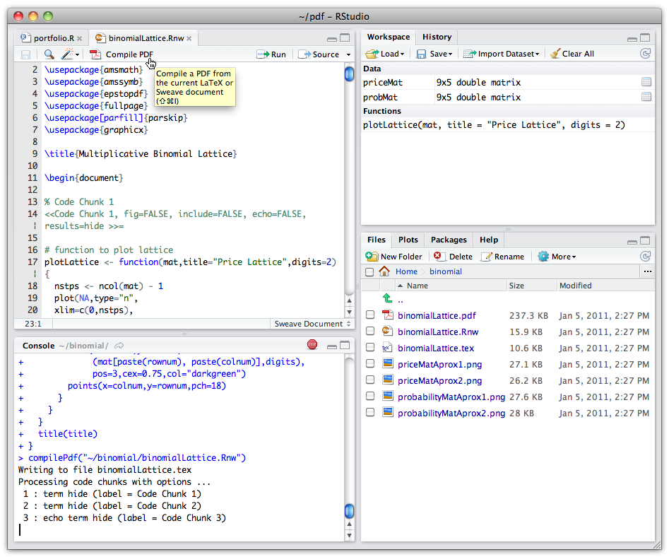

Notecard
========

- Name
-	Program (major/degree/year)
- Graduate students: What was your undergraduate major/college?
-	How much statistics have you had?
- What is your level of programming?
- What experience do you have with data analysis environments (SAS/SPSS/S-Plus/R/Python/Matlab/F#/Mathematica/Maple)?

Data science course
===================

What is data science?
=====================

- *Data Science refers to an emerging area of work concerned with the collection, preparation, analysis, visualization, management, and preservation of large collections of information.* - Jeffrey Stanton

- *The Analytics Section of INFORMS is focused on promoting the use of data-driven analytics and fact-based decision making in practice. The Section recognizes that analytics is seen as both (i) a complete business problem solving and decision making process, and (ii) a broad set of analytical methodologies that enable the creation of business value.*  -  INFORMS Section on Analytics

Goals
=====

-  Teach skills required for data science.
-  Practical skills

Contrast
========

-  Computer programming - Teaches a computer language, but not necessarily the specific task of working with data.
-  Business Intelligence - Focus on displaying data summaries from data found in databases.
-  Big Data - Methods for working with large databases (large meaning larger than practical for a single machine)
-  Statistics - Methods of testing hypothesis using observed data.

Some related topics
===================

-  Machine learning
    - Focuses on methods for improving knowledge or performance of an intelligent agent.
    -  Many applied statistics and pattern recognition fields.
-  Data mining (Knowledge Discovery and Data Mining (KDD))
    -  More focused on application to data than machine learning
    -  Includes the entire process of data analytics
    - Data preparation, model learning, data evaluation, . . .

What is missing from ML and Data mining?
================================

-  How to transform the messy, electronically collected data into a form that can be analyzed.
-  Working with unstructured, non-numeric, error-prone data.
-  Focus on the subject matter expertise.
-  Focus on the business decision that will be made.

This Course
===========

1.  Introduction to Data Science
2.  Data Science tools: R, R Studio, and Git
3.  About data and data problems
4.  Data munging: getting and working with data
5.  Introduction to data visualization
6.  Model evaluation
7.  Regression Models
8.  Classification Models
9.  Clustering

Machine Learning
================

<!--http://scikit-learn.org/stable/_static/ml_map.png-->

Tools
=====

1.  R - Environment for Data Analysis
    -  Rattle - Data Mining in R
    -  Caret package for model evaluation
2.  R-Studio - IDE for R
3.  Git - Source code version control

Textbooks
=========

1.  (APL) Max Kuhn, Kjell Johnson, (2013), Applied Predictive Modeling, Springer, ISBN: 978-1-4614-6850-9
2.  (Moderndive) Chester Ismay and Albert Y. Kim (2017), ModernDive: An Introduction to Statistical and Data Sciences via R, http://moderndive.com/index.html, A basic introduction to working with R, data manipulation, and using R for computational statistics.

Supplements
===========

1.  [W] Graham Williams, (2011), Data Mining with Rattle and R: The Art of Excavating Data for Knowledge Discovery, UseR Series, Springer, ISBN: 978-1-4419-9889-7 Available at Pitt Library as an ebook.
2.  [HT] Trevor Hastie, Robert Tibshirani, Jerome Friedman, (2001), The Elements of Statistical Learning 2nd ed, Springer, available at https://statweb.stanford.edu/~tibs/ElemStatLearn/. One of the standard reference textbooks for Machine learning.
3.  [R] Bill Venables, David Smith, and the R Core Team, (2013), An Introduction to R - Notes on R: A Programming Environment for Data Analysis and Graphics, available at http://cran.r-project.org/manuals.html and distributed along with R

Some useful references
===========================

1.  [ggplot] Hadley Wickham, (2016),  Introduction to ggplot 2nd ed, Springer, available in epub or PDF from the Pitt Library
2.  [ISRS] Introductory Statistics with Randomization and Simulation, https://www.openintro.org/stat/?stat_book=isrs. This is a different look at introductory statistics than the standard intro to statistics course. We will use it for simulation near the end of the course. In addition, the labs in the website has code that can help you implement statistical methods.
3.  (Pro Git) Scott Chacon and Ben Straub, Pro Git, Apress, free e-book at https://git-scm.com/book/en/v2

Assignments
===========

Homeworks
===========

  - Take one data set from APL Ch 1.4 to use in applying methods throughout the course. We will set aside class time to both do and discuss this.
  - Data manipulation/visualization
  - Regression assignment
  - Classification assignment

Case study
==========

-  Apply basic methods in a realistic setting.
-  Part 1
  -  Practice writing CONVO statements
  -  Practice in applying data visualization
-  Part 2
  -  Apply basic predictive models and  model evaluation

Project
===========

- Three papers/presentations
- Find a data set and a question
    - Kaggle.com

1.  Exploratory Data Analysis
2.  Preliminary Data Analysis
3.  Final project

Exploratory Data Analysis
============================

-  Identify a data set. Discuss the origin and structure of the data.
-  Text analysis - What were difficulties faced working with the data?
-  Data summary
-  Data visualization
    -  Apply five named graphs to the dataset
        - Scatter plots, line graphs, histograms, boxplots, barplots
    -  Develop at least two complex visualizations that are motivated by the basic graphs.
        - Complex visualizations include more than two dimensions.
    -  The expectation is that at least one may be not useful, but you should have found at least one that tells a story.
-  **CoNVO** - Context, Need, Vision, Outcome

Preliminary Data analysis
======================
-  Preliminary analysis.
    -  An appropriate, complex visualization (at least two visual cues)
    -  Apply at least 3 types of methods to the data
    -  Must at minimum cover the categories in the corresponding homework assignment 
-  Hypothesis - Question to be answered.
    -  CoNVO - Context, Need, Vision, Outcome
-  Plan of work 
    - What type of problem is this? (regression/classification/clustering)
    - How will you answer the question

Final project
=================
-  Data manipulation - What made working with the data interesting or difficult?
-  CoNVO - Context, Need, Vision, Outcome
- Hypothesis from Preliminary Data Analysis
    - How did hypothesis change?
-  Data visualization
-  Analysis
    -  Compare at least three methods from the category chosen in PDA
    -  Results
-  Conclusions
    -  From PDA and final, why did some methods work better than others.
    -  CONVO - Explain results to client and give recommendation

Learning Data Science
=====================

1.  Treat it as **science**, hypothesis, test, thesis.
2.  Learn by doing. Do the examples in APL. You need to see what they did, not just read about it or watch someone else do it.
3.  Try, try, and try again. You are doing experiments. Assume that the first thing you try will not work.
4.  Talk and listen.
5.  Class participation. Discuss the weekly article.  Practice applying data to a business problem.  How much do you help others learn.
    -  Our employers consistently state that our graduates are good technically, but lack soft skills.
    -  Demonstrate and practice understanding the problem from a client point of view and delivering results that a client can understand.

What is a data scientist?
=========================

Data
====

-  *Datum* - Latin for *thing given*
-  *Data is not information, information is not knowledge, knowledge is not understanding, understanding is not wisdom* - Tim Berners-Lee
-  Our goal is wisdom.
-  The tools we use are a means to an end.

Forms of data
=============

- Traditional:  Numerical, categorical, or binary.
- Text:  articles, emails, tweets.
- Records:  User level, timestamped events, log files.
- Geo-spatial data
- Network data
- Sensor data
- Images

Role of the data scientist
==========================
-  Data architecture
-  Data acquisition
-  Data analysis
-  Data archiving

Data architecture
=================

-  Routing and organization of data to support analysis, visualization, and presentation of data to different groups of people.

Data acquisition
================
-  How the data is collected and represented prior to analysis and presentation.
-  Representation
-  Transformation
-  Grouping
-  Linking
-  e.g. bar codes at FedEx
    -  Picture, number, link to package, group in a shipment.

Data analysis
=============

-  Summarizing and visualizing data.
-  Make inferences about the larger context.
-  Analysis is always done in the context of making a decision.

Data archiving
==============

-  What aspects of the data would be important to know in the future.
-  e.g. geocoding of Twitter tweets

Data scientist skills
=====================

-  Learning the application domain
-  Communicating with end users
-  Seeing the big picture of a complex system
-  Knowing how data could be represented
-  Data transformation and analysis
-  Data visualization and presentation
-  Attention to quality
-  Ethical reasoning

Aspects of data science
=======================

The scientific method
=====================

1. Ask a question.
2. Do background research.
3. Construct a hypothesis.
4. Test your hypothesis by doing an experiment.
5. Analyze your data and draw a conclusion.
6. Communicate your results.

The Data Science Venn Diagram
=============================

- The primary colors of data
    - Hacking skills,
    - Math and statistics knowledge, and
    - Substantive expertise.

Data Science:  Computer Hacking skills
======================================
-  Data is traded electronically, so need to be able to manipulate text files, understanding vectorized operations, thinking algorithmically.
-  Without computer skills means you cannot even get started with using electronic data.

Data Science:  Math and Statistics
==================================

-  The next step is to actually extract insight from it.
-  Apply appropriate math and statistics methods.
-  Without this, you can produce what looks like meaningful output using a computer, but the output is without meaning.  VERY DANGEROUS.
- *Lies, damned lies, and statistics*

Data Science:  Substantive Expertise
====================================

-  Science is about discovery and building knowledge, which requires some motivating questions about the world and hypotheses tested with statistical methods.
-  Most academics (you) have math and statistics.

Three categories of data science
=======================================

- Descriptive analytics
    - Prepares and analyzes historical data
    - Identifies patterns from samples for reporting of trends
- Predictive analytics
    - Predicts future probabilities and trends
    - Finds relationships in data that may not be readily apparent with descriptive analysis
- Prescriptive analytics
    - Evaluates and determines new ways to operate
    - Targets business objectives
    - Balances all constraints

Tools for data science
========================================================

Data science requirements
========================================================

1. Read in data
2. Handle data of indefinite size
3. Manipulate data
4. Mathematical/statistical analysis
5. Model evaluation
6. Presentation of results

Remember, analysis is never done in isolation
========================================================

-  Analysis is always part of a larger problem.
-  When evaluating an analysis platform, think about what it needs to interface with.
-  Databases, text processing, GUI inputs, Web interfaces, decision support, etc.
-  Organizational structure and decision making procedures.

Types of analytical environments
========================================================

Analytical environments
========================================================

1.  GUI based spreadsheets.
    -  Excel
2.  GUI based statistical packages.
    -  Minitab, Statistica
3.  Visual data exploration
    -  Tableau
4.  Batch based statistical packages
    -  SPSS, SAS
5.  General systems languages (static)
    -  C, C++, C#, Fortran, Java
6.  Data analysis programming languages (dynamic)
    -  Matlab, Python, R, F#, Julia, Clojure, Scala
7.  GUI based Machine Learning tools/interfaces
    -  Weka, KMINE, Rapidminer, Orange

Criteria
========================================================

1.  Employer forces a choice of language.
2.  Libraries available.
    -  Some fields have many tools
    -  Libraries mean much of the work has been done for you.
3.  Ability to customize solutions.

Read in data
========================================================

-  Generally the domain of languages with easy to use database interfaces.
-  Sometimes the ability to develop a GUI helpful.
-  Perl, Python, Ruby, Visual Basic.

Handle data of indefinite size
========================================================

-  Indefinite size implies using array or matrix based computation.
-  Languages with functional characteristics helpful.
    -  Vectorization makes it easier to read implementations of analytical methods.
    -  No side effects requirement of functional languages leads to thinking of operations on all rows or records rather than one record at a time.
    -  Principle strength of Excel, but hard when data spans multiple screens.
-  Lisp, Clojure, R, Matlab, Python, Julia

Manipulate data
========================================================

-  Need ability to work with text as well as numbers.
-  Regular expressions (mathematical tools for expressing methods for extracting text)
-  Text processing libraries
-  Perl, Python, Ruby, Java

Mathematical and statistical analysis
========================================================

-  Interfaces to Fortran and C based scientific libraries (e.g. LAPACK/BLAS)
-  Enable vectorized operations
    -  Map, reduce, apply
    -  List comprehensions
-  Matlab, Python, R, Julia, Scala, Clojure

Presentation of results
========================================================

-  Graphics and charting libraries.
-  Excel (not flexible)
-  Python, R, Javascript all have good and flexible libraries.
-  Libraries exist for Java, C++, Matlab but they tend to not be flexible.

Tools for data hacking
==============================

Data Hackers
====================

-  Data is a commodity traded electronically; therefore, in order to be in this market you need to speak hacker (computer programming).
-  This does not require a background in computer science.
-  Understanding vectorized operations
-  Thinking algorithmically.

Tools for computer programming
==============================

-  More than just knowing a computer programming language.
-  Systematic approach to design, development, operation, and maintenance of software.
-  How to manage your development of analysis methods.
-  Tools
    -  Data manipulation, analysis, presentation
    -  Documentation
    -  Change management

Data manipulation, analysis, presentation
=========================================

-  Data manipulation requires ability to
    -  Read in data
    -  Clean data - correct errors and make it usable
    -  Manipulate data into forms suitable for analysis
-  Data analysis

Documentation
=========================================

-  Reports *Markdown*
-  Slide presentations *R Presentation* and *Markdown*
-  Web based documentation *Wiki*

Change management
=========================================

-  Source code distributed version control
-  Local and remote repositories maintain record of changes
-  Master repository maintains history of changes down to the change level
-  Branches record work to add new features or special versions
-  Tags identify milestones
-  Can revert code to the state at any point in time

Tools
=====

 R
==============

Programming and development
============================

-  R environment for data analysis
    -  Includes libraries for data manipulation, analysis, and presentation.
-  *Rattle* - Machine Learning based GUI for R.
-  R Studio IDE
    -  Editing code
    -  Eases installation of libraries
    -  Supports *Markdown* and *R Presentations*

R
=====

-  Environment for statistical computing
-  Programming language
-  Open source - Growth in features is developed by users

Benefits of R
=============

-  Programming language based implementation means very little is hidden.
-  Implementation of all methods as scripts means that analysis is reproducible, even on new data sets.
-  Open source means that researchers develop new methods in R and create a new package to disseminate it.
-  Many visualization and data processing methods have been implemented as R packages.  R packages are indexed on **CRAN**
-  Able to access code written in Java, C, C++, Fortran, and Python from R.

Difficulties of R
=================

-  Programming language means that there is a learning curve at the beginning.
-  Syntax is very different for those who know only Algol based (C/C++/Java/C#) languages.
-  Package interfaces are not consistent, learning to use a new package is often like learning to use a new software tool.
-  Text based interface means it is often difficult to get started.

Rattle
======

-  Data mining GUI for R.
-  Importing Rattle automatically imports a range of data mining and data import libraries.
-  GUI saves your session as R scripts.  Use Rattle to start analysis, then edit the session to modify the analysis.

R Studio
=============

R Studio
========

- IDE for R
- Includes editor, console, workspace, plots.
- Integrates file manager, project manager, version control
- Code completion, command history

Documentation
=============

-  *Markdown*:  Text based representation of document
    -  Works with version control systems.
    -  Encourages you to focus on the content and structure of the document, not the appearance.
    -  Works with LaTeX if you need to tweak the appearance.
    -  Can embed code and output in with the text.
    -  Can be used for presentations
    -  Creates a browser based presentation (HTML5) or PDF (Beamer if you have LaTeX)
-  *pandoc*: converts different file formats to and from each other
    - pdf, LaTeX, Markdown, docx, html
    - `knitr` function in R Studio runs this
  
  Markdown and knitr
===================

- Markdown and Sweave integrates text and R code.
- Maintain documentation on the problem, data, methods, and interpretation along with the data processing and implementation of methods.
- Convert to HTML, PDF, or slides.

Git: Version control
====================

Version control
===============

-  Distributed Version Control Systems (DVCS) enable tracking of changes to text based files (e.g. code files).
-  By `commit`ing changes at frequent milestones, you can use DVCS to return to a working version of the code at any point in time.
-  DVCS enable teams to work on the same code base simultaneously, as it assists in reconciling team members work.

Version control terms
=====================

-  repository - The version control history of the project.
-  working directory - The files you do your actual work on.
-  master - The main branch of the project.
-  branch - Work done off of the main branch of the project.  
-  merge - Reconciling a master and a branch
-  remote - A repository other than the directory you do your work on.
-  fork - A copy of a repository created so that a developer can work separately from the main team.  Later, a *pull request* can be made to integrate the changes.

Git basics
==========

Tasks that you need to be able to do

- `git init` - Initialize a repository
- `git clone` - Clone (copy) a remote repository
- `git add` - *Stage* changes - add changes to be tracked in a repository
- `git commit` - Take changes and commits them to the project history
- `git status` - Show the state of the working directory and the staged changes.
- `git fetch` - Downloads updates from a remote repository (but does not change your working directory)
- `git pull` - Download changes from remote repository and merges changes into the working directory.
- `git push` - Uploads committed changes to the remote repository.

