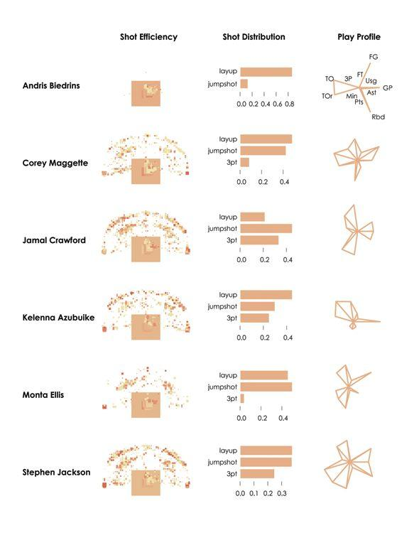

Scoping problems
===================
type: section

Projects
========

-  Look at Kaggle for ideas.
-  If you have a project from another source (another class, project with another professor, thesis topic exploration, etc.) ask me about using it for this project.

Representing data
=================
type: section

Snow data
========

- If you were responsible for winter snow removal preparation, What would you like to know about the coming year's snow forecast?

What is visualization for?
==========================

-  Analysis and exploration
-  Communicate and present information
-  Entertainment
-  Art

Visualizations in data science
==============================

How do we represent data?
=========================

-  Use visual cues to show values.
-  Shapes, colors, scales, position.
-  Visualization is how we summarize raw data to communicate meaning.
-  What makes for a good visualization?

Visualization components
========================
type: section

Visualization components
========================

.

Visual cues
===========

.

Ranking visual cues
===================

Some visual cues are more clear than others

Coordinate systems
==================

Coordinate systems dictate the dimensions of the visualization.

.

Scales
======

Scales dictate where in the dimensions the data maps to.

.

Using visualization
===================
type:section

Data exploration questions to ask?
==================================

-  What data do you have?
-  What do you want to know about your data?
-  Which visualization methods should you use?
-  What do you see and does it make sense?

Exploring through visualization
===============================

Visualizing categorical data
============================

.

Time
====

Time is continuous, but you can also divide it into categories.

Time series
===========

How does your data change over time?

.

Visualizing spatial data
========================

.

Combining components
====================

By combining components, graphs are richer and can display many relationships at once.

.

Multiple variables
==================

There is no hard limit to how many variables can be in one visualization

.

Data distribution
=================

- Visualization can show how data is distributed in a population
- Box plots
- Histograms
- Density plots

Visualizing distributions
=========================

.

Comparisons
===========

One thing that visualizations should do is show how things change.

.

Color scales
============

-  Sequential
-  Diverging
-  Qualitative

Highlighting
============

Emphasize a particular data point or series to place focus

Annotation
==========

Give context to data or explain boundary cases.

.

Making things pretty
====================

Summary
=======

-  Think in terms of telling a story.
-  What is the message?
-  What is the main point?
-  How to tell it?

