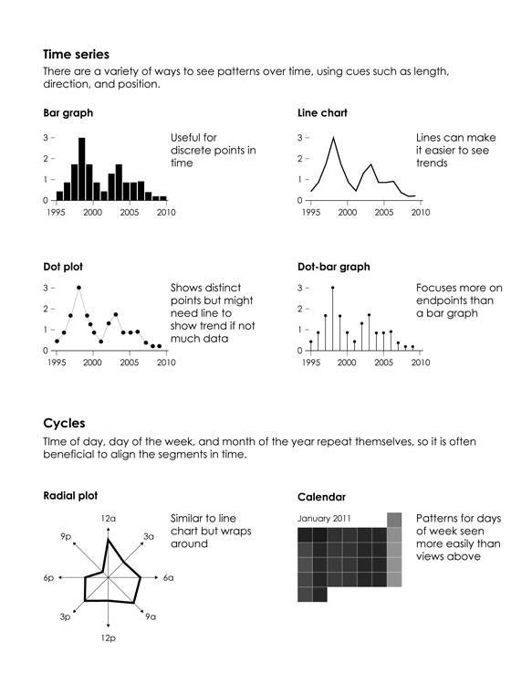

Scoping problems
===================

Projects
========

-  Look at Kaggle for ideas.
-  If you have a project from another source (another class, project with another professor, thesis topic exploration, etc.) ask me about using it for this project.

Representing data
=================

Lending club
========

- What do you want to know about historical load data?


What is visualization for?
==========================

-  Analysis and exploration
-  Communicate and present information
-  Entertainment
-  Art

Visualizations in data science
==============================


How do we represent data?
=========================

-  Use visual cues to show values.
-  Shapes, colors, scales, position.
-  Visualization is how we summarize raw data to communicate meaning.
-  What makes for a good visualization?


Visualization components
========================

Visualization components
========================

.


Visual cues
===========

.


Ranking visual cues
===================

Some visual cues are more clear than others


Coordinate systems
==================

Coordinate systems dictate the dimensions of the visualization.

.


Scales
======

Scales dictate where in the dimensions the data maps to.

.


Using visualization
===================


Data exploration questions to ask?
==================================

-  What data do you have?
-  What do you want to know about your data?
    -  What do you have?
    -  Is it complete?
    -  Is it representative of problem I will see in the future?
-  Which visualization methods should you use?
-  What do you see and does it make sense?

Exploring through visualization
===============================


Visualizing categorical data
============================

.


Time
====

Time is continuous, but you can also divide it into categories.


Time series
===========

How does your data change over time?

.


Visualizing spatial data
========================

.


Combining components
====================

By combining components, graphs are richer and can display many relationships at once.

.


Multiple variables
==================

There is no hard limit to how many variables can be in one visualization

.


Data distribution
=================

- Visualization can show how data is distributed in a population
- Box plots
- Histograms
- Density plots

Visualizing distributions
=========================

.


Comparisons
===========

One thing that visualizations should do is show how things change.

.


Color scales
============

-  Sequential
-  Diverging
-  Qualitative


Highlighting
============

Emphasize a particular data point or series to place focus


Annotation
==========

Give context to data or explain boundary cases.

.


Making things pretty
====================


Summary
=======

-  Think in terms of telling a story.
-  What is the message?
-  What is the main point?
-  How to tell it?

Visualizations with ggplot
==================
- Install the package DMwR2 to follow this lecture
```{r echo=FALSE, warning=FALSE}
library(dplyr)
library(ggplot2)
library(gridExtra)
library(lattice)
library(tidyr)
library(DMwR2)
```
http://www.dcc.fc.up.pt/~ltorgo/DataMiningWithR/datasets.html

Topics
========================================================

-  Data munging
-  Exploratory Data Analysis
-  Predictive models

Data munging
=============

Data munging
============

-  We obtain data from various sources.
-  But the data may not be in a usable form.
  -  Data collection was not organized with analysis in mind.
  -  It may have been impractical to collect what we wanted.
  -  The format of data delivered may not be what our analysis tools need.
-  Managing the data is *data munging*.


Reading in data
===============

- Data can be provided in the form of R data files (`*.RData`)
- Files
  - comma separated format (csv)
  - Excel spreadsheets
  - Databases
  - Network, internet sources
- Covered in the document *R Data Import/Export*
- Application programming interfaces (API) for network based sources.


Sample data - nycflights
========================
- Information about all domestic flights departing from New York City in 2013.
    - Newark (EWR), John F. Kennedy International (JFK), LaGuardia (LGA)
- Five dataframes
    - flights: information on all 336,776 flights
airlines: translation between two letter IATA carrier codes and names (16 in total)
    - planes: construction information about each of 3,322 planes used
    - weather: hourly meteorological data (about 8705 observations) for each of the three NYC airports
    - airports: airport names and locations

Sample database - Algae
=======================

- Included with *Data Mining with R*
- 200 water samples of taken from the same river over three months.
- 11 variables
  - Season, size, speed of river
  - 8 Different chemical parameters
- 7 frequency values of harmful algae
- Later, we will try to predict algae in 140 observations of nominal and chemical parameters.

```{r}
library(nycflights13)
```

Look at a dataset
===================
- `glimpse` displays a dataset variable names and types

```{r}
glimpse(flights)
```

Look at data table
===================
- `View` opens data table in a new tab.

```{r}
View(airlines)
```

See data values
=============
- Look in the *Environment* tab to see data types.
- `head` looks at first few lines. `tail` looks at last few lines
- `tibble` is a kind of data frame.

```{r}
head(weather)
```


Data from a file
================

```{r}
data("algae")
```
```
algae <- read.table('../resources/Analysis.txt',
  header=F,
  dec='.',
  col.names=c('season','size','speed',
              'mxPH','mnO2','Cl','NO3', 
              'NH4','oPO4','PO4','Chla', 
              'a1','a2','a3','a4', 
              'a5','a6','a7'),
  na.strings=c('XXXXXXX'))
```

Results
=======

```{r}
head(algae)
```

Data visualization
==================

-  Visualization provides a summary of the data.
-  We want to see what the data looks like.
-  Also identify if any of the data looks 'wrong'

Algae data
==========

```{r}
summary(algae)
```

Histogram
=========

```{r}
ggplot(algae, aes(x=mxPH)) + geom_histogram() + theme_bw()
#qplot(mxPH, data = algae, geom = "histogram")+ aes(y = ..density..) + theme_bw()
```

Check for normal distribution
=============================

```{r, echo=FALSE, fig=TRUE}
library(car)
ggplot(algae, aes(x=mxPH)) + geom_histogram(aes(y = ..density..), fill="white",colour="black") +geom_density() +theme_bw() +ggtitle("Histogram of maximum pH value") + ylim(0,1) + geom_rug()
# create the parameters for the geom_abline for the QQ-plot
pspacing = (1/(length(algae$mxPH)+1))
pseq = seq(pspacing, 1.0-pspacing, by = pspacing)

x <- qnorm(pseq, mean=mean(algae$mxPH, na.rm=TRUE), sd = sd(algae$mxPH, na.rm=TRUE)) 
slope = (max(algae$mxPH, na.rm=TRUE)- min(algae$mxPH, na.rm=TRUE))/(max(x)-min(x))
int = min(algae$mxPH, na.rm=TRUE) - slope * min(x)
ggplot(algae, aes(sample=mxPH)) + stat_qq() + geom_abline(slope=slope, intercept=int)

```


Scatterplot
===========

```{r, echo=FALSE}
algae$ID<-seq.int(nrow(algae))
ggplot(algae, aes(x=ID, y=NH4)) + geom_point() + theme_bw() +
  geom_hline(yintercept=mean(algae$NH4,na.rm=T), lty=1) +
  geom_hline(yintercept=mean(algae$NH4,na.rm=T)+sd(algae$NH4,na.rm=T),lty=2) +
  geom_hline(yintercept=median(algae$NH4,na.rm=T),lty=3)
```

Boxplot with conditioning
=========================

```{r}
algae$size <- factor(algae$size, levels = c("small", "medium", "large"))
ggplot(algae, aes(x=size, y=a1)) + geom_boxplot() + theme_bw()
```

Violin plots show more detail
=============================

```{r}
ggplot(algae, aes(x=size, y=a1)) + geom_violin() + theme_bw()
```

Strip plots show how different parts of the data stream look
============================================================

```{r}
minO2 <- equal.count(na.omit(algae$mnO2),
                     number=4,overlap=1/5)
stripplot(season ~ a3|minO2,
          data=algae[!is.na(algae$mnO2),])
```

Data munging
=============


Removing observations with missing values
=========================================

-  Some observations have missing values, which causes a problem when looking for correlations.
-  Look at any data before removing it, to make sure there is not an underlying issue

```{r}
head(algae[!complete.cases(algae),])
```
```{r}
nrow(algae[!complete.cases(algae),])
```

Remove observations
===================

```{r}
algae <- na.omit(algae)
```

or you could have just ignored specific rows.

```
algae <- algae[-c(62, 199),]
```

Counting missing values
=======================

- Use `apply()` to apply a function to many data records.

```{r echo=FALSE}
algae <- read.table('../resources/Analysis.txt',
  header=F,
  dec='.',
  col.names=c('season','size','speed',
              'mxPH','mnO2','Cl','NO3', 
              'NH4','oPO4','PO4','Chla', 
              'a1','a2','a3','a4', 
              'a5','a6','a7'),
  na.strings=c('XXXXXXX'))
```

```{r}
apply(algae, 1, function(x) sum(is.na(x)))
```

Filling in missing values
=========================

If there is a missing value, you could:

1. Remove the data.
2. Ignore the missing value.
3. Fill it in.

1. Centrality statistic (mean, median, mode)
  
```
algae[is.na(algae$Chla), "Chla"] <- median(algae$Chla, na.rm = T)
```

Filling unknown values by exploring correlations
================================================

-  If we know a certain variable is highly correlated with our variable of interest (*mxPH*), we can use the value of that variable to fill in the missing variable of interest.
-  First, obtain correlations

==========

```{r}
symnum(cor(algae[,4:18], use = "complete.obs"))
```

Applying correlations
=====================

-  NH4 correlated with NO, PO4 correlated with oPO4.
-  Use linear regression to determine the regression equation

```{r}
algaeNoMA <- algae[-manyNAs(algae),]
lm(PO4 ~ oPO4, data = algaeNoMA)
```

Filling in the missing value
============================

- Observation 28 is missing a value for PO4.

```{r}
algae[28,]
algae[28, "PO4"] <- 42.90 + 1.29 * algae[28, "oPO4"]
```

Use conditioning values
=======================

What if we could use a centrality statistic, conditioned on some variable.

```{r}
data(algae)
algae$season <- factor(algae$season, levels = c("spring","summer", "autumn", "winter"))
ggplot(algae, aes(x=mxPH)) + facet_grid(.~season) + geom_histogram() + theme_bw()
```

Conditioning on multiple values
===============================

```{r}
ggplot(algae, aes(x=mxPH)) + facet_grid(.~size * speed) + geom_histogram()+theme_bw()
```

Same thing, but use jittering
=============================

```{r}
stripplot(size ~ mxPH | speed, data = algae, jitter = T)
```

-  Use the combination of classifying values, then take a statistic of centrality for the missing value.

Filling in missing values using similarities
============================================

-  Take the point with the missing value, then identify several observations that are very similar.
-  Use a statistic of centrality among those similar observations.
-  e.g. Use *k-Nearest-Neighbors* to identify similar observations.

Tidy Data
===========

Introduction to tidy data
============

- 80% of data analysis is spent on the process of cleaning and preparing data.
- Tidy data provides a standard way to organize data values within a data set.
- Standard facilitates initial exploration and analysis of data.
- Simplifies the development of data analysis tools that work well together.
  - You do not have to take the output of one tool, then manipulate it into the input of the next.
- Understanding tidy data should also improve your spreadsheets.
  - Design your spreadsheets knowing that you will use it as a data source in addition to an analysis tool.

Where data manipulation fits in the workflow
=======================

  
Relationship to databases
=========================

- Tidy data is similar to Codd's normal forms in relational algebra and relational databases.
  - This is covered this in IE 1014 Database design.
- Presentation is focused on the need to make data analysis tools work together.


Definitions
==================

- Most statistical datasets are rectangular tables made up of *rows* and *columns*.
- A dataset is a collection of values
  - Each value belongs to an *observation* and *variable*
  - A *variable* contains all values that measure the same underlying attribute across observational units.
  - An *observation* contains all values measured on the same unit.
- A *tibble*  is an immutable data frame 
  - *immutable* cannot be changed. This is an aspect of functional (as opposed to procedural or object oriented) programming. You can use a data frame where R4DS says tibble.

Tidy data rules
==========

1.  Each variable must have its own column.
2.  Each observation must have its own row.
3.  Each value must have its own cell.

Implications
===========

1. Put each dataset has its own data.frame.
2. Put each variable in a column.

Benefits to tidy data
=====================

1.  Having one consistent way of storing data leads you to learn a standard set of tools and methods to work with them (i.e. patterns)
2.  If variables are in columns, then you can use vectorized methods. (vectorized methods are a hallmark of data focused programming environments like R, Matlab, and Python)
3.  The R packages you will learn this semester (ggplot2, dplyr) are designed to work with tidy data.

Introduction to R
=================

- R is a data analysis environment.
- Includes the tools for working with data using data frames.
- Anything that you can do in a database, you can do with a data frame.
- Usually, the reason you use a database is to ensure data integrity and availability.

Data types in R
===============

- R tries to automatically recognize data types, but you can tell R that a data frame variable is of a specific data type.
- as.integer()
- as.double()
- as.character()
- as.factor()
- as.ordered()

```
library(tidyverse)
```

Three versions of a table, what makes it not tidy?
- Country, year, population, cases

Version 1
===========
```{r, echo=FALSE}
table2
```

Version 2
==========
```{r, echo=FALSE}
table3
```

Version 3
==========
```{r, echo=FALSE}
table4a
```
```{r, echo=FALSE}
table4b
```

Version 4
=========
```{r, echo=FALSE}
table1
```

Benefits - Vectorized operations %>% operator
=================================

- %>% (pipe) operator works on each row of a data frame.
- Take something on the left side and perform the function on the right side to each element.
- Alternative - ???

```{r}
table1 %>% 
  mutate(rate = cases / population * 10000)
```

Why may data be provided in other forms?
===========================

- Data may be organized for another purpose? e.g. making collection easy.
- People who do not work with data may not appreciate the need to make it easy.

Ways data may be badly organized
============================

- There may be a variable spread among multiple columns (e.g. class1, class2, class3)
- One observation may be spread among multiple rows.

Basic operations to correct this
=================================

- *gather* - Column names are actually values not variables, need to break them into rows of individual values.
- *spread* - One observation is on multiple rows, collect rows and use columns to hold variables.
- use the package `tidyr` (part of `tidyverse`)

Gather
===========

- Take a table where values are spread over two columns
- Create rows that give a year and number of cases.
- Columns should be: Country, year, cases
```{r}
table4a
```

gather()
========
```{r}
help(gather)
```


using gather
===========
```{r}
head(gather(table4a, `1999`, `2000`, key = "year", value = "cases"),6)
```

Same thing using pipes
============
```{r}
table4a %>% gather(`1999`, `2000`, key = "year", value = "cases") %>% head(6)
```

Do the same thing with the population table and save the results
=================

```{r}
tidy4a <- table4a %>% gather(`1999`, `2000`, key = "year", value = "cases") %>% head(6)
tidy4b <- table4b %>% gather(`1999`, `2000`, key = "year", value = "population")
```
```{r}
tidy4b %>% head(4)
```

With tidy data, now other operations become easier
================

- We will cover relational operations in the next lecture.

```{r}
tidy4 <- left_join(tidy4a, tidy4b, by=c('country', 'year'))
head(tidy4, 4)
```

Spread
=======

- Data on a single observation is spread on two rows.
- Often used to make data readable on a single sheet of paper.
- You need to combine rows for a single observation into a single row.

Example
=====

- For each country and year, have cases and population.
- Then you can easily calculate a rate or proportion of population.
```{r}
table2%>% head(4)
```

Using spread
==========

- Key is the column with the variable names (which were split into different rows)
- Value is the column with the value of the variable for that observation.

```{r}
help(spread)
```

spread
========
```{r}
tidy2 <- table2 %>% spread(key=type, value=count)
tidy2 %>% head(4)
```

Separate
========

- Separate is when two values are kept in a single column.
- Often seen in Excel spreadsheets where 2 values are put in a single cell to mimic a table.
- `separate` will split on a non-alpha numeric character

```{r}
help(separate)
```

Separate example
========


```{r}
table3 %>% head(2)
```

===========
```{r}
tidy3 <- table3 %>% separate(col='rate', into=c('cases', 'population'), sep='/')
head(tidy3, 4)
```


