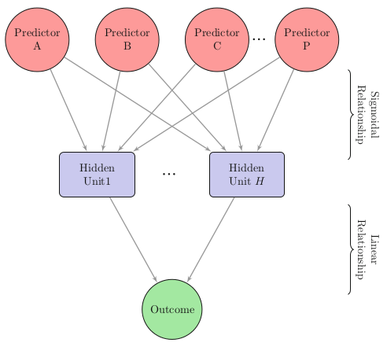
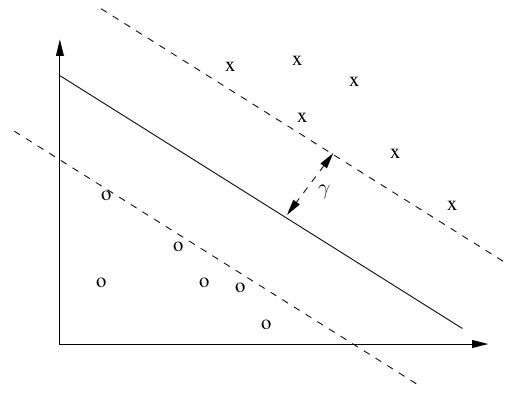

Overview
========

-  Time series modeling
-  Artificial Neural Networks
-  Support Vector Machines
-  Multivariate adaptive regression splines

Predicting stock market returns
===============================

Example: Stock market trading
=====================

-  Lots of historical data.
-  Data mining excels when there is more data than a human can process.
-  But, *efficient market hypothesis* states that markets adapt so fast in making price adjustments there is no way to obtain consistent profits over the market standard.

Some terminology
================

-  Goal of stock trading is to maintain a portfolio of assets based on buy and sell orders.
-  Develop a trading strategy that achieves as much profit as possible.
  - And is completely automated.
-  Use data mining methods to develop indications that drive the trading strategy.

Available data
==============

-  Use S&P 500 market index
-  Date of the stock exchange session.
-  Open price
-  Highest price during session
-  Lowest price during session
-  Closing price
-  Daily volume
-  Adjusted closing price

Sample data
===================
```{r, echo=FALSE, warning=FALSE }
options(width=80, digits=2, scipen=8)
library(dplyr)
library(magrittr)
library(tidyr)
library(ggplot2)
library(caret)
library(DMwR)
library(xts)
library(quantmod)
library(randomForest)
library(earth)
library(TTR)

data(GSPC)
head(GSPC)
```

Plot the series - Indicator
============================

- Create an indicator that summarizes the prices over the next 10 days.
- Candle chart has a the bar for open/close, with whiskers for the high/low. 

```{r Tindpredictor, echo=FALSE}
###################################################
### Defining the Prediction Tasks
###################################################
T.ind <- function(quotes,tgt.margin=0.025,n.days=10) {
  v <- apply(HLC(quotes),1,mean)

  r <- matrix(NA,ncol=n.days,nrow=NROW(quotes))
  ## The following statment is wrong in the book (page 109)!
  for(x in 1:n.days) r[,x] <- Next(Delt(Cl(quotes),v,k=x),x)

  x <- apply(r,1,function(x) sum(x[x > tgt.margin | x < -tgt.margin]))
  if (is.xts(quotes)) xts(x,time(quotes)) else x
}
```

Using quantmod library
======================

-  `quantmod` is a library that specializes in financial modeling.
```{r, echo=FALSE}
candleChart(last(GSPC,"3 months"), theme="white", TA=NULL) # from quantmod
avgPrice <- function(p) apply(HLC(p), 1,  mean)
addAvgPrice <- newTA(FUN=avgPrice, col=1, legend="AvgPrice")
addT.ind <- newTA(FUN=T.ind, col="red", legend="T Indicator")
addAvgPrice(on=1)
addT.ind()
```

Predicting price behavior
=========================

-  Can we predict the future changes in price?
-  *Technical indicators* are numerical summaries that reflect properties of time series.
-  *Technical analysis* tries to use the technical indicators to predict stock market movement
-  Some technical indicators are included in the package `TTR`

Some technical indicators
=========================

-  Average True Range (ATR)
-  Stochastic Momentum Index (SMI)
-  Welles Wilder's Directional Movement Index (ADX)
-  Aroon indicators
-  Bollinger Bands, 
-  Chaikin Volatility
-  Close Location Value (CLV)
-  Arms' Ease of Movement Value (EMV)
-  MACD oscillator
-  Money Flow Index (MFI)
-  Parabolic Stop-and-Reverse
-  Volatility indicator

```{r, echo=FALSE}
library(TTR)
myATR <- function(x) ATR(HLC(x))[,'atr']
mySMI <- function(x) SMI(HLC(x))[,'SMI']
myADX <- function(x) ADX(HLC(x))[,'ADX']
myAroon <- function(x) aroon(x[,c('High','Low')])$oscillator
myBB <- function(x) BBands(HLC(x))[,'pctB']
myChaikinVol <- function(x) Delt(chaikinVolatility(x[,c("High","Low")]))[,1]
myCLV <- function(x) EMA(CLV(HLC(x)))[,1]
myEMV <- function(x) EMV(x[,c('High','Low')],x[,'Volume'])[,2]
myMACD <- function(x) MACD(Cl(x))[,2]
myMFI <- function(x) MFI(x[,c("High","Low","Close")], x[,"Volume"])
mySAR <- function(x) SAR(x[,c('High','Close')]) [,1]
myVolat <- function(x) volatility(OHLC(x),calc="garman")[,1]
```

Feature selection
=================

- Take that list of 22 indicators, see if we can narrow it down.

```{r featureselection}
library(randomForest)
data.model <- specifyModel(T.ind(GSPC) ~ 
       Delt(Cl(GSPC),k=1:10) +myATR(GSPC) + mySMI(GSPC) + myADX(GSPC) + myAroon(GSPC) +  myBB(GSPC)  + myChaikinVol(GSPC) + myCLV(GSPC) +  CMO(Cl(GSPC)) + EMA(Delt(Cl(GSPC))) + myEMV(GSPC) +  myVolat(GSPC)  + myMACD(GSPC) + myMFI(GSPC) + RSI(Cl(GSPC)) + mySAR(GSPC) + runMean(Cl(GSPC)) + runSD(Cl(GSPC)))
set.seed(1234)
rf <- buildModel(data.model,method='randomForest',
             training.per=c(start(GSPC),index(GSPC["1999-12-31"])),
             ntree=50, importance=T)
```

Repeat using caret
===================

- Create a data frame
```{r}
pricemodel <- data.frame(Tind = T.ind(GSPC), 
       Delt(Cl(GSPC),k=1:10),
       myATR(GSPC) ,
       mySMI(GSPC) ,
       myADX(GSPC) ,
       myAroon(GSPC) ,
       myBB(GSPC)  ,
       myChaikinVol(GSPC) ,
       myCLV(GSPC) ,
       CMO(Cl(GSPC)) ,
       EMA = EMA(Delt(Cl(GSPC))) ,
       myEMV(GSPC) ,
       myVolat = myVolat(GSPC)  ,
       myMACD(GSPC) ,
       myMFI(GSPC) ,
       RSI(Cl(GSPC)) ,
       mySAR(GSPC) ,
       runMean = runMean(Cl(GSPC)) ,
       runSD = runSD(Cl(GSPC)))
```
Apply random forest using carat
=============
```
pricemodel <- pricemodel[complete.cases(pricemodel),]
set.seed(1234)
mtryGrid <- data.frame(mtry = floor(seq(10, ncol(pricemodel[,-1]), 
                      length = 5)))
indx <- createFolds(pricemodel[,"Tind"], returnTrain = TRUE)
ctrl <- trainControl(method = "cv", index = indx)
rf <- train(x = pricemodel[,-1], 
            y = pricemodel[,"Tind"],
            method='rf',
            tuneGrid = mtryGrid,
            ntree = 50,
            importance = TRUE,
            trControl = ctrl)

```


Check importance of the variables
==================================

```{r}
varImpPlot(rf@fitted.model,type=1)
```

Pick the most important variables
=================================

```{r}
imp <- importance(rf@fitted.model,type=1)
rownames(imp)[which(imp > 10)]
```

Use the most important indicators in a model
============================================

```{r}
data.model <- specifyModel(
  T.ind(GSPC) ~ Delt(Cl(GSPC),k=1) + 
    myATR(GSPC) + myADX(GSPC) + 
    myEMV(GSPC) + myVolat(GSPC) +
    myMACD(GSPC) + mySAR(GSPC) + 
    runMean(Cl(GSPC)) )
```

Predictions
=============

Predictions using time series
=============================

-  Our goal is to find a model that predicts the T indicator (stock price over the *next* 10 days).
1.  Alternative 1 - Use the *T* value as a target variable and try to obtain models that forecast this using the predictors and generating buy/sell/hold signals.
  - Multiple regression
2.  Alternative 2 - Predict the correct signal (buy/sell/hold)
  - Classification task
  
Classifiers
============

-  Classification tasks use a nominal target variable with a finite set of values (instead of a number)
-  Contrast with regression that has as output a numerical prediction.
-  Start by creating training and evaluation datasets.
```{r}
Tdata.train <- as.data.frame(modelData(data.model,
              data.window=c('1970-01-02','1999-12-31')))
Tdata.eval <- na.omit(as.data.frame(modelData(data.model,
             data.window=c('2000-01-01','2009-09-15'))))
Tform <- as.formula('T.ind.GSPC ~ .')
```

Evaluation criteria
===================

-  How do we evaluate the signal predictions of our models (i.e. a predicted T that indicates a buy/sell/hold recommendation)?
-  Define an error rate
$$error.rate = \frac{1}{N} \sum_{i=1}^nl_{0/1}(y_i, \hat{y}_i)$$
-  And the 0/1 loss function
$$L_{0/1}(y_i, \hat{y}_i) =$$ 
$$\begin{array}{cc}
    1 & if \text{ } \hat{y}_i \neq y_i\\
    0 & if \text{ }\hat{y}_i = y_i
    \end{array}$$
    
Some problems
=============

-  The most common signal should be *hold*, but we want predictors that accurately tell us when to buy/sell.
-  Our focus should be on accurately predicting the rare events.

Evaluating predictors
=====================

-  *Precision* - Proportion of event signals created by the model that are correct.
-  *Recall* - Proportion of events that are signaled by the models.
-  Confusion matrix


Precision and recall
====================

- Precision
$$Prec=\frac{n_{s,s} + n_{b,b}}{N_{.,s}+N_{.,b}}$$
- Recall
$$Rec=\frac{n_{s,s} + n_{b,b}}{N_{s,.}+N_{b,.}}$$
- Combine these to form the *F-measure*
$$F=\frac{\beta^2+1 * Prec * Rec}{\beta^2 * Prec + Rec}$$
- Where $0\leq \beta \leq 1$

Prediction models
=================

Choosing prediction models
===========================

-  We think that this problem is highly non-linear, so pick methods that work well in that context.
-  Artificial Neural Networks (ANN)
-  Support Vector Machines (SVM)
-  Multivariate Adaptive Regression Splines (MARS)

Using training data with time series
====================================

- Problem: time series tend to have periods of stability and volatility  *non-stationarity*
- How do we decide that variability is just normal variability (keep it) or due to a change in the volatility (replace it)?
- We can create a window of data that we use at any point in time, gradually throwing away old data.


Artificial Neural Networks
==========================

-  Frequently used in financial forecasting because of ability do deal with highly non-linear problems.
-  *Feed forward neural nets* is implemented in the R `nnet` package.
-  Formed by a set of computing units linked to each other.
  1. Linear combination of inputs.
  2. Non-linear computation to obtain output value.
  3. Result fed to other neurons in the network.
  4. Each neuron connection has a weight.
  
Feed-forward ANN
================

-  Neurons organized in layers.
-  First layer contains inputs (initially the training observations)
-  Last layer contains the predictions of the neural network from presented input data.
-  In between, weights are updated to optimize the predictions according to an error criterion.

***



ANN Example
===========

- Low precision means that the model gave wrong signals frequently. Big problem if you want to trade stocks based on this.
- Low recall means the model missed buy/sell opportunities.

```{r annexample, echo=FALSE}
set.seed(1234)
library(nnet)
library(nnet)
norm.data <- scale(Tdata.train)
```
```{r}
nn <- nnet(Tform,norm.data[1:1000,], size=10,decay=0.01, maxit=1000, linout=T,trace=F)
```
```{r, echo=FALSE}
norm.preds <- predict(nn,norm.data[1001:2000,])
preds <- unscale(norm.preds,norm.data)
sigs.nn <- trading.signals(preds, 0.1, -0.1)
true.sigs <- trading.signals(Tdata.train[1001:2000,'T.ind.GSPC'],0.1,-0.1)
sigs.PR(sigs.nn,true.sigs)
```


Application of ANN
==================

-  Classification tasks

```{r, echo=FALSE}
set.seed(1234)
signals <- trading.signals(Tdata.train[,'T.ind.GSPC'],0.1,-0.1)
norm.data <- data.frame(signals=signals,scale(Tdata.train[,-1]))
```
```{r}
nn <- nnet(signals ~ .,norm.data[1:1000,],size=10,decay=0.01,maxit=1000,trace=F)
```
```{r, echo=FALSE}
preds <- predict(nn,norm.data[1001:2000,],type='class')
sigs.PR(preds,norm.data[1001:2000,1])
```

-  Not that much better.

Support Vector Machines
=======================

SVM
===

-  Modeling tools that can be applied to both regression and classification tasks.
-  Implemented in the package `kernlab` and `e1071` (`svm`)
-  Map original data to a high-dimensional space.
-  Apply linear models to separate the data using hyperplanes.
-  Mapping of the original data is through *kernal functions*.

SVM Hyperplane
==============

SVM finds the hyperplane that maximizes the separation between cases belonging to different classes.



SVM example
============

```{r}
library(e1071)
sv <- svm(Tform,Tdata.train[1:1000,],gamma=0.001,cost=100)
s.preds <- predict(sv,Tdata.train[1001:2000,])
sigs.svm <- trading.signals(s.preds,0.1,-0.1)
true.sigs <- trading.signals(Tdata.train[1001:2000,'T.ind.GSPC'],0.1,-0.1)
sigs.PR(sigs.svm,true.sigs)
```

Again using kernlab
===================
```{r, warning=FALSE}
library(kernlab)
data <- cbind(signals=signals,Tdata.train[,-1])
ksv <- ksvm(signals ~ .,data[1:1000,],C=10)
ks.preds <- predict(ksv,data[1001:2000,])
sigs.PR(ks.preds,data[1001:2000,1])
```


Multiple Adaptive Regression Splines
====================================

MARS
====

-  Example of an additive regression model.
-  Has the general form
$$mars(x) = c_0 + \sum_{i=1}^k c_i B_i(x)$$
-  $B_i$ are *basis function*

Basis functions
===============

- Generally take the form of *hinge* functions
$$H[-(x_i-t)] = max(0, t-x_i)$$
$$H[+(x_i-t)] = max(0, x_i-t)$$
-  $x_i$ are predictors
-  $t$ is a threshold on the predictor.
-  Implemented in package `mda` (`mars()`)
-  Package `earth` (`earth()`)

MARS example
============
```{r}
library(earth)
e <- earth(Tform,Tdata.train[1:1000,])
e.preds <- predict(e,Tdata.train[1001:2000,])
sigs.e <- trading.signals(e.preds,0.1,-0.1)
true.sigs <- trading.signals(Tdata.train[1001:2000,'T.ind.GSPC'],0.1,-0.1)
sigs.PR(sigs.e,true.sigs)
```

Using signal predictions
=========================

How predictions would be used
==============================
- Assume that we will trade in the futures markets.
- Able to open two types of trades:  long and short
  -  Long: purchase the commodity at time *t* at price *p*, sell it at time *t+x*
  -  Short: sell at time *t* with price *p* with the obligation of buying it in the future.
  
Model for futures trading
=========================
  1.  All decisions are taken at the end of the day
  2.  If a sell order of price $pr$, with a 10 day deadline
      -  post a buy limit order of *pr + p%* (*p%* is the target profit margin)
      -  post a buy stop order with a price limit of *pr+l%*, *l%* is the maximum allowable loss.
  3.  If a buy order, with a 10 day deadline
      - post a sell limit order with a target price of *pr+p%*, 
      - post a sell stop order with a price of *pr-l%*
  4.  After 10 days, sell/buy at the market price.
      
Evaluation criteria
====================

-  Use package `PerformanceAnalytics`.

1.  Simple net balance between initial capital and capital at the end of the period (profit/loss).
2.  Percentage return.
3.  Excess return over simple buy and hold strategy.                                i.e. compare against the status quo strategy.
4.  Risk:  Sharpe ratio coefficient.  Return per unit of risk (risk is measured as the standard deviation of returns.)
5.  Maximum drawdown (i.e. maximum level of loss at any point in the simulation)

Trading policy input requirements
================================

1.  Market quotes for security.
2.  Trading policy function.
3.  Trading policy parameters.
4.  Cost for transactions.
5.  Initial capital.

Trading policy protocol
=======================

For each daily session $d$ we need (i.e. in real life we would have)

1.  Vector with the predicted signals up to day $d$.
2.  Market quotes up to day $d$.
3.  Currently opened positions.
4.  Money currently available to the trader.

Trading policy output
=====================

1.  A set of orders that the simulator should carry out.
2.  A set of orders
  -  Buy, sell, limit, stop.
3.  Quantity of stocks to trade
  -  Quantity for open, NA for close, target for limit and stop orders
4.  Action
5.  Position ID (if an existing position)


```{r policydefinitions, echo=FALSE}
###################################################
### From Predictions into Actions
###################################################
policy.1 <- function(signals,market,opened.pos,money,
                     bet=0.2,hold.time=10,
                     exp.prof=0.025, max.loss= 0.05
                     )
  {
    d <- NROW(market) # this is the ID of today
    orders <- NULL
    nOs <- NROW(opened.pos)
    # nothing to do!
    if (!nOs && signals[d] == 'h') return(orders)

    # First lets check if we can open new positions
    # i) long positions
    if (signals[d] == 'b' && !nOs) {
      quant <- round(bet*money/market[d,'Close'],0)
      if (quant > 0) 
        orders <- rbind(orders,
              data.frame(order=c(1,-1,-1),order.type=c(1,2,3), 
                         val = c(quant,
                                 market[d,'Close']*(1+exp.prof),
                                 market[d,'Close']*(1-max.loss)
                                ),
                         action = c('open','close','close'),
                         posID = c(NA,NA,NA)
                        )
                       )

    # ii) short positions  
    } else if (signals[d] == 's' && !nOs) {
      # this is the nr of stocks we already need to buy 
      # because of currently opened short positions
      need2buy <- sum(opened.pos[opened.pos[,'pos.type']==-1,
                                 "N.stocks"])*market[d,'Close']
      quant <- round(bet*(money-need2buy)/market[d,'Close'],0)
      if (quant > 0)
        orders <- rbind(orders,
              data.frame(order=c(-1,1,1),order.type=c(1,2,3), 
                         val = c(quant,
                                 market[d,'Close']*(1-exp.prof),
                                 market[d,'Close']*(1+max.loss)
                                ),
                         action = c('open','close','close'),
                         posID = c(NA,NA,NA)
                        )
                       )
    }
    
    # Now lets check if we need to close positions
    # because their holding time is over
    if (nOs) 
      for(i in 1:nOs) {
        if (d - opened.pos[i,'Odate'] >= hold.time)
          orders <- rbind(orders,
                data.frame(order=-opened.pos[i,'pos.type'],
                           order.type=1,
                           val = NA,
                           action = 'close',
                           posID = rownames(opened.pos)[i]
                          )
                         )
      }

    orders
  }


policy.2 <- function(signals,market,opened.pos,money,
                     bet=0.2,exp.prof=0.025, max.loss= 0.05
                    )
  {
    d <- NROW(market) # this is the ID of today
    orders <- NULL
    nOs <- NROW(opened.pos)
    # nothing to do!
    if (!nOs && signals[d] == 'h') return(orders)

    # First lets check if we can open new positions
    # i) long positions
    if (signals[d] == 'b') {
      quant <- round(bet*money/market[d,'Close'],0)
      if (quant > 0) 
        orders <- rbind(orders,
              data.frame(order=c(1,-1,-1),order.type=c(1,2,3), 
                         val = c(quant,
                                 market[d,'Close']*(1+exp.prof),
                                 market[d,'Close']*(1-max.loss)
                                ),
                         action = c('open','close','close'),
                         posID = c(NA,NA,NA)
                        )
                       )

    # ii) short positions  
    } else if (signals[d] == 's') {
      # this is the money already committed to buy stocks
      # because of currently opened short positions
      need2buy <- sum(opened.pos[opened.pos[,'pos.type']==-1,
                                 "N.stocks"])*market[d,'Close']
      quant <- round(bet*(money-need2buy)/market[d,'Close'],0)
      if (quant > 0)
        orders <- rbind(orders,
          data.frame(order=c(-1,1,1),order.type=c(1,2,3), 
                         val = c(quant,
                                 market[d,'Close']*(1-exp.prof),
                                 market[d,'Close']*(1+max.loss)
                                ),
                         action = c('open','close','close'),
                         posID = c(NA,NA,NA)
                        )
                       )
    }

    orders
  }
```

Two policies
=============

```
policy.1 <- function(signals,market,opened.pos,money,
   bet=0.2,hold.time=10,
   exp.prof=0.025, max.loss= 0.05
   )
policy.2 <- function(signals,market,opened.pos,money,
   bet=0.2,exp.prof=0.025, max.loss= 0.05
   )
```

Start the trading simulator
===========================

-  Start the trading simulator by using a small sample of data.
-  Use support vector machine to obtain predictions.
-  Use these predictions to feed into trading policy.

```{r traintradingsim, echo=FALSE}
# Train and test periods
start <- 1
len.tr <- 1000
len.ts <- 500
tr <- start:(start+len.tr-1)
ts <- (start+len.tr):(start+len.tr+len.ts-1)

# getting the quotes for the testing period
data(GSPC)
date <- rownames(Tdata.train[start+len.tr,])
market <- GSPC[paste(date,'/',sep='')][1:len.ts]

# training the model and obtaining its signal predictions
library(e1071)
s <- svm(Tform,Tdata.train[tr,],cost=10,gamma=0.01)
p <- predict(s,Tdata.train[ts,])
sig <- trading.signals(p,0.1,-0.1)
```

Look at the resulting trading record (policy 1)
================================================

```{r tradingsimpolicy1}
t1 <- trading.simulator(market,sig, 'policy.1',
        list(exp.prof=0.05,bet=0.2,hold.time=30))
summary(t1)
```

Evaluate the results for policy 1
=================================
```{r}
tradingEvaluation(t1)
```

And visualizing the results
============================

```{r}
plot(t1,market,theme='white',name='SP500')
```

And the same for policy 2
=========================

```{r}
t2 <- trading.simulator(market,sig,'policy.2',
                list(exp.prof=0.05,bet=0.3))
```

Evaluation of policy 2
========
```{r}
tradingEvaluation(t2)
```


And the plot for policy 2
=========================

```{r}
plot(t2,market,theme='white',name='SP500')
```

And now look at using different training and test periods
===============================================================

```{r echo=FALSE}
start <- 2000
len.tr <- 1000
len.ts <- 500
tr <- start:(start+len.tr-1)
ts <- (start+len.tr):(start+len.tr+len.ts-1)
s <- svm(Tform,Tdata.train[tr,],cost=10,gamma=0.01)
p <- predict(s,Tdata.train[ts,])
sig <- trading.signals(p,0.1,-0.1)
t2 <- trading.simulator(market,sig,'policy.2',list(exp.prof=0.05,bet=0.3))
summary(t2)
```


Evaluation
=======
```{r}
tradingEvaluation(t2)
```

Moral of the story, don't do this :-)

Model evaluation and selection for time series
==============================================

Model evaluation
================

-  Question:  given that our model selection criteria output is dependent on the choice of training and test data, how do we obtain reliable estimates?
-  In a time series, order matters, so we cannot just randomly select training and test data like we did in cross-validation.
-  Need to ensure that training data is before test data.

Monte Carlo Estimates
=====================

-  We can create blocks of 15 years.
  - 10 years training data, 5 years test set.
  - Random start times.
  
Experimental computations
=========================

-  Develop different models for SVM, Neural Net, MARS.
  - Regression and classifiers.
-  Implement multiple policies.
-  Select a set of *R* points to sample.
  - Each sample includes 10 years prior to $R$ for training then 5 years after $R$ for testing.
  - Use paired comparisons for statistical confidence intervals.
-  Determine precision and recall of statistics and other economic evaluation metrics.

```{r, echo=FALSE}
###################################################
### Model Evaluation and Selection
###################################################
MC.svmR <- function(form,train,test,b.t=0.1,s.t=-0.1,...) {
  require(e1071)
  t <- svm(form,train,...)
  p <- predict(t,test)
  trading.signals(p,b.t,s.t)
}
MC.svmC <- function(form,train,test,b.t=0.1,s.t=-0.1,...) {
  require(e1071)
  tgtName <- all.vars(form)[1]
  train[,tgtName] <- trading.signals(train[,tgtName],b.t,s.t)
  t <- svm(form,train,...)
  p <- predict(t,test)
  factor(p,levels=c('s','h','b'))
}
MC.nnetR <- function(form,train,test,b.t=0.1,s.t=-0.1,...) {
  require(nnet)
  t <- nnet(form,train,...)
  p <- predict(t,test)
  trading.signals(p,b.t,s.t)
}
MC.nnetC <- function(form,train,test,b.t=0.1,s.t=-0.1,...) {
  require(nnet)
  tgtName <- all.vars(form)[1]
  train[,tgtName] <- trading.signals(train[,tgtName],b.t,s.t)
  t <- nnet(form,train,...)
  p <- predict(t,test,type='class')
  factor(p,levels=c('s','h','b'))
}
MC.earth <- function(form,train,test,b.t=0.1,s.t=-0.1,...) {
  require(earth)
  t <- earth(form,train,...)
  p <- predict(t,test)
  trading.signals(p,b.t,s.t)
}
singleModel <- function(form,train,test,learner,policy.func,...) {
  p <- do.call(paste('MC',learner,sep='.'),list(form,train,test,...))
  eval.stats(form,train,test,p,policy.func=policy.func)
}
slide <- function(form,train,test,learner,relearn.step,policy.func,...) {
  real.learner <- learner(paste('MC',learner,sep='.'),pars=list(...))
  p <- slidingWindowTest(real.learner,form,train,test,relearn.step)
  p <- factor(p,levels=1:3,labels=c('s','h','b'))
  eval.stats(form,train,test,p,policy.func=policy.func)
}
grow <- function(form,train,test,learner,relearn.step,policy.func,...) {
  real.learner <- learner(paste('MC',learner,sep='.'),pars=list(...))
  p <- growingWindowTest(real.learner,form,train,test,relearn.step)
  p <- factor(p,levels=1:3,labels=c('s','h','b'))
  eval.stats(form,train,test,p,policy.func=policy.func)
}


eval.stats <- function(form,train,test,preds,b.t=0.1,s.t=-0.1,...) {
  # Signals evaluation
  tgtName <- all.vars(form)[1]
  test[,tgtName] <- trading.signals(test[,tgtName],b.t,s.t)
  st <- sigs.PR(preds,test[,tgtName])
  dim(st) <- NULL
  names(st) <- paste(rep(c('prec','rec'),each=3),
                     c('s','b','sb'),sep='.')
  
  # Trading evaluation
  date <- rownames(test)[1]
  market <- GSPC[paste(date,"/",sep='')][1:length(preds),]
  trade.res <- trading.simulator(market,preds,...)

  c(st,tradingEvaluation(trade.res))
}
```

Three policies
===============

```{r}
pol1 <- function(signals,market,op,money)
  policy.1(signals,market,op,money,
     bet=0.2,exp.prof=0.025,max.loss=0.05,hold.time=10)

pol2 <- function(signals,market,op,money)
  policy.1(signals,market,op,money,
     bet=0.2,exp.prof=0.05,max.loss=0.05,hold.time=20)

pol3 <- function(signals,market,op,money)
  policy.2(signals,market,op,money,
     bet=0.5,exp.prof=0.05,max.loss=0.05)
```

Run simulation
==============

```{r loadsimulationresults, echo=FALSE}
# Data files loaded from Book Extra Data Files page
load('../DMwRcode/svmR.Rdata')
load('../DMwRcode/svmC.Rdata')
load('../DMwRcode/earth.Rdata')
load('../DMwRcode/nnetR.Rdata')
load('../DMwRcode/nnetC.Rdata')
```
-  Determine best model for each methodology.
-  Evaluate4 score for each.

Precision
==========

```{r, echo=FALSE}
tgtStats <- c('prec.sb','Ret','PercProf',
              'MaxDD','SharpeRatio')
allSysRes <- join(subset(svmR,stats=tgtStats),
                  subset(svmC,stats=tgtStats),
                  subset(nnetR,stats=tgtStats),
                  subset(nnetC,stats=tgtStats),
                  subset(earth,stats=tgtStats),
                  by = 'variants')
rankSystems(allSysRes,5,maxs=c(T,T,T,F,T))
```

Look at one result
=================

Compare against Buy and Hold strategy

```{r}
summary(subset(svmC,
       stats=c('Ret','RetOverBH','PercProf','NTrades'),
       vars=c('slide.svmC.v5','slide.svmC.v6')))
```


```{r}
fullResults <- join(svmR,svmC,earth,nnetC,nnetR,by='variants')
nt <- statScores(fullResults,'NTrades')[[1]]
rt <- statScores(fullResults,'Ret')[[1]]
pp <- statScores(fullResults,'PercProf')[[1]]
s1 <- names(nt)[which(nt > 20)]
s2 <- names(rt)[which(rt > 0.5)]
s3 <- names(pp)[which(pp > 40)]
namesBest <- intersect(intersect(s1,s2),s3)
```


Comparison of results
=====================
```{r}
compAnalysis(subset(fullResults,
          stats=tgtStats, vars=namesBest))
```

Visualize results
====================

```{r}
plot(subset(fullResults,
      stats=c('Ret','PercProf','MaxDD'),
      vars=namesBest))
```

Look at the result that is different
=====================================

```{r}
getVariant('single.nnetR.v12',nnetR)
```

Conclusion
==========

-  Would you pick any of these?

Supervised learning summary
===========================

Methods discussed
=================

-  Time series
-  Windowing mechanisms
-  Artificial Neural Networks
-  Support Vector Machines
-  Multivariate adaptive regression splines
-  Evaluation using Monte Carlo methods.
-  Precision and recall